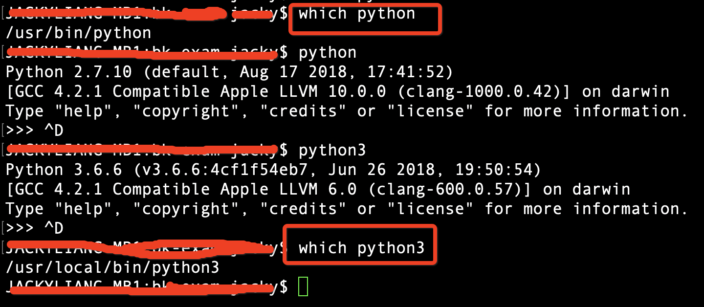
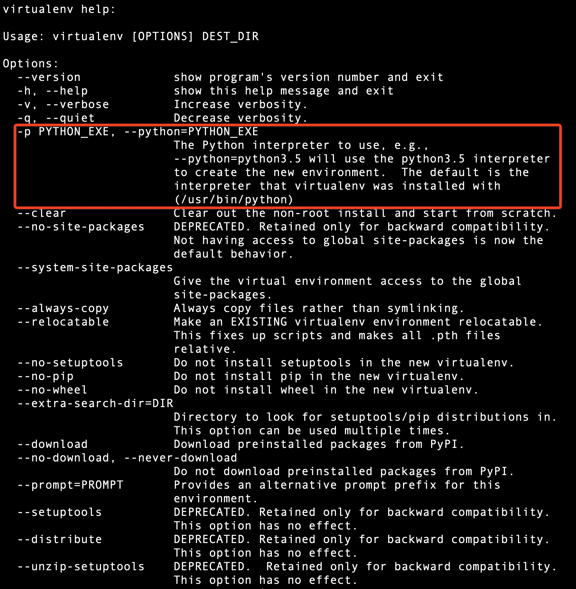

### 1. 方案总体介绍

为了方便开发者使用利用已有的环境配置，下面的方案利用了Python的virtualenv模块可以创建多个独立Python环境的能力，解决了Python2与Python3开发环境之间的相互独立的问题。同时，为了降低我们使用virtualenv的门槛，方案中也使用了virtualenvwrapper模块，方便我们创建、复制和删除各个虚拟环境。


当然，Python生态中也有其他的解决方案，各位开发者可以参考使用：

- [pyenv](https://github.com/pyenv/pyenv)
- [pipenv](https://github.com/pypa/pipenv)

### 2. 安装Python3 & virtualenvwrapper

【MacOS环境】

首先，我们去到Python官网下载最新的Python安装包：[Python 下载地址](https://www.python.org/downloads/)。这里强烈建议大家使用安装器(Installer)的方式安装。因为如果使用源码安装时，会遇到openssl开发依赖环境及macOS系统限制，给你带来各种麻烦。

【Linux环境】

建议大家可以使用Python的源码包进行安装，这样的好处在于我们可以指定Python的安装路径，确保新安装的Python3不会影响已有的系统工具，例如yum等。这里，建议各位读者使用Python 3.6.3的源码安装，原因是Python3.7后对openssl的版本会有要求限制，但是公司内网yum源提供的openssl版本并不能满足要求，会导致安装Python3.7时openssl模块缺失，从而影响pip的使用。

源码安装命令如下:

```
tar -zxf Python-3.6.3.tgz
cd Python-3.6.3
# 自定义配置安装路径为/opt/python36
./configure --prefix=/opt/python36
# 编译并安装
make -j 4
make install 
export PATH=/opt/python36/bin:$PATH
```

 【Windows环境】

Windows安装的时候需要注意使用自定义的安装路径，可以参考以下视频：[windows安装说明](https://www.youtube.com/watch?v=V_ACbv4329E)。各位读者需要注意，安装后需要修改PATH环境变量。

【virtualevnwrapper安装】

安装完成后，大家可以发现自己本地新增了一个【python3】的命令。当然，不用担心系统自身的Python2环境丢掉了，安装器会将这个Python2的保留下来。如下图所示：



接下来，我们需要安装virtualenvwrapper来协助我们创建独立的虚拟环境。Windows用户需要注意安装的是virtualenvwrapper-win。

```
# 安装virtualenvwrapper
# windows用户注意，安装virtualwrapper-win
$ sudo pip install virtualenvwrapper
...
# 指定虚拟环境放置的目录，可以按需调整
$ export WORKON_HOME=~/Envs
# 创建好路径
$ mkdir -p $WORKON_HOME
# 添加virtualenvwrapper命令及环境准备，建议这个命令可以放置到~/.bash_profile中
$ source /usr/local/bin/virtualenvwrapper.sh
```

###  3. 分割环境

安装后，我们可以先看一下virtualenv的帮助菜单，如下图所示：

-p这个参数是整个方案实施的关键。我们可以通过这个参数，来指定虚拟环境使用的Python解释器路径，而默认情况下，参数使用的是/usr/bin/python这个解释器。因此，我们可以指定不同的解释器路径，创建Py2和Py3不同的虚拟环境。操作如下：

```
$ mkvirtualenv test_python2_env 
New python executable in /Users/.virtualenvs/test_python2_env/bin/python
Installing setuptools, pip, wheel...done.
virtualenvwrapper.user_scripts creating /Users/.virtualenvs/test_python2_env/bin/predeactivate
virtualenvwrapper.user_scripts creating /Users/.virtualenvs/test_python2_env/bin/postdeactivate
virtualenvwrapper.user_scripts creating /Users/.virtualenvs/test_python2_env/bin/preactivate
virtualenvwrapper.user_scripts creating /Users/.virtualenvs/test_python2_env/bin/postactivate
virtualenvwrapper.user_scripts creating /Users/.virtualenvs/test_python2_env/bin/get_env_details
(test_python2_env) $ python 
Python 2.7.10 (default, Aug 17 2018, 17:41:52) 
[GCC 4.2.1 Compatible Apple LLVM 10.0.0 (clang-1000.0.42)] on darwin
Type "help", "copyright", "credits" or "license" for more information.
>>> ^D
(test_python2_env) $ mkvirtualenv test_python3_env -p /usr/local/bin/python3
Running virtualenv with interpreter /usr/local/bin/python3
Using base prefix '/Library/Frameworks/Python.framework/Versions/3.6'
New python executable in /Users/.virtualenvs/test_python3_env/bin/python3
Also creating executable in /Users/.virtualenvs/test_python3_env/bin/python
Installing setuptools, pip, wheel...done.
virtualenvwrapper.user_scripts creating /Users/.virtualenvs/test_python3_env/bin/predeactivate
virtualenvwrapper.user_scripts creating /Users/.virtualenvs/test_python3_env/bin/postdeactivate
virtualenvwrapper.user_scripts creating /Users/.virtualenvs/test_python3_env/bin/preactivate
virtualenvwrapper.user_scripts creating /Users/.virtualenvs/test_python3_env/bin/postactivate
virtualenvwrapper.user_scripts creating /Users/.virtualenvs/test_python3_env/bin/get_env_details
(test_python3_env) $ python 
Python 3.6.6 (v3.6.6:4cf1f54eb7, Jun 26 2018, 19:50:54) 
[GCC 4.2.1 Compatible Apple LLVM 6.0 (clang-600.0.57)] on darwin
Type "help", "copyright", "credits" or "license" for more information.
>>> 
```

 上面的操作中，我们首先创建了一个使用默认Python解释器的虚拟环境。创建完成后，我们进入Python可以观察到，对应的版本是2.7.x。紧接着，笔者再创建了一个使用指定Python解释器路径的虚拟环境，创建完成后我们进入Python可以观察到，对应的版本是3.6.x。至此，两个独立、互不干扰的Py2和Py3环境创建完成。

如果需要不同的环境切换，使用workon命令切换即可。