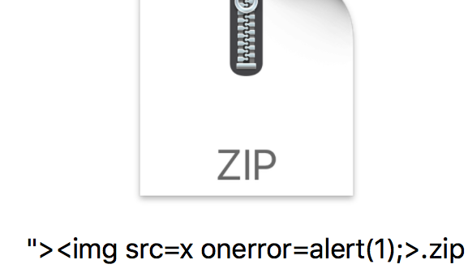
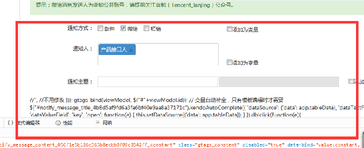
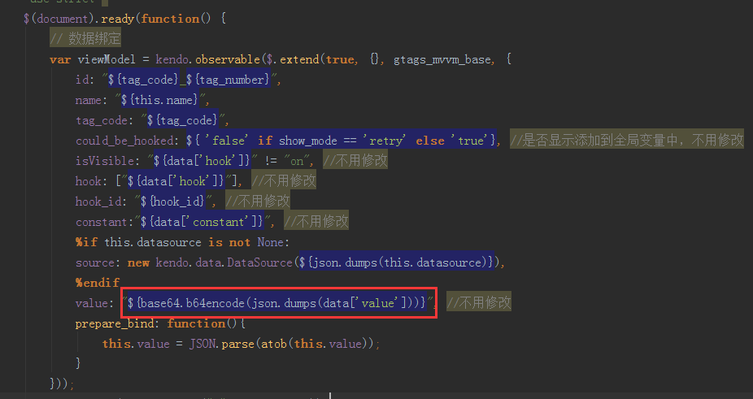

# 安全规范

## 【必须】基本要求

1.  使用蓝鲸提供的 **应用开发框架**，已集成基本的 web 安全防范策略（XSS、CSRF、统一登录等）

2.  **Debug 信息** 禁止对外暴露（测试、正式环境禁止开启 debug 模式，建议规范错误日志，查看日志定位问题）

3.  访问限制（IP 或 QQ 白名单）（统一使用蓝鲸 **开发者中心** 提供的 **权限管理** 功能）

4.  越权操作防范和自检（**用户、业务、操作** 权限等 **关联** 鉴权）（参考越权案例）

5.  权限回收（**应用统一回收通知模块**，定时通知业务测负责人对外部人员权限进行梳理确认，应用开发框架集成）

6.  内部应用 **对外提供 API** 并做好鉴权，统一由 **蓝鲸 ESB** 封装，必须报备

7.  **webshell** 必须报备

8.  Flash XSS 漏洞（例如：zeroclipboard 插件，请将插件升级至最新版本）

## 常见 XSS 漏洞及解决方案

### 场景 1 ：存储型 XSS

#### 定义

把用户输入的数据“存储”在服务器端，用户浏览页面时，再从服务器端读取生成页面展现给用户

#### 示例

用户输入内容直接显示在前端标签里，例如 `<h1> some_user_input</h1>` 或者
`<input type="text" name="address1" value=${"address"}>`


#### 解决

为了使浏览器能正确地显示这些字符，而不是去执行，我们需要使用 html 实体字符。

1. 在数据入库之前做转义，例如将 `<script>` 转义成 `&lt;script&gl`,
这个在蓝鲸应用开发框架提供的中间件中有实现，要确保该中间件有在使用

2. 对输出到前端的内容，我们也要过滤，防止因为对输入过滤被绕后，可以使用 Mako 模版的h参数 `${ name\| h }`

3. 对于不是 Mako 模版渲染展示的内容，需要做 html 特殊字符的转义，特别注意前端的 `title`, `name`, `class` 等属性的赋值同样需要做转换

#### 测试

对所有用户输入部分进行检测，输入 `<script>alert('xss');</script>` 查看展示部分是否被弹窗。

### 场景 2 ：反射型 XSS

#### 示例

对于用户的输入，我们有时并不是像场景1那样简单地显示在标签里，比如自动填充表单时，会用到
```js
$("#my_input").val("some_message");
```

或者填充图片 src 时，会用到
```html

```

这里的 some_message 都是我们用户输入，并由后端填充的内容。此时可以通过输入如下代码提前闭合引号来进行 XSS 攻击 
```html
"><imgsrc=x onerror=alert(1);>
```

经过后端传到前端之后，前端代码变为
```js
$("#my_input").val('">');
```

原本的赋值语句被破坏，如果是持久型的存储数据，将会持续影响正常业务。

或者变为
```html

```

#### 解决

同场景 1，对输入内容做特殊字符的过滤转义

#### 测试

对所有用户输入部分进行检测，输入 `">` 查看展示部分是否被弹窗，以及业务功能是否受影响。

### 场景 3 ：文件上传与导入

对于导入或者上传的文件，通常会忽略特殊字符的转义，这样当文件内容在前端显示的时候，会出现 XSS 攻击

#### 示例

比如，Excel 导入用户数据并生成表格


信息导入后传至前端表格，造成场景 1 中的标签内 XSS

又比如，文件上传并展示



在非 windows 的操作系统（如Lunix、OSX）中，文件名可以被命名为任意格式，可以包含 JS 代码，在上传完成后在前端显示时造成 XSS 攻击

#### 解决

1. 对 Excel 和文件导入的数据进行校验，对特殊字符进行转义，包括不限于单引号、双引号、反引号、尖括号、&等。

2. 后台对上传文件的大小、内容、类型做校验，只允许上次符合要求的文件类型

3. 文件名在前端显示的时候，做 html 特殊字符转义

#### 测试

在导入的 Excel 中尝试使用 `<script>alert('xss');</script>`和`">` 来检查是否弹窗和业务功能完整性。

将上传的文件名命名为 `">.zip` 或来检验是否弹窗和业务功能完整性。

常用 XSS 测试 payload
```html

```

### 场景 4 ：出错提示信息

#### 示例

上传文件的路径写了 `<script>alert(/xss/)</script>`,
执行的时候，路径出错，前端提示信息中有显示用户填写内容，未做过滤，导致 XSS 攻击


#### 解决

同场景1 前端显示用户输入的时候要做 html 特殊字符转义

#### 测试

填写上传文件或者文件分发路径的地方，输入 `<script>alert(/xss/)</script>` 检查系统是否正常，结果是否符合预期

### 场景 5 ：通过用户输入提前闭合 script

利用浏览器解析html的原理，通过用户输入内容将 `<script>` 标签提前闭合，导致后续的 js 代码直接暴露在前端页面

#### 示例

如下简单的三段代码就可以导致 script 提前闭合，user_variable 的渲染正式使用 Mako 渲染的常见场景：
```js
<script>
    var user_variable = "</script>";
</script>
```



#### 解决

Mako 渲染时，将用户输入的信息在 python 中以 base64 的形式输出到 html 中，这样用户输入的所有特殊符号都被转换成字母，不会导致 html 解析时 script 标签提前闭合。

最后运用用户变量之前使用 js 的 base64 解码转换一次



## 常用 XSS 测试 payload

- `<script>alert('xss')</script>`

- `http://localhost/x.html#<script>alert('xss')</script>`

- `<script src=http://www.qq.com></script>`

- `"><script>alert(1)</script>`

- `">`

- `"><iframe src=javascript:alert(1)></iframe>`

- `</script>`

## 常见越权漏洞及解决方案

### 常见越权分类

1. 平行越权

    场景1：普通用户A可以访问到普通用户B的数据

    场景2：用户可以通过修改请求链接或参数，访问到其它本应无权访问的数据

2. 上下越权

    普通用户可以执行管理员的操作

### 场景 1 ：对 get 请求中显式的 URL 更改进行越权

假设 URL 为 `http://test.com/detail/123`，在没有严格判断的情况下，特别是后台采用 API 模式时，用户通过随意更改 `/detail/` 后面的数字，可以绕过权限判断访问任意的页面。

#### 解决

对所有增、删、改、查的功能中，对用户暴露出的 API，都要进行严格的权限判断

对用户身份，需要操作的id需要做严格的校验，建议在 RUL 中加入业务字段，根据业务字段判断用户是否有操作权限

#### 测试

将URL中的 id 更改为权限外的页面 id，检查是否能越权访问以及返回页面是否符合预期

### 场景 2 ：对 post 请求中的预置参数更改进行越权

一些固定的 post 参数，如 hidden 属性的 input，或 ajax 的 data 中在页面返回时就确定的信息，都是可能被修改的


如图，页面在后端渲染时确定了一个 report_id，用户点击按钮时就会拿这个 id 去下载相应的文件。如果在下载逻辑中没有进行权限控制，则可能被修改 id 来下载任意文件，造成越权。

#### 解决

同场景 1，完善各个视图函数的权限控制。

#### 测试

使用 Postman 或其他 chrome 插件来模拟、修改 POST 请求

使用 fiddler 抓取请求包，修改 post 请求中的参数

### 场景 3 ：非管理员用户访问管理界面

通常 app 中会设定一个管理员界面，方便进行一些配置工作。一般的做法是前端进行控制，管理界面的 url 不会暴露给非管理员用户，但是不排除非管理员通过各种手段获取到所有 url 并进行访问。

#### 解决

后台管理相关的操作，需要在后台对操作用户进行权限校验，避免非法用户的访问

#### 测试

用普通用户的帐号尝试访问管理员界面或者管理操作的 cgi

## 常用越权测试方法

1. 测试点 1

    获取A用户操作请求到的数据包，用B用户身份来请求，看返回数据（可在页面操作后，使用 fiddler 抓取请求包，在使用 B 用户身份请求）

2. 测试点 2

    - 修改请求链接中的业务 ID 等数据后，发起请求，判断是否有越权
    - 修改请求参数中的业务 ID，用户名等数据后，发起请求，判断是否有越权（用 fiddler 抓包）

## 常见 CSRF 漏洞及解决方案

### 场景 1 ：JSON hijacking

#### 漏洞描述

`JSON hijacking` 是 csrf 漏洞的一种，CGI 以 JSON 形式输出数据，黑客控制的第三方站点以 CSRF 手段强迫用户浏览器请求 CGI 得到 JSON 数据，黑客可以获取敏感信息

#### 漏洞检测

使用工具获取 json 数据

#### 漏洞修复

可使用以下任意办法防御 JSON Hijacking 攻击

1. 在请求中添加 token（随机字符串）

2. 请求 referer 验证(限制为合法站点，并且不为空)

#### 注意事项

在线 json 防御被外域恶意调用只限制了 referer，但是允许空 referer 访问：比如本地 html，还有某些伪协议远程调用时是没有 referer 的。从而导致问题持续。所以空 referer 也是不安全的

#### 解决

蓝鲸应用开发框架已经集成了 django 的 csrf 中间件来预防 csrf 攻击，一般比较重要的增删改操作都会使用 post 请求，一般不会出现问题。但是如果是 get 请求去获取敏感信息的话，就有可能存在上述问题，对于使用 get 方式获取有敏感信息的 cgi，建议换成 post 方法或增加 referer 校验

## 常见高危操作及对策

### 场景 1 ：权限控制不严格

#### 描述

调用第三方敏感接口 ，没有校验权限；ijobs 未经鉴权操作任意指定的服务器； CC 业务属性修改，没有校验权限

#### 对策

1. 前端采用下拉框的方式，选择服务器地址，限定选择范围

2. 无论是用户输入，还是通过下拉框选择输入服务器地址，在后台一定要校验，人员对业务的操作权限，业务对服务器的操作权限

3. 页面显示业务信息时，需要校验人员对展示信息的权限，避免敏感信息泄露。

### 场景 2 ：预留操作后门

#### 描述

开发人员为了方便初始化数据、测试功能、定位问题，通过 URL、DB 配置等方式，开通操作后门

#### 对策

1. 尽量不要开通后门，如果一定需要后门，请限制使用次数，使用完毕即时关闭，

2. 后门操作一定要鉴权，最小化后门的操作人员数量，如果长期留置后门，需要报备产品

3. 使用后门时，需要避开访问高峰期

### 场景 3 ：不同环境操作没有隔离

#### 描述

开发环境、测试环境和正式环境的数据、接口共享

#### 对策

1. 在开发环境、测试环境进行操作时，一定要控制在尽量小的范围，不要进行未报备的大规模测试，同时要限制 `root` 账号的权限

2. 开发环境、测试环境数据尽量与正式环境隔离，如果不能隔离，一定要向产品报备风险，告知测试人员

3. 使用 API 或者 migrations 方式初始化关键数据（如手机号，邮箱等）时根据环境区分数据源

## 代码安全与数据脱敏

本节主要从代码和运行时数据两个方面，规范开发者的行为，以避免敏感信息被泄露、加固数据的安全性。

### 代码存储

公司项目代码不允许存储在 GitHub、GitLab 等外部托管平台

### 代码交付

代码交付规范主要针对的是社区版、企业版应用中的全部文本文件，包括前后端代码、文档、图片等。

1. 不允许出现人员名称。如果必须使用作者信息，请使用 blueking、PaaS 或各平台英文代号

2. IP地址务必限制在 `10.0.0.1` 、`127.0.0.1`，开源组件内的 IP 可以忽略

3. 域名务必限制在 `blueking.com`

检测命令（仅供参考）
```bash
ack "\\d+\\.\\d+\\.\\d+\\.\\d+" # 查找全部 IP

ack "username"  # 查找指定用户名

ack "tencent.com\|blueking.online"  # 查找指定域名
```

> 建议：对于上述信息。如果必须使用，请通过配置环境变量获取

### 敏感信息存储与访问

1. 服务器登陆密码不允许存储在任何地方

2. 非机器登陆密码，需要加密存储

3. 严禁明文存储 QQ、手机号、账户和密码信息，请使用 AES 等加密算法加密存储

4. 前端页面上不允许显示任何敏感信息，如密码、重要外网配置等。手机号显示前三位后两位，身份证显示前一位后一位，银行卡显示前六位后四位。

5. 对于访问敏感信息 DB，必须做好来源 IP 限制

**需要注意的是，数据的脱敏和访问来源检验，需要在服务端完成，不能依靠前端处理。**

## 开发注意的安全事项

### 安全校验豁免的接口不能上线到正式环境

针对不同的环境，进行不同的 Django 配置时，配置应该注意相互隔离、不能共用。

> 例如：为了方便前端调试，在 SaaS 中配置了 `corsheaders`。此时应该，仅在开发时间段允许本地和测试环境进行跨域调用，而不能上线到正式环境，同时在完成迭代之后，应该立即关闭跨域配置，避免误上线操作，导致安全风险。
