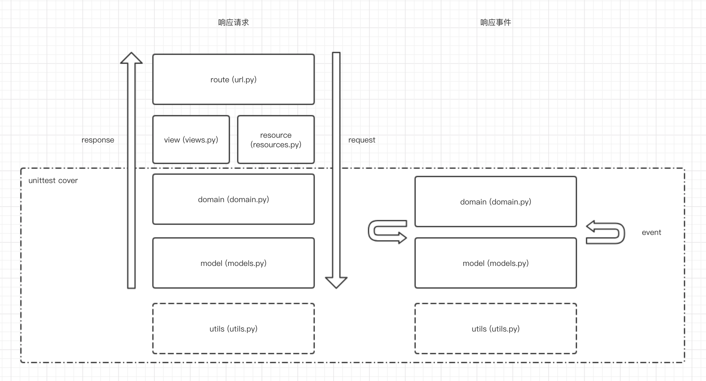
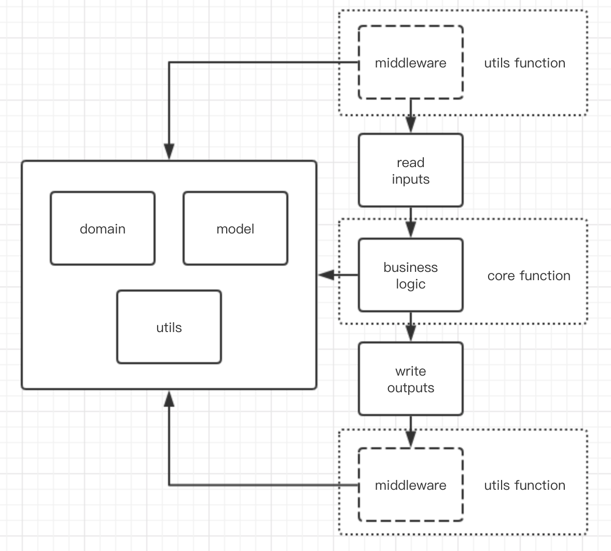
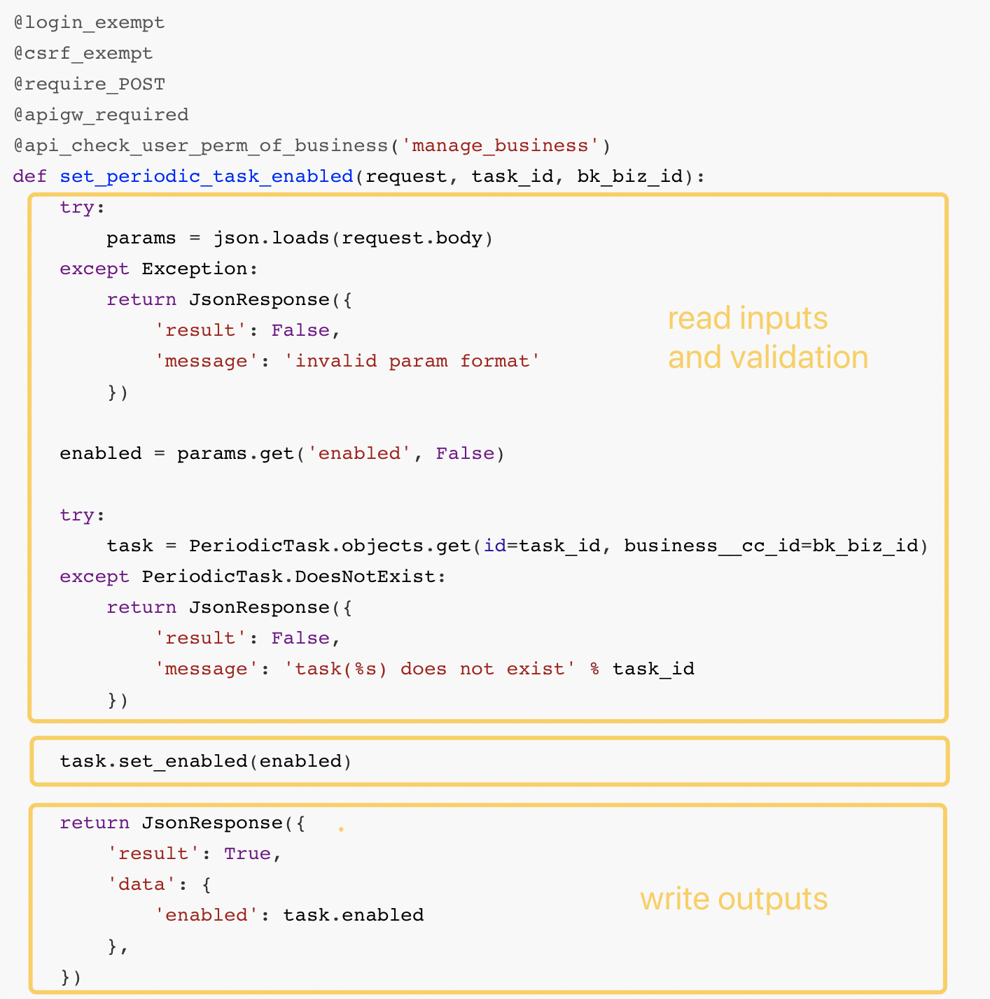

# 目录

- 序言
- 测试覆盖范围
- 测试隔离

## 1. 序言

本规范用于指导蓝鲸 SaaS 服务端开发过程中单元测试的编写方法及规范，从而为代码提供修改时的保护网，尽早的发现一些比较低级的 BUG 并修复。同时，通过了解有效单元测试用例构造方式，能够以尽可能少的测试用例来获得尽可能好的测试效果，减少测试成本。

在测试编写过程中请使用 [mock](https://pypi.org/project/mock/) 框架来进行测试隔离的操作。(Python3 已将该库集成到内部 `unittest` 模块中)。

## 2. 测试覆盖范围

如下图所示，SaaS 的服务端程序可以抽象为下面两种运行模式：

- 处理请求：通过暴露 HTTP 接口向外提供服务的后台程序都属于这种模式。
- 响应事件：不会向外暴露接口，可能是一个独立的进程，拥有自己的运行循环。



对于处理请求的场景，通常我们会使用第三方框架(Django、DRF、Tastypie)来向外暴露接口，但是接口最终调用的是我们系统内部的领域逻辑，所以我们测试所需要覆盖的则是接口之下的这些领域逻辑、模型以及工具。

对于响应事件的场景，大多数情况下是系统内部的模块在进行交互，这些模块都要被单元测试覆盖到。

**总而言之，在系统内部模块划分合理，层次结构清晰的情况下，我们需要覆盖到接口层之下的所有模块。**

### 2.1 覆盖范围的选择

对于一个向外暴露 HTTP 接口的后台服务程序，我们在处理外部到来的请求时一般流程如下：



- middleware：请求可能会经过我们设置的中间件进行一些处理
- read inputs：读取请求中的输入数据
- business logic：系统根据请求中的数据执行特定的业务逻辑
- write outputs：将返回数据写入响应中
- middleware：响应可能会经过我们设置的中间件进行一些处理

在这个流程中，read inputs 及 write outpus 是我们在接口层对请求和响应进行处理的逻辑，可以不在单元测试中进行覆盖；而其他三个过程一般由系统中定义的领域逻辑、模型以及工具负责，所以我们的单元测试必须覆盖到这些过程中所使用的模块。

### 2.2 实例

#### 2.2.1 响应请求



#### 2.2.2 响应事件


## 3. 测试隔离

我们的系统内存在各种各样的依赖关系，有自身内部模块之间的依赖，也有对外部环境(运行时组件：MySQL，Redis，Rabbitmq 等)的依赖，这些依赖导致我们在进行测试的时候需要准备各种各样的模块以及环境，增加了我们的测试执行及编写成本，所以，在编写和执行测试时，我们需要进行测试隔离。

一般来说，我们通过提供 Test Double (测试仿件)来实现测试隔离。

### 3.1 与环境隔离

假设我们的待测模块依赖 Redis 组件：

```python
from redis_client import RedisClient

def get_list_from_redis_and_sum(key):
  client = RedisClient()
  
  nums = client.get(key)
  nums = [] if nums is None else nums
  
  return sum(nums)
```

那么我们可以提供 Redis Client 的 Test Double 来实现与环境的隔离

```python
class ClientReturnNone(object):
  def get(key):
    return None

@patch('redis_client.RedisClient', ClientReturnNone)
def test_get_list_from_redis_and_sum__return_none():
  # write your test
  pass
```

### 3.2 与模块隔离

系统中的模块之间会相互协作来完成一些复杂的任务，那么久必定会存在模块间的依赖。如果我们不在测试的时候进行模块的隔离，会导致测试越往上层编写，测试数据准备的成本就越高；另外，加入模块 A 依赖模块 B 及模块 C；既然我们已经完成了模块 B 和模块 C 的独立测试，我们就不需要在测试模块 A 时再次测试模块 B 和 模块 C，只需要保证模块 A 以我们想要的方式完成了调用即可。

**注意，这里的模块指的不是 Python 中的 module，而是一个比较泛的概念，可能是一个 module，一个类或是一个函数。**

假设我们有三个模块 `Waiter`，`House` 及 `Door`，`Waiter` 需要依赖 `House` 和 `Door` 来完成自己的 `serve` 方法：

```python
class Waiter(object):
  def __init__(self, house, door):
    self.house = hosue
    self.door = door

  def serve(self):
    if self.house.peoples > 5:
      self.door.open()

class House(object):
  def __init__(self, peoples):
    self.peoples = peoples

class Door(object):
  def open(self):
    pass
```

那么在编写测试时，可以通过提供 `Waiter` 所依赖模块的 Test Double 来进行隔离：

```python
from mock.mock import MagicMock
from waiter import Waiter

class MockHouse(object):
  def __init__(self, peoples_return):
    self.peoples_return = peoples_return

  def peoples(self):
    return self.peoples_return

class MockDoor(object):
  def __init__(self):
    self.open = MagicMock()

def test_waiter_serve():
  door = MockDoor()
  house = MockHouse(peoples_return=6)
  waiter = Waiter(house=house, door=door)
  
  waiter.serve()
  
  door.open.assert_called_once()
```
