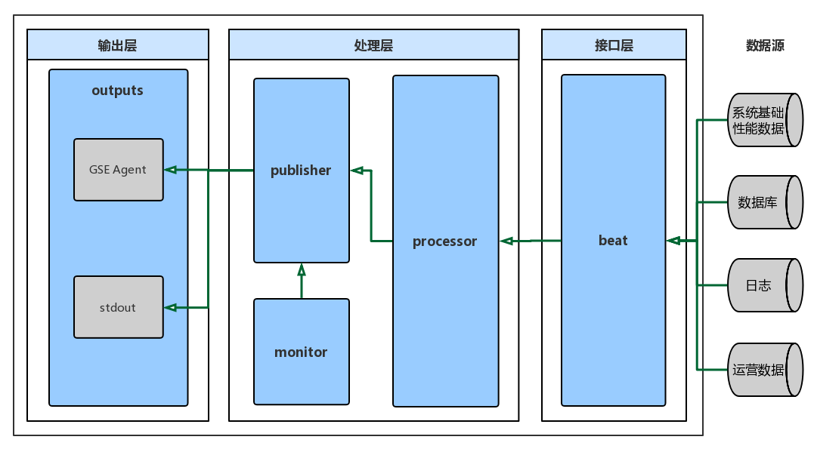

# 蓝鲸采集器框架使用文档
## 蓝鲸采集器框架简介

### 功能简介

蓝鲸采集器框架是基于 libbeat 开源采集器框架开发的，针对主机和互联网应用进行数据收集上报的组件。基于蓝鲸采集器框架，可以方便构建各类采集器，用于**收集主机/容器资源**，包括系统性能、组件服务、数据库、日志等指标，并将数据发送至蓝鲸数据平台，以便开发者轻松获取和使用，完成展示、分析、监控、告警等任务。除此之外，蓝鲸采集器框架还支持**配置重新加载**、**PID 文件**、**本地存储**、**运营监控数据上报**等功能。

### 框架结构



蓝鲸采集器框架设计，整体分为以下三层：

1. **接口层**：提供初始化、发送等接口，开发者可利用这些接口实现采集逻辑，完成不同数据源的数据采集任务。

2. **处理层**：接收来自接口层的数据，通过过滤、打包、监控打点等操作对数据进行加工处理。

3. **输出层**：经处理层处理后的数据，会通过输出层，输出到具体的输出通道上，如 GSE Agent 和标准输出。

为了方便开发者高效构建采集器，蓝鲸采集器框架提供了一系列功能包，它们的功能简介如下：

| 包               | 功能                                                         |
| :--------------- | :----------------------------------------------------------- |
| libbeat/beat             | 提供了管理 Beat 生命周期的方法，提供了方法对 Beat 进行配置、日志记录、publisher 初始化等操作，并提供了采集器的 Beater 接口标准 |
| libbeat/processor        | 在数据被传输前，对满足某一些自定义条件的数据进行处理的模块   |
| libbeat/outputs          | 输出模块，提供了 PublishEvent 方法，将采集数据按照输出端的配置向输出端传输数据 |
| libbeat/publisher        | 封装了 output，提供 Client 接口进行数据传输                     |
| libbeat/logp             | 日志打印模块，可以在配置文件中更改日志打印级别，默认打印 info 及以上等级的日志（debug，info，warning，error，critical error） |
| libbeat/config           | 提供了通用的配置格式以及配置的解析方法                       |
| libbeat/common   | libbeat 封装的基础库                                          |
| bkdatalib/gselib           | 提供与向 gse agent 传输信息有关的功能                          |
| bkdatalib/monitor          | 埋点数据，提供数据质量监控使用                               |
| bkdatalib/reloader         | 通过监听管道消息，提供配置热加载的功能                       |
| bkdatalib/storage          | 提供本地数据存储的方法                                       |
| bkdatalib/docker           | 提供容器信息采集方法的包                                     |
| bkdatalib/stat             | 周期性发送运营数据，监控数据打点                             |
| bkdatalib/system | 封装了 linux/windows 操作系统的 socket、disk 相关接口，提供与操作系统无关的函数调用 |

### 工作原理


- 采集器调用 b.Publisher.Connect() 连接到输出，Connect 函数返回 Client 实例
- 采集器初始化周期采集定时器Timer或采集事件监听Event
- 一旦 Timer 或 Event 激活，采集器执行采集数据操作，并调用 Client.PublishEvent 将数据交给 Publisher
- Publisher 收到采集器的数据，按照配置将数据进行预处理，然后将数据发送给指定输出端

## 功能特性

### 支持蓝鲸数据链路上报

**作用**

蓝鲸数据链路是基于 GSE 数据管道，连接了采集和存储。蓝鲸采集器框架支持将采集的数据，通过蓝鲸数据链路进行上报、存储。

**使用方法**

使用 gse 作为输出，具体配置如下：

```yaml
output.gse:
  # linux agent ipc file config
  endpoint: "/var/run/ipc.state.report"
  # windows agent socket config
  endpoint: "127.0.0.1:47000"
  retrytimes: 3
  retryinterval: 3s
  mqsize: 1
  writetimeout: 5s
```

### 数据质量监控

**作用**

对采集数据的发送情况进行统计监控，并上报。上报时间间隔是 1 分钟。

**使用方法**

使用 gse 作为输出，默认开启该功能，dataid 为 295，也可以在 gse 的配置中指定 monitorid。

### 资源占用监控

**作用**

对采集器使用的系统资源进行监控并上报，上报时间间隔是 1 分钟。

**使用方法**

使用 gse 作为输出，默认不开启，在 gse 的配置中指定大于 0 的 resourceid 则可开启资源使用上报模块。

### 运营数据上报

**作用**

周期性发送运营数据，包含采集器名称、版本、时间以及附属信息，附属信息需要用户实现 GetStat 函数。

**使用方法**

1. 实现 GetStat 函数

  ```
  type GetStat func() beat.MapStr
  ```
  
2. 实例化运营数据上报模块

  ```
  stat, err := stat.NewCycleStat(beatName, GetStat, beat.Send)
  ```
  
3. 开启运营数据上报模块

  ```
  stat.Run()
  ```

## 使用说明

### 采集器快速开发示例

#### 工程结构

```
<beats>
	└─<mybeat>
		├─examplebeat.yml	采集器的配置文件
		├─main.go			采集器主体（需实现 Beater 的 Start，Stop，Reload 函数
		│				，并提供一个创建 Beater 实例的 Creator 工厂函数）
		└─<config>
			└─config.go		自定义的配置类，后续通过 unpack 方法，
						将配置文件中对应的配置加载进 Config 实例中
```

#### 接口及类的实现

基于蓝鲸采集器框架，要开发一个采集器，需要实现 Beater 接口和 Creator 函数。

**Beater接口**

```go
type Beater interface {
    /* Beater.Run()
	** 在收到结束的信号前（<-beater.done）
	** 根据设定的间隔反复收集信息，
	** 并向指定的输出端发送信息。
	*/
    Run(b *Beat) error

	/* Beater.Stop()
    ** 该函数被调用时，应安全地停止正在进行的
	** 数据采集工作（关闭beater.doen通道），
	** 并且与所有输出端口断开连接。
	*/
	Stop()

	/* Beater.Reload()
    ** 该函数被调用时，应重新加载采集器的配置。
	*/
	Reload(*common.Config)
}
```

**Creator函数**
```go
// 定义
type Creator func(*Beat, *common.Config) (Beater, error)

/*
** 从Creator函数的引用位置可以看出，
** 输入Creator的配置信息是配置文件中与
** Beater相关的配置。因此，
** Creator应解析这个子配置，
** 利用子配置中的项初始化Beater
*/
// 引用
......
	// load the beats config section
	var sub *common.Config
	configName := strings.ToLower(beat.Name)
	if beat.RawConfig.HasField(configName) {
		sub, err = beat.RawConfig.Child(configName, -1)
		if err != nil {
			return err
		}
	} else {
		sub = common.NewConfig()
	}

	beater, err := Creator(beat, sub)
	if err != nil {
		return err
	}
......
```

#### 编译及调试

- **Linux**

1. 设置环境变量 %BEAT_NAME% 为采集器项目的名称
2. 设置环境变量 %BEAT_VERSION%
3. 设置环境变量 %GO_PATH% 以满足以下条件
   - 自定义的采集器目录 $\in$ %GO_PATH%\src\github.com\elastic\bkbeats\\%BEAT_NAME%
4. 执行 %GO_PATH%\src\github.com\elastic\bkbeats\bkdev_tools\bkbuild_linux.sh

- **Windows**

1. 设置环境变量 %BEAT_NAME% 为采集器项目的名称
2. 设置环境变量 %BEAT_VERSION%
3. 设置环境变量 %GO_PATH% 以满足以下条件
   - 自定义的采集器目录 $\in$ %GO_PATH%\src\github.com\elastic\bkbeats\\%BEAT_NAME%

4. 执行 %GO_PATH%\src\github.com\elastic\bkbeats\bkdev_tools\bkbuild_win.sh

#### 开发示例

1. 实现配置类

```go
package config

import (
	"time"
)

type Config struct {
	DataID   int32         `config:"dataid"` 	/* 在配置文件中是
    											** examplebeat.dataid
    											*/
    Interval time.Duration `config:"interval"` 	/* 在配置文件中是
    											** examplebeat.interval
    											*/
}

//如果配置文件没有设置相关内容，则使用默认配置
var DefaultConfig = Config{
	DataID:   0,
	Interval: time.Minute,
}

```

2. 实现ExampleBeat类

**成员变量**

|  变量名  |      变量类型      |                       功能描述                       |
| :------: | :----------------: | :--------------------------------------------------: |
|  dataid  |      `int32`       |              用来唯一识别所创建的采集器              |
|  client  | `publisher.Client` |    `Client` 提供了向给定的输出端发送采集信息的方法    |
|  timer   |   `*time.Timer`    |                     提供计时方法                     |
| interval |  `time.Duration`   |           表示两次相邻的采集之间的时间间隔           |
|   done   |    `chan bool`     | 当通道被关闭时则代表采集器被关闭，停止采集和发送信息 |

**成员函数**

```go
// Run beater interface
func (bt *ExampleBeat) Run(b *beat.Beat) error {
	logp.Info("ExampleBeat is running.")

	bt.client = b.Publisher.Connect() //获取采集信息输出端

	// loop report msg

	bt.timer = time.NewTimer(bt.interval) //设定采集和发送信息的时间间隔
	for {
		select {						 //轮询计时器信号与采集器结束信号
		case <-bt.timer.C:				 //当计时器通道响应时，采集器采集、发送信息
			bt.timer.Reset(bt.interval)  //重复设定时间间隔的目的是支持热加载配置
			localtime, _, _ := bkcommon.GetDateTime()
			event := common.MapStr{
				"dataid": bt.dataid, // must have dataid field
                "localtime": localtime, /* 自定义的信息内容
                						** 也可以在这里放置其他信息
                						*/
			}
			bt.client.PublishEvent(event) /* 调用publishEvent，
										  ** 向配置的输出端发送消息
										  */
		case <-bt.done:					//当采集器结束通道响应时，终止采集
			logp.Info("shutting down.")
			return nil
		}
	}
    return nil
}

// Stop beater interface
func (bt *ExampleBeat) Stop() {
	bt.client.Close()			//断开与输出端的连接（Socket等）
    close(bt.done)				//关闭bt.done通道，使Run()函数安全结束
}

// Reload reload config, update timer
func (bt *ExampleBeat) Reload(localConfig *common.Config) {
	logp.Info("reloading, get config:%+v", localConfig)
	cfg := config.DefaultConfig
	err := localConfig.Unpack(&cfg)	//解析配置文件
	if err != nil {
		logp.Err("error reading configuration file")
	}
    logp.Info("config:%+v", cfg)
	bt.interval = cfg.Interval		/* 加载配置文件
									** 因为例子中只有interval是可以变化的配置
									** 所以只重新加载了interval
									*/
}
```

3. 实现 Creator 工厂函数

```go
// New create ExampleBeat
func New(b *beat.Beat, localConfig *common.Config) (beat.Beater, error) {
	logp.Info("name=%s, version=%s", b.Name, b.Version)

	// parse config
	cfg := config.DefaultConfig		//自行定义的配置类
	err := localConfig.Unpack(&cfg)	/* 将localConfig中与cfg中的各项名称相同的
    								** 配置加载入cfg中
    								*/
	if err != nil {
		return nil, errors.Wrap(err, "error reading configuration file")
	}
	logp.Info("config:%+v", cfg)

	return &ExampleBeat{
		dataid:   cfg.DataID,
		interval: cfg.Interval,
		done:     make(chan bool),
	}, nil
}
```

4. 配置

```yaml
#============================== examplebeat ===========================
# need a beatname namespace
examplebeat:
  dataid: 1430
  interval: 1s

#================================ Outputs ==============================
# Configure what outputs to use when sending the data collected by the beat.
# Multiple outputs may be used.
output.console:
```

5. 构建

将 src/github.com/bkbeats/examplebeat 的父目录加入 %GO_PATH%，转到 example beat 项目文件夹，执行命令

```bash
go build main.go
```

### 配置说明

#### 配置总览

配置文件格式：yaml

可配置项：

| 配置项名称 | 信息                       |
| ---------- | -------------------------- |
| {beatname} | 自定义的配置信息           |
| output     | 采集数据输出方法的配置     |
| path       | 采集器的目录相关配置       |
| logging    | 采集器的日志模块相关配置   |
| processors | 采集器的采集数据预处理配置 |

配置示例：

```yaml
# ==================自定义配置信息==================
# 此项为自定义项，需要自行实现配置类，
# 见上文采集器快速开发示例一节
examplebeat:
  dataid: 1430
  interval: 1s

# ===================输出方式配置===================
# 向 GSE Agent 输出
output.gse:
  endpoint: "/var/run/ipc.state.report"
  endpoint: "127.0.0.1:47000"
  retrytimes: 5
  retryinterval: 5s
  mqsize: 2
  writetimeout: 3s
  monitorid: 295
  resourceid: 233
# 或 使用命令行输出
# output.console:
#   pretty: true
#   enabled: true
#   bulk_max_size: 2048
#   codec.format:
#     json.escape_html: false

# =====================路径配置=====================
path:
  config: /usr/local/gse/plugins/etc
  logs: /var/log/gse
  data: /var/lib/gse
  pid: /var/run/gse

# =====================日志配置=====================
logging.level: error
logging.to_files: true
logging.to_syslog: false
logging.files:
  path: /var/log/mybeat
  name: mybeat.log
  keepfiles: 7

# ===================数据处理配置===================
processors:
 - <processor_name>:
     when:
        <condition>
     <parameters>
 - <processor_name>:
     when:
        <condition>
     <parameters>
```

#### Beater

有关采集逻辑的基础配置，例如采集时间间隔、采集器数据 id，开发者自行定义

Example：

```go
examplebeat:    // 必须以采集器的名称命名
  dataid: 1430
  interval: 1s
```

#### Output

有关采集数据输出方法的配置

共有 2 种 Output 模型：

```yaml
output.gse
output.console
```

**output.gse**

配置详情

| 字段          | 类型           | 必填 | 默认值 | 单位 | 描述                                                         |
| ------------- | -------------- | ---- | ------ | ---- | ------------------------------------------------------------ |
| endpoint      | string         | 是   |        |      | gse agent 监听的端点                                          |
| retrytimes    | unsigned int   | 否   | 3      | 次   | 与 gse agent 尝试重连的最大次数                                |
| retryinterval | time.Duration  | 否   | 3      | 秒   | 与 gse agent 两次重连之间的时间间隔                            |
| mqsize        | unsigned int32 | 否   | 1      | 个   | 发送数据 channel 的缓存大小，当发送数据的数量达到缓存则会阻塞 channel 的写操作 |
| writetimeout  | time.Duration  | 否   | 5      | 秒   | 写数据超时，如果超时直接中止当前传输任务并返回错误           |
| monitorid     | int32          | 否   | 295    |      | 数据质量监控的 dataid                                         |
| resourceid    | int32          | 否   | 0      |      | 资源占用监控的 dataid                                         |

配置示例

```yaml
output.gse:
  # linux agent ipc file config
  endpoint: "/var/run/ipc.state.report"
  # windows agent socket config
  endpoint: "127.0.0.1:47000"
  # 断线重连
  retrytimes: 5
  retryinterval: 5s
  mqsize: 2
  # 秒为单位
  writetimeout: 3s
  # 监控gse采集数据上报质量，默认295
  monitorid: 295
  # 监控采集器资源使用情况（cpu, mem, fd）
  resourceid: 233
```

**output.console**

配置详情

| 字段          | 类型   | 必填 | 默认值 | 单位 | 描述                                                         |
| ------------- | ------ | ---- | ------ | ---- | ------------------------------------------------------------ |
| pretty        | bool   | 否   | false  |      | 是否格式化 json 输出，值为 false 则不格式化，值为 true 则格式化，默认为 false |
| enabled       | bool   | 否   | true   |      | 是否打开命令行输出，默认为 true                               |
| bulk_max_size | int32  | 否   | 2048   | 个   | 输出缓存，表示为 events 在输出前可以被缓存的个数               |
| **codec**     | object | 否   |        |      | 指示数据应该以何种方式被格式化，默认以 pretty 约束的 json 格式输出 |

**codec**

| 字段       | 类型   | 必填 | 描述                     |
| ---------- | ------ | ---- | ------------------------ |
| **json**   | object | 否   | 以 json 格式格式化输出     |
| **format** | object | 否   | 以自定义的格式格式化输出 |

**json**

| 字段        | 类型 | 必填 | 默认值 | 描述                         |
| ----------- | ---- | ---- | ------ | ---------------------------- |
| pretty      | bool | 否   | false  | 是否格式化 json 数据           |
| escape_html | bool | 否   | false  | 是否跳过 json 数据中的 html 符号 |

**format**

| 字段   | 类型   | 必填                         | 描述         |
| ------ | ------ | ---------------------------- | ------------ |
| string | string | 是（如果声明了其父命名空间） | 格式化字符串 |


配置示例

```yaml
output.console:
  # 自定义格式
  codec.format:
    string: '%{[@timestamp]} %{[message]}'
```

#### Path

有关采集器的目录配置

**Path**

配置详情

| 字段   | 类型 | 必填 | 默认值             | 描述                   |
| ------ | ---- | ---- | ------------------ | ---------------------- |
| home   | path | 否   | 二进制文件所在目录 | 采集器主目录           |
| pid    | path | 否   | $home              | pid 文件所在目录        |
| config | path | 否   | $home              | 采集器配置文件所在目录 |
| data   | path | 否   | $home/data         | 采集器数据存放目录     |
| logs   | path | 否   | $home/logs         | 采集器日志存放记录     |

配置示例

```yaml
path:
  home: /usr/share/beats
  config: /usr/share/beats/config
  logs: /var/log/beats
  data: /var/lib/beats
  pid: /var/pid
```

#### Logging

有关日志输出的配置，例如日志输出的类别（debug，info，warning，error，critical error），是否保存到文件等等配置。默认为输出 info 及其以上级别的日志。

配置示例

```yaml
logging.level: debug
logging.to_files: true
logging.to_syslog: false
logging.files:
  path: /var/log/mybeat
  name: mybeat.log
  keepfiles: 7
```

#### Processors

Processors 用于在发送采集信息前对采集信息进行预处理。Processors 的配置方法如下：

```yaml
# - <processor_name>:
#     when:
#        <condition>
#     <parameters>

processors:
 - add_fields:
     target: project
     fields:
       name: myproject
       id: '574734885120952459'
 - drop_event:
     when:
       equals:
         dataid: -1
...
```
