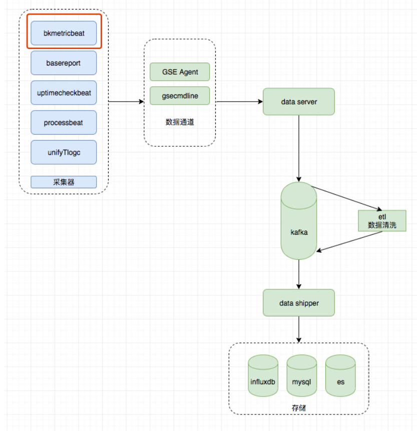
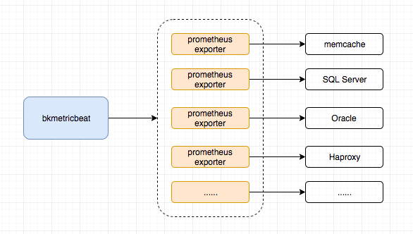
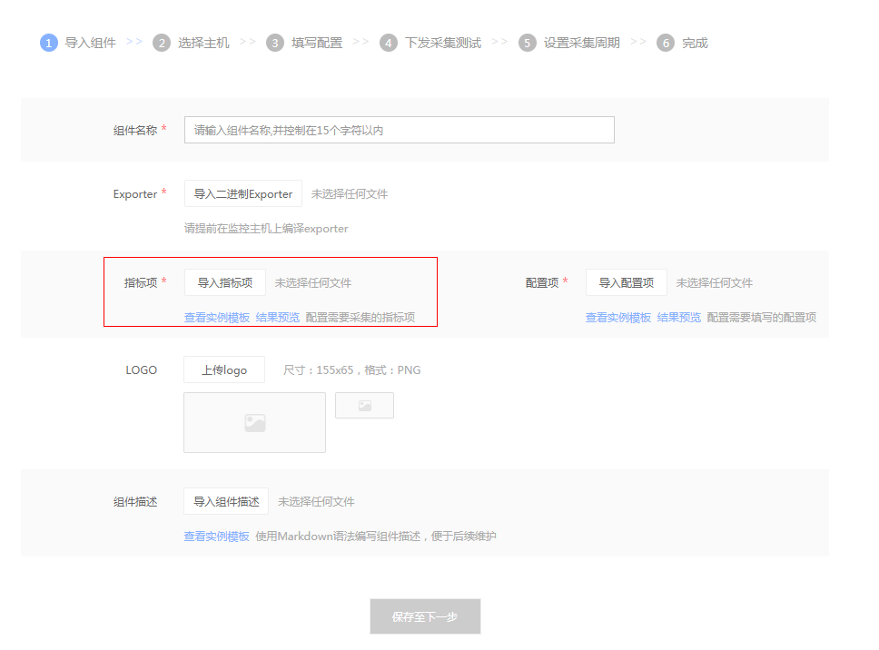
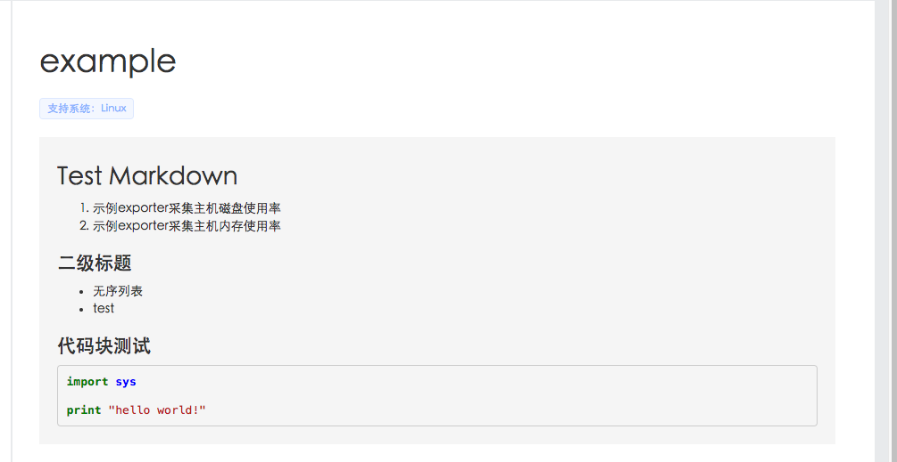
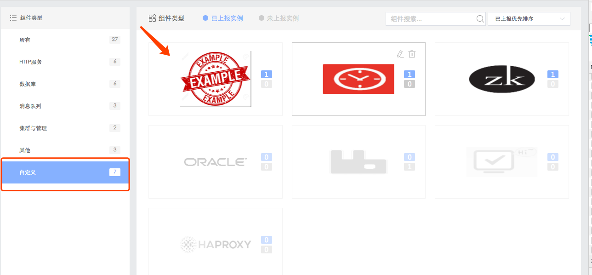
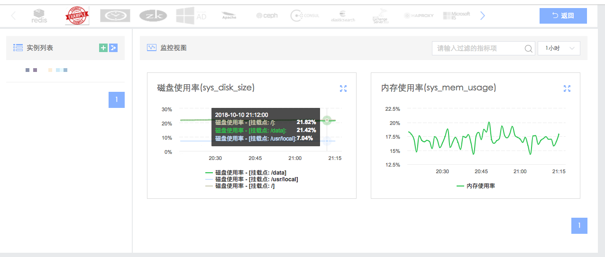

# 蓝鲸监控 - Exporter 开发

## 任务一： 开发⼀个自己的 Exporter

### 数据链路

#### 蓝鲸监控整体数据链路图



#### 自定义组件采集流程



- 蓝鲸监控通过 job 部署 prometheus 社区的 Exporter，对目标组件进行性能数据采集。接着 bkmetricbeat 从 Exporter 上周期拉取性能数据并通过数据通道上报。

### 自定义组件采集导入流程

- 蓝鲸监控当前支持使用 go 编写 Exporter

  1. 在社区找到适合自己的 Exporter 或者编写新的 Exporter

  2. 将源码编译成二进制文件

  3. 将编译的 Exporter 打成 zip 包

  4. 上传配置文件

## Exporter 开发

### Exporter 简介

- Exporter 本质上就是将收集的数据，转化为对应的⽂本格式，并提供 http 接口，供蓝鲸监控采集器
定期采集数据。

### Exporter 基础

- 指标介绍 Prometheus 中主要使⽤的四类指标类型，如下所示：

  - Counter (累加指标)

  - Gauge (测量指标)

  - Summary (概略图)

  - Histogram (直方图)

  最常使用的是 Gauge，Gauge 代表了采集的一个单个数据，这个数据可以增加也可以减少，比如 CPU 使用情况，内存使用量，硬盘当前的空间容量等。 Counter 一个累加指标数据，这个值随着时间只会逐渐的增加，比如程序完成的总任务数量，运行错误发生的总次数等，代表了持续增加的数据包或者传输字节累加值。

  >【注】：所有指标的值仅支持 float64 类型。


- 文本格式以下面输出为例：

```bash
# metric:
sample_metric1 12.47
sample_metric2 {partition="c:"} 0.44
```

  其中：

  \#: 表示注释 sample_metric1 和 sample_metric2 表示指标名称

  partition: 表示指标的作⽤维度，例如磁盘分区使⽤率，维度就是磁盘分区，即每个磁盘分区都有⼀个磁盘分区使⽤率的值

  c: 表示维度的值，例如磁盘分区的 C 盘 / D 盘等 12.47 和 0.44 表示对应指标的值

### Exporter 开发

- 环境搭建：

  - Golang 安装

  - apt-get install git

  - wget https://dl.google.com/go/go1.10.7.linux-amd64.tar.gz

  - tar -C /usr/local -xzf go1.10.7.linux-amd64.tar.gz

  - export PATH=$PATH:/usr/local/go/bin

  - export GOPATH=`你的代码目录`


  > 不同系统安装介绍：https://github.com/astaxie/build-web-application-with-golang/blob/master/zh/01.1.md

- Prometheus Exporter 开发依赖库

  ⾸先引⼊ Prometheus 的依赖库

```bash
go get -v github.com/prometheus/client_golang/prometheus
```

- 开发示例

1. 导⼊依赖模块: 本例计划采集主机的内存和磁盘信息，因此引⼊以下依赖库

  ```bash
  go get -v github.com/shirou/gopsutil
  go get -v github.com/go-ole/go-ole
  go get -v github.com/StackExchange/wmi
  go get -v github.com/golang/protobuf/proto
  go get -v golang.org/x/sys/unix
  ```
2. 新建⼀个 Exporter 项⽬： ⼀个 Exporter 只需要⼀个⽂件即可；在 GOPATH 下 src ⽬录下新建⼀个 test_exporter ⽬录和⼀个 test_exporter.go ⽂件: test_exporter.go ⽂件第⼀⾏必须写上 package main 可执⾏的命令必须始终使⽤ package main。

```go
import (
	"flag"
	"log"
	"net/http"

	"github.com/prometheus/client_golang/prometheus"
	"github.com/prometheus/client_golang/prometheus/promhttp"
	"github.com/shirou/gopsutil/disk"
	"github.com/shirou/gopsutil/mem"
)
```

3. 定义 Exporter 的版本（Version）、监听地址（listenAddress）、采集 url（metricPath）以及⾸⻚（landingPage）

```go
var (
	Version       = "1.0.0.dev"
	listenAddress = flag.String("web.listen-address", ":9601", "Address to listen on for web interface and telemetry.")
	metricPath    = flag.String("web.telemetry-path", "/metrics", "Path under which to expose metrics.")
	landingPage   = []byte("<html><head><title>Example Exporter" + Version + "</title></head><body><h1>Example Exporter" + Version + "</h1><p><ahref='" + *metricPath + "'>Metrics</a></p></body></html>")
)
```

4. 定义 Exporter 结构体

```go
type Exporter struct {
	error        prometheus.Gauge
	scrapeErrors *prometheus.CounterVec
}
```
5. 定义结构体实例化的函数 NewExporter

```go
func NewExporter() *Exporter {
	return &Exporter{}
}
```

6. Describe 函数，传递指标描述符到 channel，这个函数不⽤动，直接使⽤即可，⽤来⽣成采集指标的描述信息。

```go
func (e *Exporter) Describe(ch chan<- *prometheus.Desc) {
	metricCh := make(chan prometheus.Metric)
	doneCh := make(chan struct{})
	go func() {
		for m := range metricCh {
			ch <- m.Desc()
		}
		close(doneCh)
	}()
	e.Collect(metricCh)
	close(metricCh)
	<-doneCh
}
```

7. Collect 函数将执⾏抓取函数并返回数据，返回的数据传递到 channel 中，并且传递的同时绑定原先的指标描述符，以及指标的类型（Guage）；需要将所有的指标获取函数在这⾥写⼊。

```go
//collect 函数，采集数据的⼊⼝
func (e *Exporter) Collect(ch chan<- prometheus.Metric) {
	var err error
	// 每个指标值的采集逻辑，在对应的采集函数中
	if err = ScrapeMem(ch); err != nil {
		e.scrapeErrors.WithLabelValues("mem").Inc()
	}
	if err = ScrapeDisk(ch); err != nil {
		e.scrapeErrors.WithLabelValues("disk").Inc()
	}
}
```

8. 指标仅有单条数据，不带维度信息示例如下：

```go
func ScrapeMem(ch chan<- prometheus.Metric) error {
	// 指标获取逻辑，此处不做具体操作，仅仅赋值进⾏示例
	mem_info, _ := mem.VirtualMemory()
	// ⽣成采集的指标名
	metric_name := prometheus.BuildFQName("sys", "", "mem_usage")
	// ⽣成 NewDesc 类型的数据格式，该指标⽆维度，[] string {} 为空
	new_desc := prometheus.NewDesc(metric_name, "Gauge metric with mem_usage", []string{}, nil)
	// ⽣成具体的采集信息并写⼊ ch 通道
	metric_mes := prometheus.MustNewConstMetric(new_desc,
		prometheus.GaugeValue, mem_info.UsedPercent)
	ch <- metric_mes
	return nil
}
```

9. 指标有多条数据，带维度信息示例如下：

```go
func ScrapeDisk(ch chan<- prometheus.Metric) error {
	fs, _ := disk.Partitions(false)
	for _, val := range fs {
		d, _ := disk.Usage(val.Mountpoint)
		metric_name := prometheus.BuildFQName("sys", "", "disk_size")
		new_desc := prometheus.NewDesc(metric_name, "Gauge metric with disk_usage", []string{"mountpoint"}, nil)
		metric_mes := prometheus.MustNewConstMetric(new_desc,
			prometheus.GaugeValue, float64(d.UsedPercent), val.Mountpoint)
		ch <- metric_mes
	}
	return nil
}
```

10. 主函数

```go
func main() {
	// 解析定义的监听端⼝等信息
	flag.Parse()
	// ⽣成⼀个 Exporter 类型的对象，该 exporter 需具有 collect 和 Describe ⽅法
	exporter := NewExporter()
	// 将 exporter 注册⼊ prometheus，prometheus 将定期从 exporter 拉取数据
	prometheus.MustRegister(exporter)
	// 接收 http 请求时，触发 collect 函数，采集数据
	http.Handle(*metricPath, promhttp.Handler())
	http.HandleFunc("/", func(w http.ResponseWriter, r *http.Request) {
		w.Write(landingPage)
	})
	log.Fatal(http.ListenAndServe(*listenAddress, nil))
}
```

11. 编译 Exporter

```bash
go build test_exporter.go
./test_exporter
```

12. 运⾏起来后，访问 http://127.0.0.1:9601/metrics 即可验证

  ⾄此 Exporter 开发完成，其中 8，9 两步中的函数是重点，⽬前仅仅写了⼀些数据进⾏示例，其中的监控指标获取数据就是该部分的主要功能，需要编写对应逻辑获取指标的值。


## 任务⼆： 制作⼀键导⼊包

### Exporter 编译

蓝鲸监控 Exporter 默认只⽀持 64 位机器运⾏ Exporter。

#### linux 系统

```bash
# 编译 windows exporter
env CGO_ENABLED=0 GOOS=windows GOARCH=amd64 go build -o ./exporterwindows.exe test_exporter
# test_exporter 为 GOPATH 下我们创建的⽬录名
# 编译 linux exporter
env CGO_ENABLED=0 GOOS=linux GOARCH=amd64 go build -o ./exporter-linux
test_exporter
```

#### windows 系统

```bash
# 编译 windows exporter
SET CGO_ENABLED=0
SET GOOS=windows
SET GOARCH=amd64
go build -o ./exporter-windows.exe test_exporter
# 编译 linux exporter
SET CGO_ENABLED=0
SET GOOS=linux
SET GOARCH=amd64
go build -o ./exporter-linux test_exporter
```

### Exporter 打包

- 上传的 Exporter ⽂件限定为 zip 压缩包

- 上传后，后台会读取相应的压缩包特定名称的⽂件，因此必须保证命名的准确性。读取的⽂件如
下： exporter-linux : linux 采集器 exporter-windows.exe : windows 采集器

- ⾄少提供以上任意⼀种采集器，否则会报错；如果只上传了⼀种采集器，那视为该组件不⽀持其他
系统。

- 上传成功后如下图：


### 配置⽂件开发

#### 指标项

- 通常，Exporter 上报的指标 (metric) 种类⾮常多，⽽⽤户只会关⼼其中⼀部分重要指标。因此⽤户需
要通过编写指标配置⽂件来配置⾃⼰关注的指标。同时，配置⽂件也决定了结果表的格式。

  `指标配置⽂件是 JSON 格式的⽂件`。



- 配置⽂件样例

```json
[
    {
        "fields": [
            {
                "monitor_type": "metric",
                "type": "double",
                "name": "sys_disk_size",
                "unit": "%",
                "description": "磁盘使⽤率"
            },
            {
                "monitor_type": "dimension",
                "type": "string",
                "name": "mountpoint",
                "unit": "","description":" 挂载点 "
            }
        ],
        "table_name": "disk",
        "table_desc": "磁盘"
    },
    {
        "fields": [
            {
                "monitor_type": "metric",
                "type": "double",
                "name": "sys_mem_usage",
                "unit": "%",
                "description": "内存使⽤率"
            }
        ],
        "table_name": "mem",
        "table_desc": "内存"
    }
]
```

- 数据结构说明 ⾸先，最外层为列表，列表的每个元素为 Object，每个元素均代表⼀个结果表。 每个元素的字段说明和取值⻅下表：

| 字段名      | 解释        | 是否必填 | 取值                  | 最⼤⻓度 |
|---         |---        |---    |---                   |---     |
|table_name | 结果表英⽂名 | 是      | \^[a-zA-Z][a-zA-Z0-9_]*$ |15 |
|table_desc| 结果表中⽂描述 | 是 |                           |15|
|fields [].monitor_type| 字段类型 | 是 | 可选 "metric" 和 "dimension"||
|fields [].type | 字段数据类型 | 是 | 可选 "long","double" 和 "string"||
|fields [].name | 字段名称，不能超过 50 个字符 | 是 | \^[a-zA-Z][a-zA-Z0-9_]*$| 50|
|fields [].unit| 字段单位，可空 | 是 |||
|fields [].description| 字段描述 | 是 || 15|
|fields [].is_diff_metric| 是否为差值指标 | 否 | true 或 false||


#### 配置项（Exporter 启动参数配置）

- ⼤多数 Exporter 在启动时，需要提供额外的参数，如服务地址等。因此⽤户需要对启动所需参数项进⾏配置，在 Exporter 启动时才能提供对应参数值。 参数配置⽂件是 JSON 格式的⽂件 。 配置项将直接体现在配置表单中。

- 配置文件样例

```json
[
    {
        "default": "http://localhost:9601/metrics",
        "mode": "collector",
        "type": "text",
        "name": "_exporter_url_",
        "description": "采集 URL",
        "visible": false
    },
    {
        "default": "localhost:9601",
        "mode": "cmd",
        "type": "text",
        "name": "--web.listen-address",
        "description": "监听地址",
        "visible": false
    }
]
```

- 数据结构说明，⾸先，最外层为列表，列表的每个元素为 Object，每个元素均代表⼀个配置项。 每个元素的字段说明和取值⻅下表：

| 字段名 | 解释 | 是否必填 | 取值 | 最大长度 |
|---   |---|---    |---   |---     |
|name| 配置名称，可空，为空时必须将该项置于首位 | 是 |  | 50 |
|mode| 传参方式 | 是 | 可选 "cmd"(命令行参数)，"env"(环境变量) 或 "collector"(_exporter_url_字段专用) | |
|type | 数据类型 | 是 | 可选 "text"，"password" 或 "file"(需要上传文件) |  |
|description| 配置描述 | 是 | | 50 |
|default| 配置默认值，可空 | 是 | | |

- 命令行参数拼接规则

    1. 当配置名称以 `--` 开头，参数名称和参数值的拼接方式为用 `=` 拼接，如 `--settings=something`

    2. 当配置名称不以 `--` 开头，参数名称和参数值的拼接方式为用空格拼接，如 `-settings something`

- 重要提示:

    - 配置文件中，必须提供 `_exporter_url_` 参数。该参数为获取 metric 的完整 url。且该参数必须设置默认值。出于安全考虑，监听地址的 IP 只能设置为 `127.0.0.1` 或 `localhost`，配置方式参见上述样例。

#### logo

155 * 65 的图片即可。

#### 描述

使用 Markdown 语法编写组件描述描述，在用户组件接入时提供指导。



#### 保存自定义组件采集

- 填写组件名

  1. 上传 Exporter

  2. 上传 metrics.json

  3. 上传 config_schema.json

  4. 上传 logo.png

  5. 上传 description.md

- 选择服务器

- 填写配置

- 采集测试

- 设置采集周期

- 完成并下发采集器

以上动作完成后，在组件监控页面，将会多一个组件。选择自定义分类，可以看到所有自定义采集的组件。



## 自定义组件一键导入

为了方便自己开发的组件采集 Exporter 可以共享给更多的用户，蓝鲸监控支持一键导入。
已经添加成功的自定义组件，可以按照以下格式打成 zip 压缩包：

1. 后台解析文件时，无视文件目录结构，直接扫描符合命名规则的文件

2. 不得出现相同文件名的文件，否则会报错

| 文件名 | 解释 |
|---  |--- |
|exporter-linux | Linux Exporter 的二进制文件 （至少提供一种 Exporter） |
|exporter-windows.exe | Windows Exporter 的二进制文件 （至少提供一种 Exporter）|
|logo.png | 组件 Logo，限定 PNG 格式 |
|description.md | 组件描述，限定 Markdown 格式 |
|metrics.json | 指标项配置文件，配置格式参见 [[指标配置文件]]  |
|config_schema.json | 配置项配置文件，配置格式参见 [[Exporter 启动参数配置文件]] |
|info.json |Exporter 包信息，需要提供 name (必须) 和 display_name (可选)|

### info.json

以上文件列表，有一个新的文件 `info.json` 。

info.json 文件示例

```json
{
    "name":"example",
    "display_name":"example",
    "supported_version":"linux"
}
```

字段名 | 含义
---|---
name | 组件名称，唯一标识符，只能由字母和数字组成
display_name | 组件显示名称
supported_version | 采集器支持版本，版本信息会显示在配置页面上

显示效果如下


## 自定义组件更新

如果需要更新组件，进入编辑模式，选择相应文件进行更新即可


附件是一个样例 Exporter 一键导入包，另外包含了打包好的 Exporter 以及源码

使用附件导入后，选择主机下发后，效果如下：


