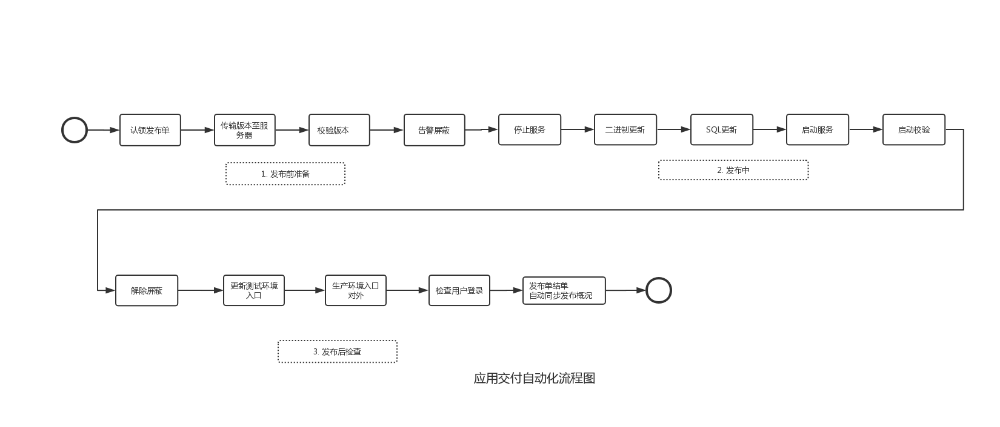
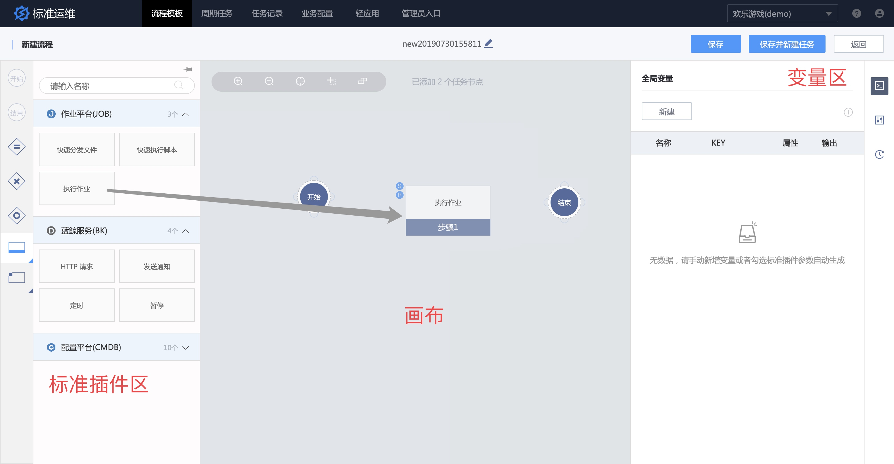
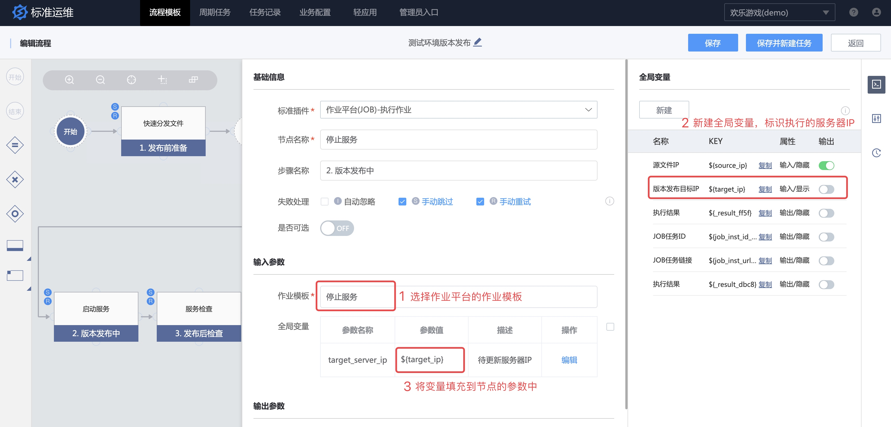
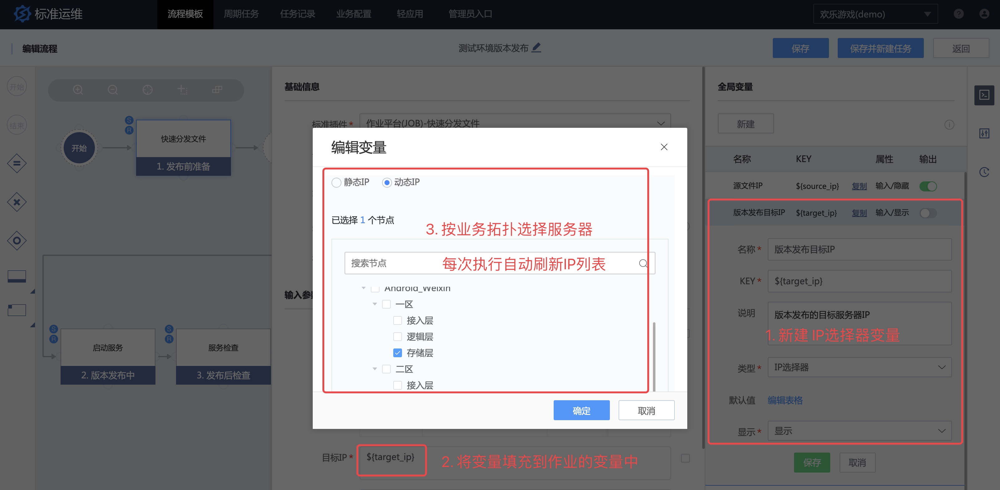
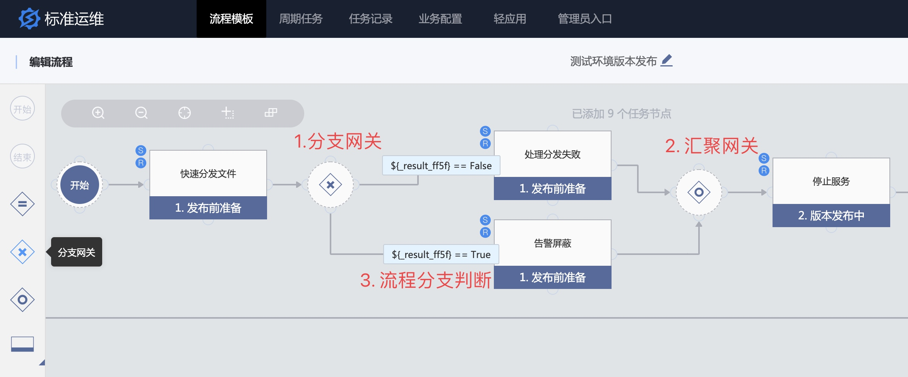
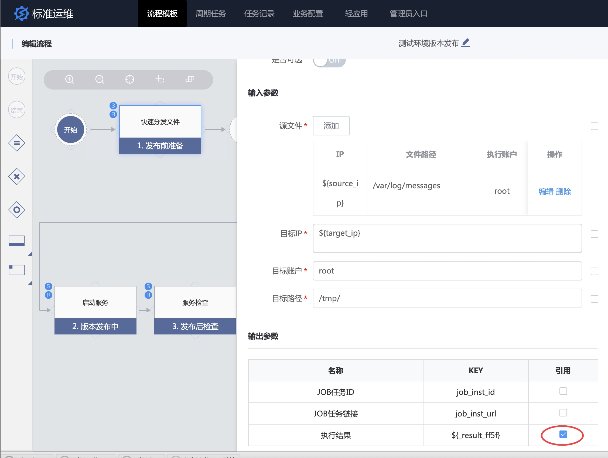

# 场景案例 

随着业务的不断发展，企业应用系统也变得越来越复杂，不同应用厂商，其背后研发团队间的技术栈，如所使用的开发语言、开发框架、操作系统、数据库等技术组合，以及发布变更、故障处理等运维操作场景和操作流程，都是不同的。应用架构的差异性和复杂性，也给 CI/CD 应用在包交付模式和灵活的编排上提出更多的挑战。

另外研发与运维团队职责不同以及环境差异化，经常导致研发人员在对配置或环境进行修改之后，不会及时告知运维人员；而运维人员发布应用时，由于对运行环境和应用的内部细节缺乏了解，难以正确选择运行环境和控制发布流程，往往会遇到各种各样的问题，沟通成本非常高。

同时，业务需要更频繁的发布，如果仅仅依靠运维人员的手工部署，一方面效率低、易出错，另外也无法满足不断增加的应用系统和部署环境。所以，开发人员对自助发布的需求越来越强烈，希望能够通过自助平台实现一键发布。

依托蓝鲸体系化设计，可以实现流程编排和应用自动发布的标准运维应运而生。
以下图为例，通过标准运维对应用发布流程进行分解，分解后的每个步骤可以包含多个原子，依次进行代码拉取，备份，以及分发文件等操作。我们可以根据固化的发布流程来创建任务，每个任务都是一次真正的业务场景作业，任务可以被暂停、被强制终止。通过标准运维的助力，实现更可靠的发布，提高部署频率，与业务目标保持紧密一致。

标准运维适配场景有：

- 运维场景：发布、变更、开区、扩缩容等执行类操作

- 其他场景：监控告警、配置管理、开发工具、企业 IT、办公应用、其它

本节介绍运维常见场景之一：业务发布操作。

## 业务发布操作

### 创建流程模板

进入新建流程页面，创建流程模板。选择流程模板的类型为 "运维工具"。如果有接入 ESB 消息通道，请选择任务节点失败和完成时通知方式和通知人员分组。

从左侧标准插件区，选择发布流程中需要的标准插件作为流程的节点，拖拽至流程画布中。

点击标准插件打开参数配置页，填写参数。

- 修改步骤名称为该节点的分组标签；
- 根据需要配置该标准插件是否需要忽略错误或可选；
- 勾选 "添加为变量" 添加到全局变量中，便于执行任务时动态修改；
- 分支设置。节点之间的流转可规则可以通过分支进行设置。

### 全局变量

服务器发生故障后，保障下一次应用发布获取最新的 IP 列表，可以通过 IP 选择器实现。

### 流程分支

应用发布过程中，执行成功 和 执行失败的处理分支不同，可以通过流程分支功能对上一步执行结果为真或为假来判断。

提前引用上一步流程节点的输出参数“执行结果”，将其用于上图中的流程分支表达式。

按照上述步骤，完成流程模板的创建。完成后选择“保存”，或者“保存并新建任务（立刻新建任务）”。这里我们以选择“保存”为例。

### 执行任务

流程模板保存完毕之后，回到业务流程列表中，点击“新建任务”。

在任务页面，点击“执行”。请参看视频内容。

../assets/sops_execution.mp4

任务执行之后可以查看每个任务执行详情。

失败的节点会阻塞任务流程，可以单击查看执行详情，了解异常信息内容。

失败的节点可以重试，点击 "重试" 可以重新填写该标准插件节点参数并执行。
