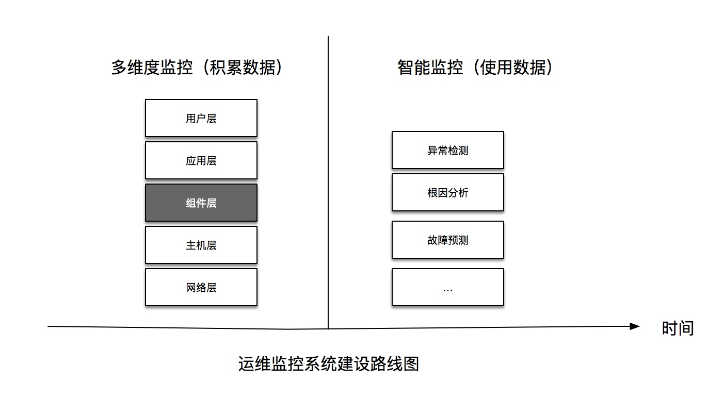
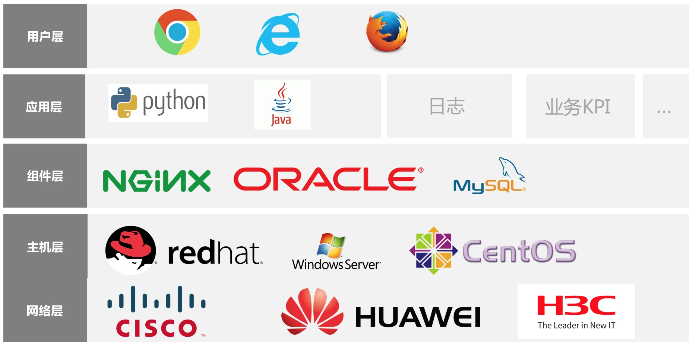
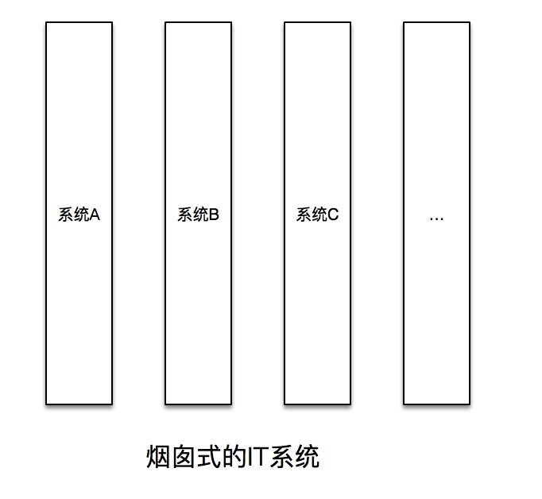
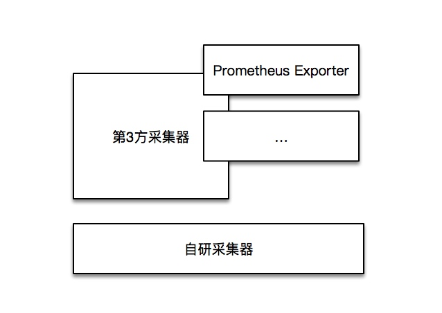
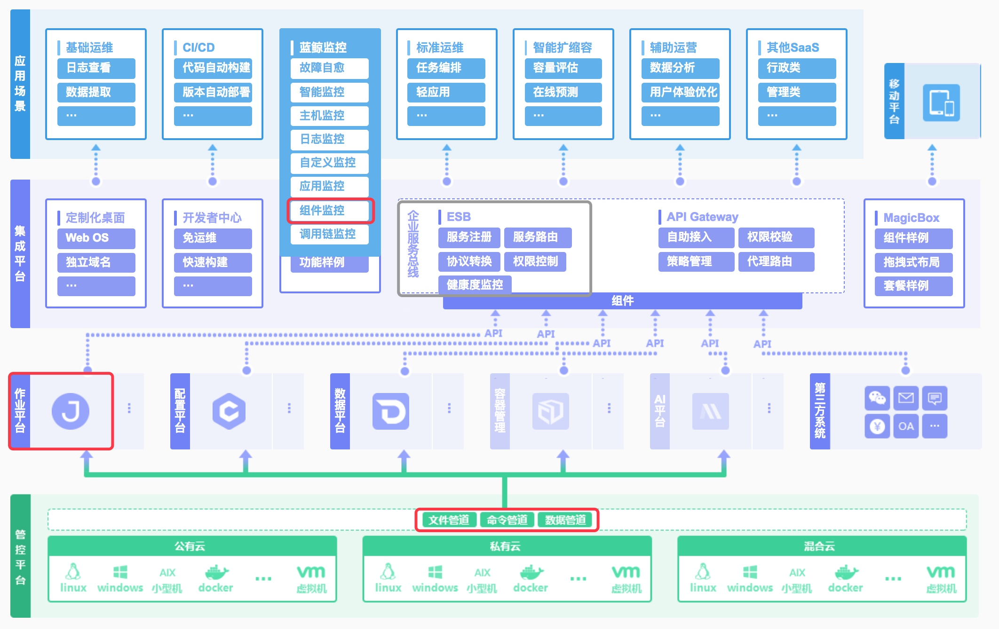

# 场景案例

## 多维度监控：智能监控的数据基础
> 以组件监控为例，介绍监控产品的路线图

运维监控系统的作用不言而喻，贯穿运维的 5 项职能：发布、变更、故障处理、体验优化、日常需求，保障上述职能的服务可用性。

从大数据的特性(数据量大、**多维度**、完备性)[1]来看，运维监控系统的建设可以分为 2 个阶段：`多维度监控`（积累数据） 和  `智能监控`(使用数据），通过多维度监控实现出了故障能看、能查，智能监控提前发现风险、找出故障根源。

组件监控是多维度监控体系的第 3 层，主要对**常见开源组件、中间件的性能指标做监控**，比如 Nginx 的性能指标有 Active Connections（当前客户端连接数）、Waiting（等待中的连接数）等，Oracle 的性能指标有 SQL 硬解析率、表空间使用率等。

通过采集组件的关键性能指标，实时获悉组件的运行状况，提前发现问题，而不是仅监控进程或端口是否存活（**进程或端口都正常时，不代表可以提供服务**）。

本文以建设组件监控为例，从`多维度监控的组成`、`监控产品要解决的3个问题`、`组件监控的技术选型`、`云端下发采集器配置`、`社区的开放能力`来介绍监控产品设计路线图。

## 多维度监控的组成

从用户访问链路的角度，将监控指标的维度分为`用户层`、`应用层`、`组件层`、`主机层`、`网络层`。

(多维度监控的组成)

用户层，通过服务拨测等方式模拟用户的访问行为，不用等用户投诉上门；应用层，通过调用链等方式追踪应用的调用状态；其他三层较为容易理解就不做介绍了。

通过这 5 层+其他关键指标（如日志、业务 KPI 曲线等），构筑监控系统的多维度监控能力，**为第二阶段的智能监控提供数据支撑**。

## 监控产品要解决的 3 个问题

除了获取关键的性能指标外，监控产品还需要解决 3 个问题， **退可做故障关联分析，进可建设运维的智能化场景**。

### 对 IT 系统的自主掌控能力

由于**对 IT 系统自主掌控能力的缺乏**，"正在更换 IT 系统" 和 "走向更换 IT 系统的路上，是部分中、大型企业在"互联网+"浪潮下积极拥抱互联网的现状。

鉴于这种情况，部分行业已明确已表明[2][3]必须加大对 IT 系统自主掌控的能力。

于是，产品设计时，需考虑能让监控系统的使用者可以参与到监控系统的开发或部分开发.

### 拒绝再造一个烟囱

竖井式的结构估计是大部分企业构建 IT 系统的现状，每个系统间毫无关联，每买一套系统等于多构建一个信息孤岛，附加值极低。

如果想实现`退可做故障关联分析，进可建设运维的智能化场景`，可在基于 PaaS 的运维平台上建设[4]，通过 iPaaS 打通企业内部的各个 IT 运营系统。

### 组件繁多，完全自研不太现实

行业中应用的组件种类繁多，从数据库、存储、HTTP 服务到消息队列等共 100+，完全自研肯定不现实。

好的办法是自研核心、行业支撑不好的组件，剩下的借助行业多年积累的能力，少造一点轮子，为社会省点电。

## 组件监控的技术选型

在 2.3 中提到自研 + 第 3 方开源采集器的思路，这里以开源采集器 Prometheus Exporter 为例。

Prometheus Exporter 的社区很活跃[5]，支持 100+ 常见开源组件，部分大厂甚至专门编写对应的 Prometheus Exporter，比如 Oracle 编写的 Weblogic Exporter，IBM 编写的 IBM MQ exporter，k8s、etcd 甚至内置基于 Exporter 规范的 metrics。

按照这种方案，只需要做一个**协议转换**即可把指标入库。

（对接行业采集器 简易时序图）

## 体验优化：云端下发采集器配置

解决基础需求后，需要马上来优化下体验。

把采集器或配置下发至被监控的主机上，一般需要手动部署或使用第三方的工具（如 Ansible）。

切换多个系统来完成一件事情，体验非常不好。

有一个优化方案，**通过 iPaaS 使用管控平台层的文件分发和命令执行能力**[4]，让用户在一个页面完成配置流程，提升效率。

（蓝鲸体系架构图）

## 社区的开放能力

在满足基础功能和优化产品体验后，接下来考虑**产品的可扩展性**。

先解决用户一键导入自研组件的便利性，接下来提供一个交流平台让社区用户可以自由分享。

**在获得社区开源能力的同时，也需要反哺社区**。

## 结尾

属于基础监控范围的多维度监控相对智能监控来说，不太光鲜，但**它是智能监控的数据基础**，没有多维度监控提供的数据，无法落地故障预测、故障根因分析等智能监控场景。

传统企业或互联网企业在拥抱互联网变革时，需冷静思考，按照路线图逐步实现。

## 参考文献
- [1] 吴军. 智能时代：大数据与智能革命重新定义未来 [M]. 北京：中信出版集团，2016-8.
- [2] 中国人民银行. [中国金融业信息技术“十三五” 发展规划](http://images.mofcom.gov.cn/coi/201706/20170629110047159.pdf)  [EB/OL]. 2017.06
- [3] 中国银监会. [中国银行业信息科技“十三五”发展规划监管指导意见（征求意见稿）](http://www.cbrc.gov.cn/chinese/home/docView/1940BD4B2D7740CC90F4FE4C6B3CD316.html) [EB/OL]. 2016.07.15
- [4] 中国通信标准化协会.[云计算运维平台参考框架及技术要求](http://v2.opensourcecloud.cn/article/2) [EB/OL]. 2017.11.16
- [5] Prometheus. [EXPORTERS AND INTEGRATIONS](https://prometheus.io/docs/instrumenting/exporters/) [EB/OL].
