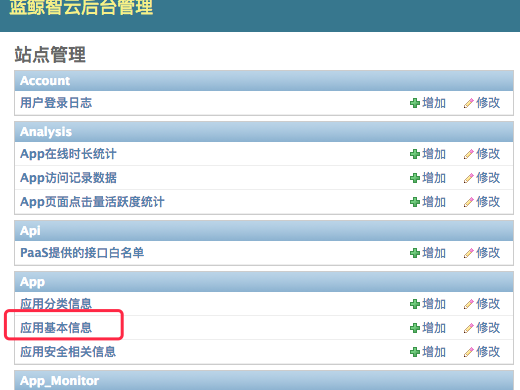

# 开源版 SaaS 标准运维替换社区版部署指南

## 开发环境后台部署

### 部署蓝鲸社区版
标准运维 SaaS 的登录鉴权依赖于蓝鲸智云 PaaS 平台，业务信息需要从蓝鲸智云配置平台提供的接口获取，所以你需要先下载部署蓝鲸社区版，作为开发联调环境。

- [下载网址](https://bk.tencent.com/download/)

- [安装方案](../../../README.md)

- [产品论坛](https://bk.tencent.com/s-mart/community)

- QQ 交流群：495299374

### 准备本地 RabbitMQ 资源

在本地安装 RabbitMQ，并启动 RabbitMQ-Server，服务监听的端口保持默认（5672）。

### 准备本地 Redis 资源
在本地安装 Redis，并启动 Redis-Server，服务监听的端口保持默认（6379）。

### 准备本地 MySQL
在本地安装 MySQL，并启动 MySQL-Server，服务监听的端口保持默认（3306）。

### 本地 Python 包安装
通过 Git 拉取源代码到工程目录中，并进入目录下运行
```bash
pip install -r requirements.txt
```

### 配置本地环境变量和数据库
1) 设置环境变量

设置环境变量的目的是让项目运行时能正确获取以下变量的值：
BK_PaaS_HOST、BK_CC_HOST、BK_JOB_HOST 分别改为你部署的蓝鲸社区版域名、配置平台域名、作业平台域名（需要加上 http 前缀。如果是 https 域名，请改为 https 前缀）。

APP_ID 设置为你的社区版标准运维应用 ID，默认设置为 bk_sops。APP_TOKEN 设置为你的社区版标准运维应用 TOKEN，默认可以访问 `http://{BK_PaaS_HOST}/admin/app/app/`，找到名为"标准运维"的应用，查看详情获取 Token 字段值。

有三种方式设置本地开发需要的环境变量。

一是手动设置，即执行如下命令

```bash
export APP_ID="bk_sops"
export APP_TOKEN="{APP_TOKEN}"
export BK_PaaS_HOST="{BK_PaaS_HOST}"
export BK_CC_HOST="{BK_CC_HOST}"
export BK_JOB_HOST="{BK_JOB_HOST}"
```

二是直接修改 scripts/develop/sites/community/env.sh，然后执行

```bash
source scripts/develop/sites/community/env.sh
```

第三种方式，你可以直接修改项目的 settings 配置，先修改 `config/__init__.py` ，设置项目的基础信息

```python
APP_ID = 'bk_sops'
APP_TOKEN = '{APP_TOKEN}'
BK_PaaS_HOST = '{BK_PaaS_HOST}'
```

然后修改 config/dev.py ，追加配置平台域名、作业平台域名配置
```python
BK_CC_HOST = '{BK_CC_HOST}'
BK_JOB_HOST = '{BK_JOB_HOST}'
```

2) 修改 config/dev.py，设置本地开发用的数据库信息，添加 Redis 本地信息

```python
DATABASES = {
    'default': {
        'ENGINE': 'django.db.backends.MySQL',  # 默认用MySQL
        'NAME': APP_ID,       # 数据库名 (默认与APP_ID相同)
        'USER': 'root',       # 你的数据库user
        'PASSWORD': '',       # 你的数据库password
        'HOST': 'localhost',  # 数据库HOST
        'PORT': '3306',       # 默认3306
    },
}

Redis = {
    'host': 'localhost',
    'port': 6379,
}
```

### 创建并初始化数据库
1) 在 MySQL 中创建名为 bk_sops 的数据库
```bash
CREATE DATABASE `bk_sops` DEFAULT CHARACTER SET utf8 COLLATE utf8_general_ci;
```

2) 在工程目录下执行以下命令初始化数据库
```bash
Python manage.py migrate
Python manage.py createcachetable django_cache
```

### 打包并收集前端静态资源
1）安装依赖包
进入 frontend/desktop/，执行以下命令安装
```bash
npm install
```

2）本地打包
在 frontend/desktop/ 目录下，继续执行以下命令打包前端静态资源
```bash
npm run build -- --STATIC_ENV=dev
```

3）收集静态资源
回到项目根目录，执行以下命令收集前端静态资源到 static 目录下
```bash
Python manage.py collectstatic --noinput
```

前端资源文件需要单独拷贝收集，执行如下命令
```bash
rm -rf static/dev static/images
mv frontend/desktop/static/dev static/
mv frontend/desktop/static/images static/
```

### 配置本地 hosts
Windows：在 C:\Windows\System32\drivers\etc\host 文件中添加“127.0.0.1 dev.{BK_PaaS_HOST}”。

Mac：执行 "sudo vim /etc/hosts"，添加 "127.0.0.1 dev.{BK_PaaS_HOST}"。

### 启动进程
```bash
Python manage.py celery worker -l info
Python manage.py runServer 8000
```

### 访问页面
使用浏览器开发 `http://dev.{BK_PaaS_HOST}:8000/` 访问应用。

## 开发环境前端部署

### 安装 node.js
标准运维前端是用 Vue 框架开发的，在本地开发时需要先安装 node.js，直接去官网下载软件并安装即可，地址为：https://nodejs.org/en/。

### 安装依赖包
进入 frontend/desktop/，执行以下命令安装。
```bash
npm install
```

### 修改配置文件
把 frontend/desktop/ 中的所有文件中的 {BK_PaaS_HOST} 换成你部署的蓝鲸社区版地址，如果你的应用 ID 修改过，请把所有文件中的 bk_sops 改成你的新应用 ID。

### 启动前端工程
进入 bk_sops/src/frontend/desktop/，执行以下命令运行前端工程。默认启动的是 9000 端口，然后通过 `http://dev.{BK_PaaS_HOST}:9000/` 访问前端应用，此时后端请求会自动转发到你启动的 django 工程，即 8000 端口。
```bash
npm run dev
```

### 开发后打包
前端开发完成后，正式发布前需要先打包。还是在 frontend/desktop/ 目录下，执行如下命令打包，会自动在当前目录下生成 static/dist/ 目录，即打包好的前端资源。

```bash
npm run build -- --SITE_URL="/o/bk_sops" --STATIC_ENV="open/prod"
```

### 收集静态资源
前端打包后，需要在工程目录下运行如下命令收集静态资源到 static 下。
```bash
rm -rf static/open static/images
mv frontend/desktop/static/open static/
mv frontend/desktop/static/images static/
```

## 正式环境源码部署

### Fork 源代码到自己的仓库
通过 Fork 源代码到自己的仓库，可以进行二次开发和定制。建议公共特性开发和 bug 修复通过 Pull requests 及时提交到官方仓库。如果不需要进行二次开发，请直接在 releases 中获取打包好的版本，上传部署升级官方标准运维 SaaS。

### 打包并收集前端静态资源
1）安装依赖包
进入 frontend/desktop/，执行以下命令安装
```bash
npm install
```

2）本地打包
在 frontend/desktop/ 目录下，继续执行以下命令打包前端静态资源
```bash
npm run build -- --STATIC_ENV=dev
```

3）收集静态资源
回到项目根目录，执行以下命令收集前端静态资源到 static 目录下
```bash
Python manage.py collectstatic --noinput
```

### 创建应用
前往你部署的蓝鲸社区版平台，在"开发者中心"点击"应用创建"，填写需要的参数，注意代码仓库填写你的 Github 仓库地址，账号和密码。注意，由于官方已经存在一个名为"标准运维"的应用，你只能填写不一样的应用名称和应用 ID，如"标准运维定制版"、bk-sops-ce。

### 修改配置
前往你部署的蓝鲸社区版平台，在"开发者中心"点击"新手指南"，按照文档指引进行操作，主要是数据库配置修改和设置 APP_ID, APP_TOKEN, BK_PaaS_HOST 等变量。

### 开通 API 白名单
手动在你部署的蓝鲸社区版的中控机执行如下命令，开通标准运维访问蓝鲸 PaaS 平台 API 网关的白名单，以便标准插件可以正常调用 API。
```bash
source /data/install/utils.fc
add_app_token bk-sops-ce "$(_app_token bk-sops-ce)" "标准运维定制版"
```
注意把"标准运维定制版" 和 bk-sops-ce 改为你创建的应用名称和应用 ID。

### 准备 Redis 资源
在你部署的蓝鲸社区版的运行环境找一台机器，新建一个 Redis 服务账号和密码。也可以公用部署蓝鲸社区版时已经有的 Redis 服务。

### 部署应用
前往你部署的蓝鲸社区版平台，在"开发者中心"点击"我的应用"，找到你刚才创建的应用，点击"应用部署"，请勾选"启用 celery"和"启用周期性任务"。这样你就可以在测试环境访问你新建的"标准运维定制版"应用了。

### 修改标准运维环境变量配置

更多可查看 [标准运维部署](../../../SaaS部署/标准运维/sops_install.md)

打开蓝鲸桌面 `http://{BK_PaaS_HOST}/console/`，在应用市场找到名字为“标准运维” (APP_CODE: bk_sops) 的应用，添加到桌面并打开。
修改浏览器链接为 `http://{BK_PaaS_HOST}/o/bk-sops-ce/admin/`，打开标准运维管理后台页面。





找到环境变量 "EnvironmentVariables" 表并单击进入编辑页面。将第二步中准备好的 Redis 信息填写到环境变量配置中，即增加 3 条数据 BKAPP_Redis_HOST、BKAPP_Redis_PORT、BKAPP_Redis_PASSWORD。
如果直接复用蓝鲸已经部署好的 Redis 服务，环境变量可以分别配置为：

- BKAPP_Redis_HOST=在中控机执行 `source /data/install/utils.fc && echo $Redis_IP` 获取

- BKAPP_Redis_PASSWORD=在中控机执行 `source /data/install/utils.fc && echo $Redis_PASS` 获取

- BKAPP_Redis_PORT=6379


### 重新部署应用
由于环境变量只有在项目启动时才会加载，所以修改后必须重新部署才会生效，请进入开发者中心，找到你创建的应用，点击 【应用部署】，请勾选 【启用 celery】和 【启用周期性任务】。

### 替换官方标准运维 SaaS
按照前面的步骤操作后，你已经在蓝鲸社区版 PaaS 上创建了一个标准运维的定制版本，如果功能测试正常（请主要测试流程模板创建、任务执行、任务操作等核心功能），那么你可以选择下架官方标准运维应用，并用定制版本替换。

1) 如果需要保留官方标准运维应用的所有数据，你需要修改数据库配置
获取你部署的蓝鲸社区版平台的数据库账号密码，以及官方标准运维应用的数据库名，默认测试环境是 bk_sops_bkt，正式环境是 bk_sops。修改代码的 config/stag.py 和 config/prod.py，分别修改为上面获取的官方标准运维应用的数据库信息。
```python
DATABASES = {
    'default': {
        'ENGINE': 'django.db.backends.MySQL',  # 默认用MySQL
        'NAME': 'bk_sops',                     # 数据库名 (测试环境写 bk_sops_bkt)
        'USER': '',                            # 官方标准运维应用数据库user
        'PASSWORD': '',                        # 官方标准运维应用数据库password
        'HOST': '',                   		   # 官方标准运维应用数据库HOST
        'PORT': '',                            # 官方标准运维应用数据库PORT
    },
}

```

2) 由于标准运维接入了蓝鲸 PaaS 平台 API 网关，你需要修改标准运维网关配置
请参考 [API 网关替换方式](5.1/部署维护/场景案例/开源产品替换/Paas平台/replace_paas_with_opensource_version.md) 文档，把标准运维 API 转发到你的定制版本的接口。

## 正式环境上传部署
### Fork 源代码到自己的仓库
通过 Fork 源代码到自己的仓库，可以进行二次开发和定制。建议公共特性开发和 bug 修复通过 Pull requests 及时提交到官方仓库。如果不需要进行二次开发，请直接在 releases 中获取打包好的版本，上传部署升级官方标准运维 SaaS。

### 修改版本号
如果有任何代码修改，请务必修改 app.yml 文件中 version 版本号。

### 打包并收集前端静态资源
1）安装依赖包
进入 frontend/desktop/，执行以下命令安装
```bash
npm install
```

2）本地打包
在 frontend/desktop/ 目录下，继续执行以下命令打包前端静态资源
```bash
npm run build -- --STATIC_ENV=dev
```

3）收集静态资源
回到项目根目录，执行以下命令收集前端静态资源到 static 目录下
```bash
Python manage.py collectstatic --noinput
```

### 准备环境
由于上传部署只支持从本地安装 Python 依赖包，而 Python 安装包是和部署的机器架构相关的，所以你需要在和蓝鲸社区版部署的机器一样的环境执行打包脚本。即准备 CentOS 7 以上操作系统的机器，可以使用 docker。

### 应用打包
在 CentOS 机器上，通过 git 拉取你的标准运维定制版仓库代码后，在项目根目录下运行以下命令执行打包操作。
```bash
bash scripts/publish/build.sh
```
注意，该脚本会把项目依赖的 Python 包都下载到生成的版本包中，请务必保证把项目依赖的 Python 包都加入到 requirements.txt 文件中。打包完成后会在当前目录下生成一个名为 "bk_sops-当前时间串.tar,gz" 格式的文件，即版本包。

### 上传版本并部署
前往你部署的蓝鲸社区版平台，在【开发者中心】点击【S-mart 应用】，找到官方标准运维应用并进入详情。在 "上传版本" 中，点击【上传文件】后选中上一步打包生成的版本包，等待上传完成。然后点击【发布部署】，你就可以在测试环境或者正式环境部署你最新的版本包了。
