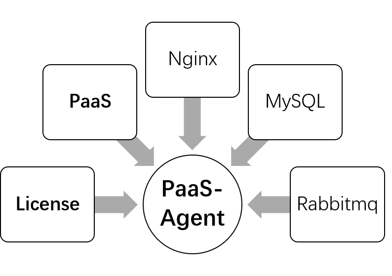

# 安装 SaaS 详细步骤

SaaS 部署环境分为测试环境 (APPT) 和正式环境 (APPO)，**注意测试环境与正式环境不能安装在同一台主机中**。对应的后台模块叫 `PaaS_Agent` ，正式环境和测试环境的区分主要是启动时环境变量的差异。




PaaS_Agent 使用 Python 的 `virtualenv` 工具来隔离不同的 SaaS 环境。有一些 SaaS 需要使用 `Celery` 框架，故依赖 `RabbitMQ` 。这些依赖前述步骤已经安装完成。

集成安装这个模块的命令在快速部署文档里提到： `./bk_install app_mgr` 。

## 激活 RabbitMQ

由于 RabbitMQ 的安装和初始化在前面步骤已经完成，此时会跳过这两步，到激活 RabbitMQ ：

```bash
./bkcec activate rabbitmq
```

激活 RabbitMQ 是调用 PaaS 的接口，传递 RabbitMQ 的用户名和密码，供 PaaS 验证 RabbitMQ 的部署是否成功。
验证成功后，PaaS 会把这个 RabbitMQ 示例标记为激活可用状态，才能继续后面的 SaaS 安装部署操作。

## 安装 APPO 环境

```bash
./bkcec install appo
./bkcec initdata appo
./bkcec start appo
./bkcec activate appo
 ```

详解：

1. 安装 APPO  (install_PaaS_Agent 函数)

  - 创建 APPS 用户，该用户用来启停 SaaS 的后台 Python 工程

  - 拷贝 PaaS_Agent 二进制和证书目录

  - 安装专属 Python 解释器

  - 使用专属 Python 创建 PaaS_Agent 的 `virtualenv` 

  - 创建 `$INSTALL_PATH/.appenvs` 目录作为 `WORKON_HOME` 

  - 安装 PaaS_Agent 部署 SaaS 时的 Python 包依赖

  - 安装 Nginx 做 SaaS 的反向代理

  - 渲染 PaaS_Agent 模板，生成配置

  - 添加 `/etc/hosts` 记录

2. 初始化 APPO (initdata_PaaS_Agent)

  - 初始化 PaaS_Agent MySQL 数据库

  - 注册 PaaS_Agent 到 PaaS 平台，成功后获取到 `sid` 和 `Token`。

  - 根据 `sid` 和 `Token` ，修改 PaaS_Agent 的配置文件

3. 启动 PaaS_Agent

4. 激活 PaaS_Agent

启用这个已经注册的 PaaS_Agent 主机。在做 SaaS 上下架时，只会操作激活过的 PaaS_Agent 服务器。

## 安装 APPT 环境

```bash
./bkcec install appt
./bkcec initdata appt
./bkcec start appt
./bkcec activate appt
```
