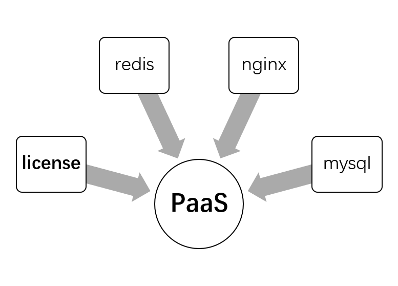

# 安装 PaaS 平台 详细步骤

PaaS 平台是蓝鲸产品的门户入口，所以安装蓝鲸先安装 PaaS 平台。

PaaS 平台依赖的组件和服务如下：



安装 PaaS 平台前，我们需要将中控机解压的 src/、install/ 目录根据 `install.config` 配置的 IP 和模块关系来分发文件。

```bash
./bkcec sync all
```

## 安装 Consul

蓝鲸整个平台的内部通信基础是 Consul，所以最先安装的开源组件是 Consul。

```bash
./bkcec install consul
./bkcec start consul
```

过程详解：

[Consul](https://www.consul.io/) 是一个分布式的服务发现和配置管理的开源组件。它只有一个二进制文件，所以安装的主要工作在于生成需要的配置文件。

安装 Consul 的主要步骤在 `install_consul` 函数中，它主要做了以下几个事情：

  - 生成 Consul 的主配置 `consul.conf` 和 Consul 用的服务定义文件`consul.d/service.json` 是由 `parse_config` 这个 Python 脚本读取 `install.config` 在每台机器上自动生成。

  - 生成 Consul 的配置后，还需要生成启动的 Supervisor 配置。

  - 修改系统的 `/etc/resolv.conf` 加上 `nameserver 127.0.0.1` 并保证它是第一条记录

启动 Consul ，正常启动后，可以用 `consul members` 确认是否三台主机，其余机器为 client （如果机器数量大于 3）。

## 安装 License 服务

证书服务 License 也是所有蓝鲸产品的全局依赖，第二个安装。

```bash
./bkcec install license
./bkcec start license
```

详解：
1. 拷贝 License 代码和 cert 目录。

2. 渲染模块配置文件。

3. 启动 License。


## 安装 MySQL

开始安装 MySQL 数据库，并初始化设置。

```bash
./bkcec install mysql
./bkcec start mysql
./bkcec initdata mysql
```

详解：

1. 安装包里自带了 MySQL 的二进制，所以直接拷贝到安装目录。新建 MySQL 用户。

2. 渲染 my.cnf 模板，然后建立 /etc/my.cnf 的软链。

3. 执行 `mysql_install_db` 命令，初始化。

4. 启动 MySQL。

5. 对所有 install.config 里的 IP 在 MySQL 上授权。


## 安装 Redis

```bash
./bkcec install redis
./bkcec start redis
```

详解：

1. 将 Redis 命令拷贝到 `/usr/bin`。

2. 渲染配置模板。

3. 修改系统内核参数。

    - `net.core.somaxconn = 512`

    - `vm.overcommit_memory = 1`

4. 启动 Redis。

## 安装 Nginx

Nginx 通过 yum 命令从 EPEL 源里安装。

```bash
./bkcec install nginx
./bkcec start nginx
```

详解：

1. yum 安装 Nginx。

2. 渲染 Nginx 模板，并将 `/etc/nginx/nginx.conf` 软链到 `$INSTALL_PATH/etc/nginx.conf`。

3. 创建 `$INSTALL_PATH/miniweb/download` 目录，并将 `/data/src/miniweb` 目录和 `/data/install/functions` 文件同步过去。供 Agent 安装时可以 HTTP 远程下载用。

4. 启动 Nginx。

## 安装 PaaS

最后安装 PaaS 模块。

```bash
./bkcec install paas
./bkcec initdata paas
./bkcec start paas
```

详解：

1. 安装 PaaS 用的函数叫 `install_open_paas` 。注意 PaaS 在安装部署脚本里均会被转换为 open_paas 来标识。这是一个特例。

    - 修改 `/etc/hosts` 配置 FQDN。

    - 拷贝代码文件到 `$INSTALL_PATH/open_paas`。

    - 安装 open_paas 专用的 Python。

    - 创建四个子工程（appengine，login，esb，paas）的 Python 虚拟环境。

    - 安装每个子工程依赖的 pip 包。

    - 渲染模板文件。

2. 初始化 PaaS

    - 导入 SQL 初始化数据库。

    - PaaS Login ESB 分别做 Python migrate 初始化。

    - ESB 同步 API 文档事项。

    - 添加 APP 的鉴权白名单，没有 session 时也可以调用 ESB。

3. 启动 PaaS。
