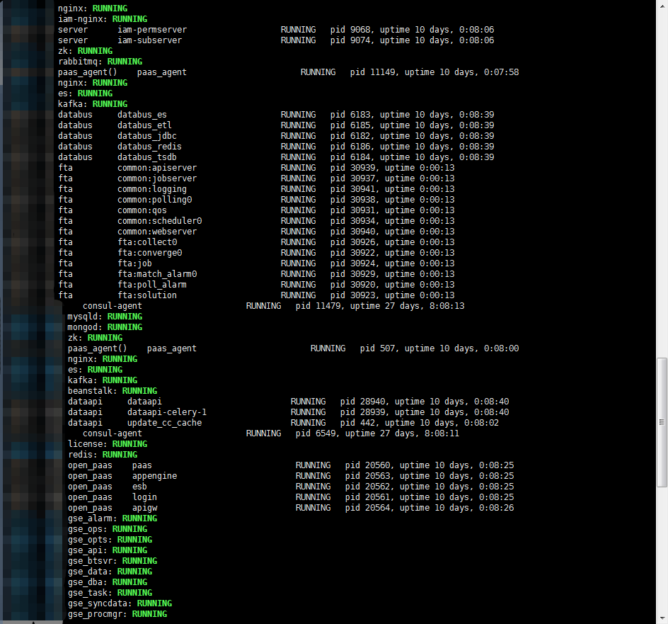
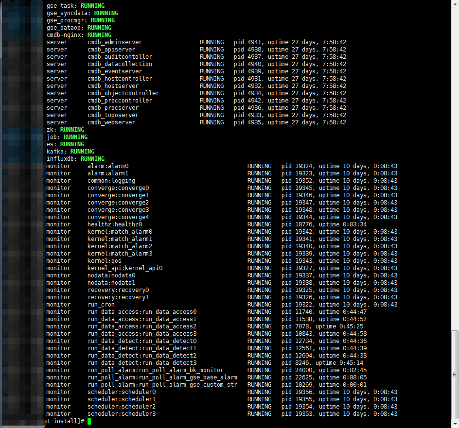
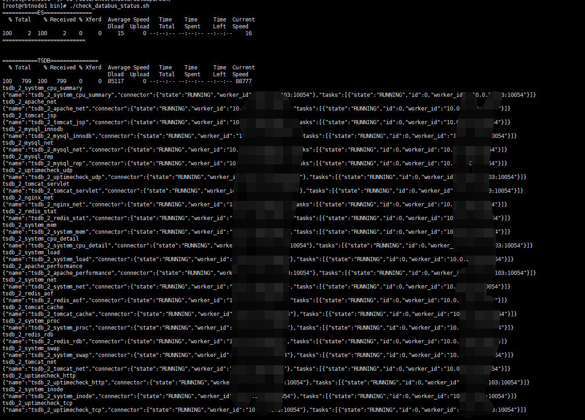

## 环境验证

### 从后台验证环境是否安装正常

1. 登录到中控机，通过脚本自带的命令查询蓝鲸后台模块的运行状态

```bash
# 加载环境变量和蓝鲸安装维护的函数
source /data/install/utils.fc

# 查看运行状态
./bkcec status all
```




如上图所示，所有模块状态都是 `RUNNING` 则说明蓝鲸社区版后台模块部署正常。

2. 检查 BKDATA 清洗数据的任务是否正常启动

  - 社区版 V5.0 及更早版本，在部署 BKDATA 的主机上执行:

  ```bash
  # 检查是否有包含 databus_etl 的任务
  crontab -l  
  ```

  - 社区版 V5.1 及之后版本，在部署完 BKDATA 后，检查进程  `run_cron` 是否存活:

3. 检查 BKDATA 运行状态

  ```bash
  # 从中控机中跳转到 BKDATA Svr，执行检查脚本检查接口，无报错即正常

  ssh $BKDATA_IP
  /data/bkce/bkdata/dataapi/bin/check_databus_status.sh
  ```


4. 检查 Agent 状态是否正常：

  - 在中控机执行

  ```bash
  ./bkcec status gse_agent

  # 返回 “Running” 说明 Agent 状态正常
  # 如果返回 "Exit" 则需要手动安装或者启动
  # 手动安装
  ./bkcec install gse_agent
  # 启动
  ./bkcec start gse_agent
  ```

5. 检查健康状态 API：

  - 蓝鲸产品后台提供了健康检查的接口，用 HTTP GET 请求访问，接口地址和端口用变量表达：

  ```bash
  cd /data/install && source utils.fc

  # PaaS 注意 URL 末尾带上/
  curl http://$PAAS_FQDN:$PAAS_HTTP_PORT/healthz/

  # CMDB
  curl http://$CMDB_IP:$CMDB_API_PORT/healthz

  # JOB
  curl http://$JOB_FQDN:$PAAS_HTTP_PORT/healthz
  ```

- 蓝鲸监控 SaaS 的监控检查接口，可以用浏览器直接访问:

```bash
http://$PAAS_FQDN:$PAAS_HTTP_PORT/o/bk_monitor/healthz/
```

### 从页面验证功能是否运行正常

请先 **配置 host 或者 DNS** 解析后，确认访问社区版域名（部署完成后提示的域名）是否正常。

  - 配置 host / DNS 解析：配置 DNS 服务或者在本地配置 host 解析请参照 蓝鲸配置文件 global.env 或者中控机下 `/etc/hosts`。

从蓝鲸工作台-开发者中心-服务器中检查 **正式服务器** 是否激活。


从蓝鲸工作台-开发者中心-第三方服务中检查 **RabbitMQ 服务** 是否激活。


登录蓝鲸，从各 SaaS 验证环境功能是否运行正常。

> 产品功能介绍&使用手册请参考各 [产品白皮书](https://bk.tencent.com/docs/)
