# 基础功能

## 开发环境

按照开发者的习惯，为每个开发者自己创建的 SaaS 提供了 3 个环境，最大限度保证自研 SaaS 的可用性。

1\. 本地开发环境：开发者在本地开发、编码的环境。

2\. 测试环境：SaaS 未发布之前，部署到 PaaS 平台测试其功能的有效性和完整性，也叫预发布环境。

3\. 正式环境：SaaS 部署到正式环境后，其他用户即可在“工作台/应用市场”看到该 SaaS。

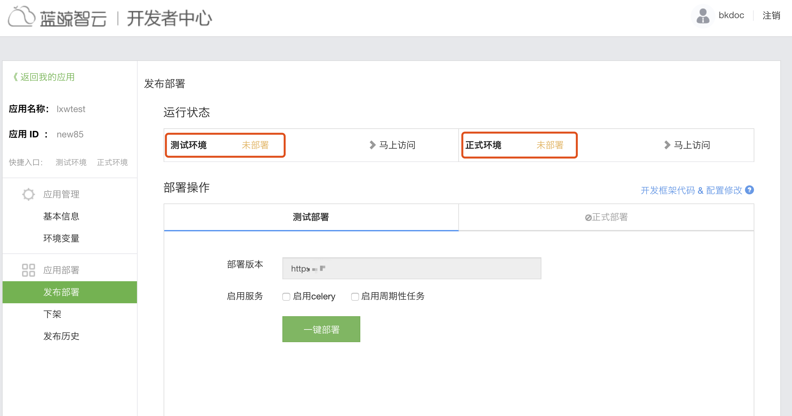

所以，本地环境和测试环境的主要用户为开发者，用于开发者编码和自测；正式环境，即就是将 SaaS 正式发布对外，是所有用户都可以看到并使用的。

> 说明：虽然用户可以看到系统，但是是否能访问这个系统，取决于应用的设计与开发，可以针对用户进行授权。

## 开发框架

为了提高 SaaS 应用的可维护性，提高开发效率，蓝鲸提供了统一的“前后台开发框架”，

该“开发框架”分为前台和后台两部分，集成统一登录鉴权模块、功能开关模块、WEB 安全防护模块、功能组件模块等通用模块。

从而让用户可以专注于代码逻辑的构建。

当用户将代码在本地运行，或者打开线上的“开发框架” SaaS ，将会看到下图的界面。

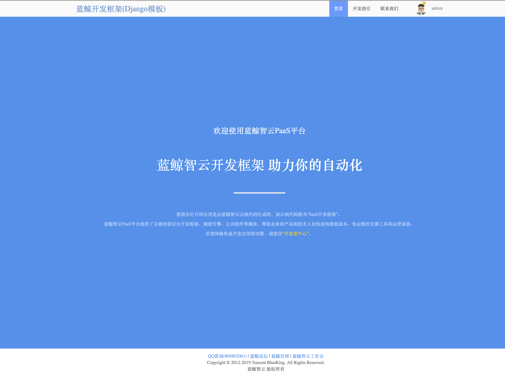

为了最大程度降低开发难度，基于“开发框架”研发了“开发样例”，即就是做了部分通过的功能。

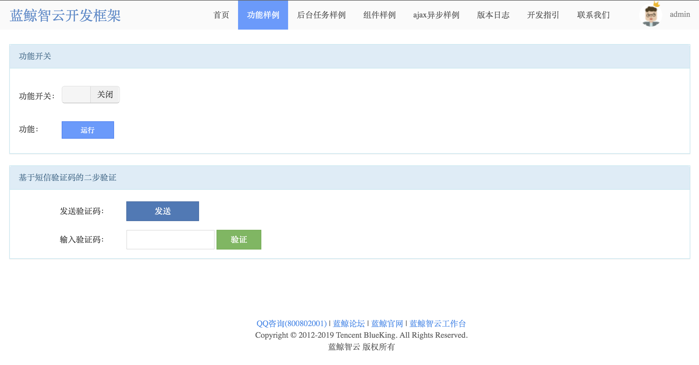

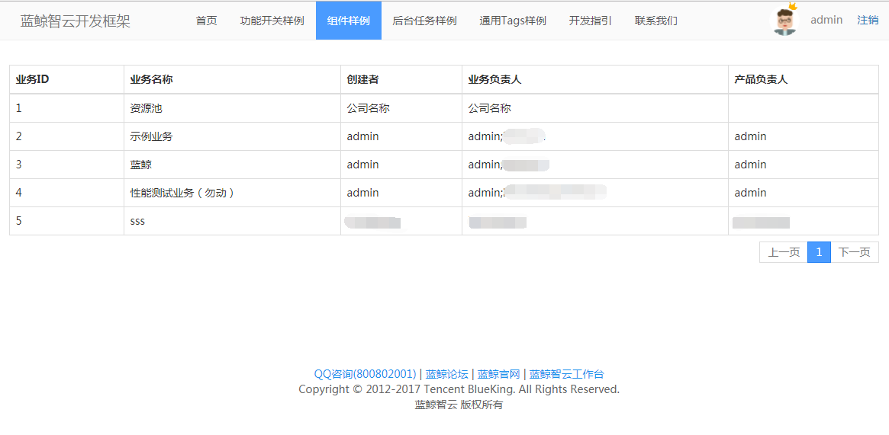

- 统一登录鉴权模块：统一使用 PaaS 平台的“用户管理”和登录逻辑

- WEB 安全防护：主要包括防 csrf 攻击和防 xss 攻击。使用 Django 提供的 csrf 模块，开发者无需做其他设置。如需对某些请求去除 csrf 验证，可在对应 view 函数添加 csrf_exempt 装饰器；xss 攻击的中间件，会对所有请求参数将进行特殊字符转义(富文本内容、URL 有特殊处理方式)。

- 功能开关模块：支持开发者在 SaaS 开发迭代中对功能选择性开放、灰度测试等。

## 两种仓库类型

支持 Git 和 SVN 两种仓库类型。输入有效的仓库地址，“创建应用”后，可以根据当前 SaaS 的开发情况，选择是否将蓝鲸的开发框架代码初始化到仓库中，开发者基于该框架进行 SaaS 开发。
建议新手选择“初始化”框架到仓库的操作。

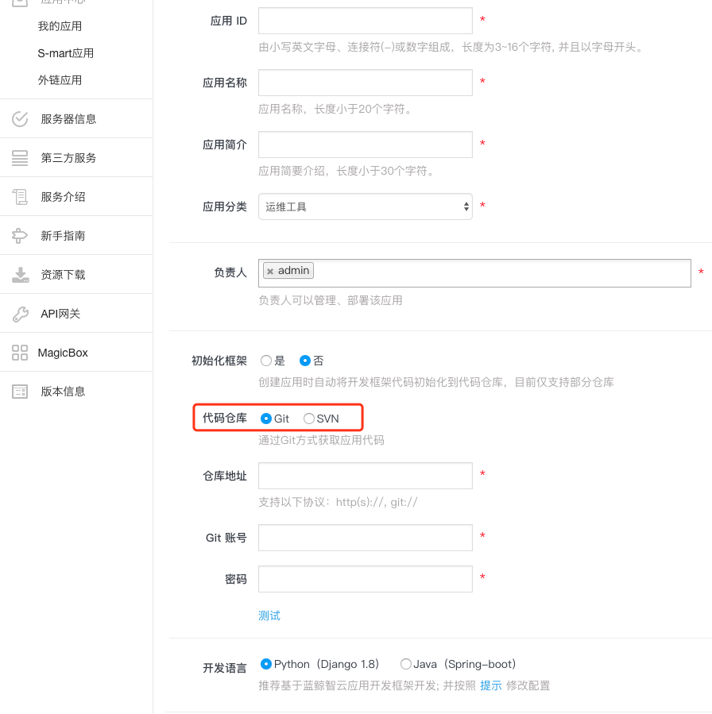

## 可扩展的环境变量

对应有些敏感变量，比如外部数据库 IP，账号密码等，直接写到代码中会有暴露风险，而且每次修改，需要拉取代码，修改提测上线后才能使用，蓝鲸开发者中心针对该场景，使用变量设置功能完全可以解决开发者的变量硬编码问题。

## 免运维托管

- 社区版

该功能是 PaaS 模式最核心的功能，基于 Virtualenv 的应用部署模式，
在 SaaS 部署时，平台为会它们创建独立的 Virtualenv，保证每个 SaaS 拥有一套“隔离”的 Python 运行环境。SaaS 的服务进程则是以 uWSGI 的 cheaper 模式托管，由于采用了 Busyness cheaper 算法，uWSGI 能够根据繁忙度，动态的调配 worker 个数，从而达到合理利用系统资源的目的

- 企业版

在 SaaS 应用部署时，平台为会它们创建独立的容器，保证每个应用拥有一套“隔离”的运行环境。SaaS 的服务进程则是以 uWSGI 的 cheaper 模式托管，由于采用了 Busyness cheaper 算法，uWSGI 能够根据繁忙度，动态的调配 worker 个数，从而达到合理利用系统资源的目的。

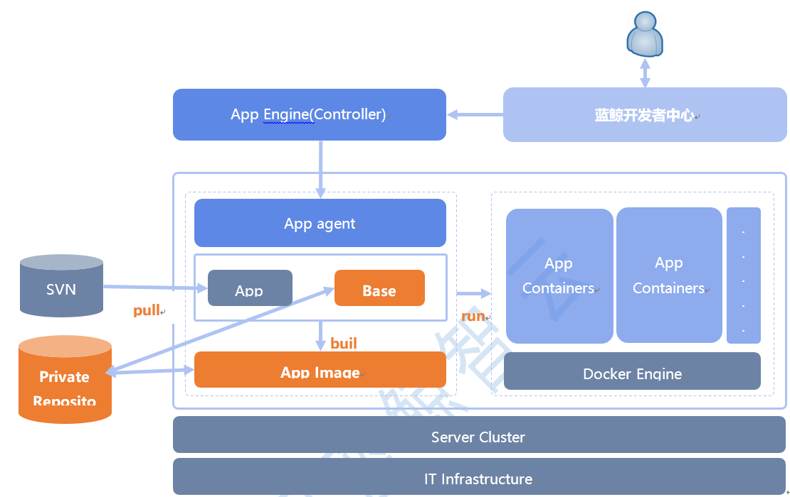

## SaaS可见范围

可以根据“用户管理”的“组织架构”设置 SaaS 的可见范围，仅限授权用户才可以在“应用市场”中检索并添加到该 SaaS。

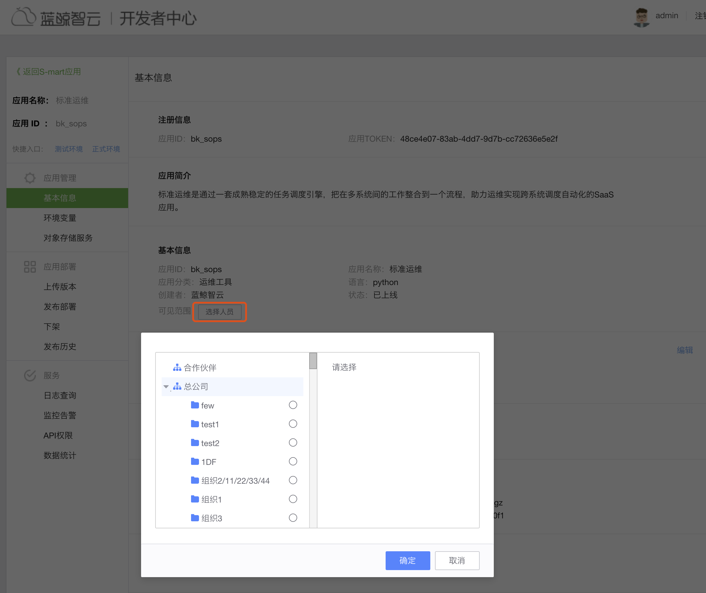

## 指定服务器部署SaaS应用

若承载 SaaS 运行的服务器有多个，在正式环境部署 SaaS 的时候，针对 SaaS 的特殊性可以选择独立的服务器来部署。

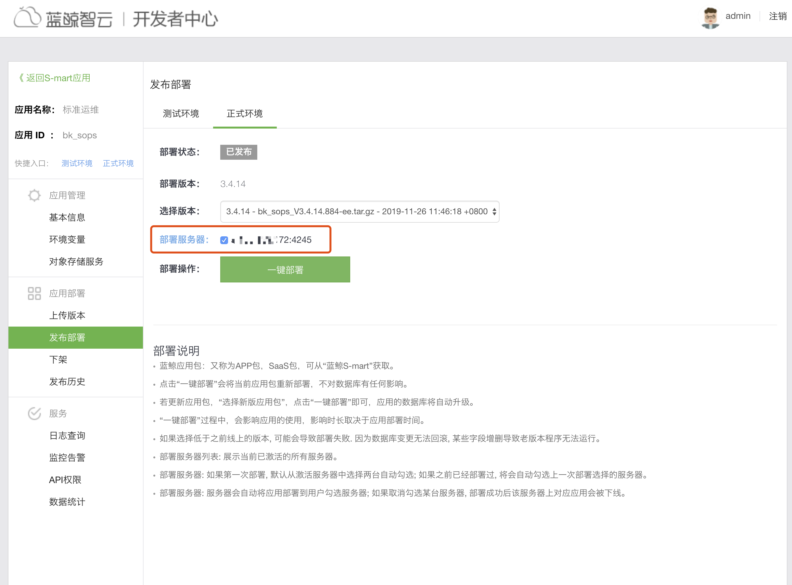

## 应用数据库托管服务

“S-mart 应用”部署后，PaaS 平台为每个应用分配有两套独立数据库(测试库和正式库)，并配备高可用方案，保证数据的可靠性。

若选择基于 Django 框架进行 SaaS 开发，可以使用 Django admin 在线查看数据库。将数据模型注册到 admin.py 文件中，就可以在页面上对数据进行

增、删、改、查。

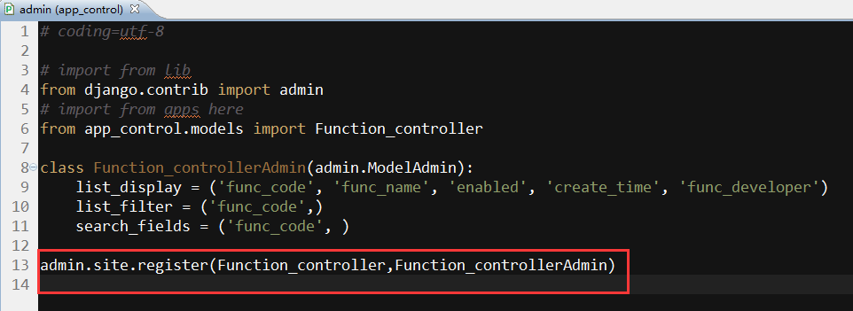

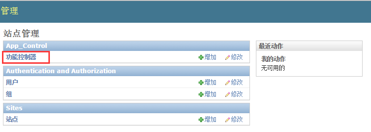

## API 网关

PaaS 平台是基于 SOA 理念设计的，其中最重要的就是企业服务总线，即“ API 网关”。它有两个作用：

其一，为整个蓝鲸体系服务，蓝鲸的其他平台，如：配置平台、作业平台、数据平台等，均可以将各平台的特性以 API 的形式对接到组件中，便于 PaaS 平台上的 SaaS 调用，整合各个平台的强大功能，发挥最实用的价值。

其二，第三方系统，如微信公众号/微信企业号/企业微信、邮件系统、OA 系统、AD 系统、财务系统等非蓝鲸体系内的运营系统，同样以 API 的形式将特性对接到组件，丰富和完善整个 PaaS 平台企业服务总线的服务。从而使 PaaS 平台之上的 SaaS 可以调度一些，连接一切。

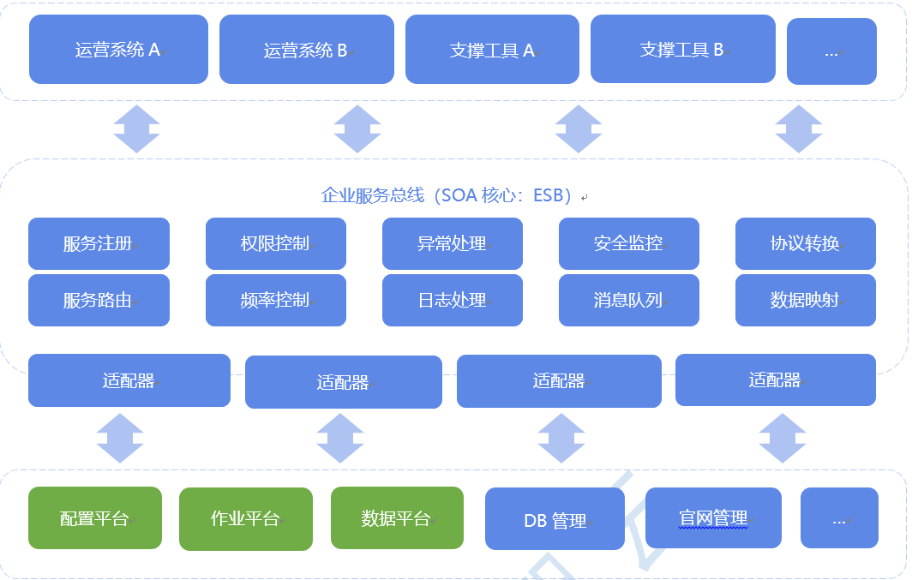

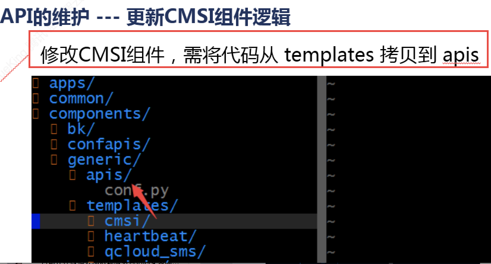

特别说明：

1）APIGateway 是企业服务总线(ESB)功能的一部分。经常用“ESB”指代通过编码方式接入的 API，该模式接入后，需要根据指引，需要重启服务模块才能生效；“APIGateway”指代通过 RESTful API 的模式接入的 API ，该模式接入后，无需重启服务模块。

2）根据当前的组件目录结构，组件加载顺序为：先查找“apis”，再查找“templates”，请将用户自定义编码接入的 API 放到“templates”目录下，否则版本更新中，会覆盖官方提供的原生 API。

“API 网关” 仅限于“管理员”角色操作，从“开发者中心”—>“API 网关”进入使用。

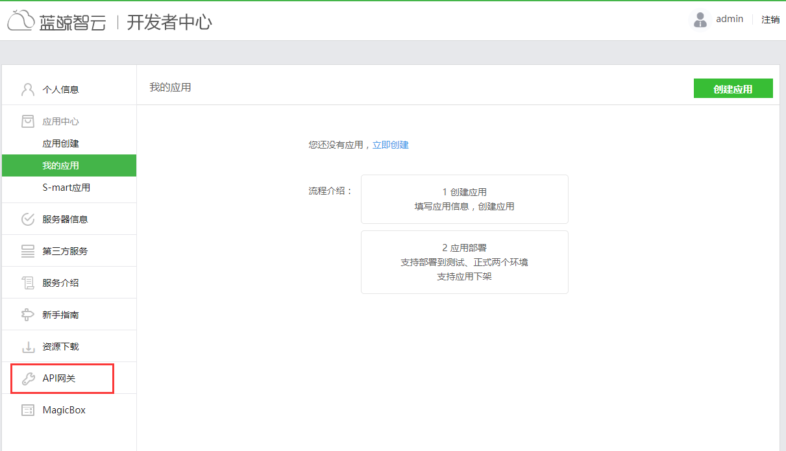

“API 网关” 给出了详细的使用文档，分为以下几个部分：

1\. 简介：概述 API 网关，API 网关的两种接入教程：编码方式(采用 Python 语法)和自助接入方式

2\. 系统管理：API 来自于哪个系统，可以看成是 API 的分类

3\. 通道管理：API 访问的路径管理

4\. 自助接入：目前仅支持 http 请求形式的自助接入

5\. 使用指南：详细的 API 网关的使用教程，如接入教程、自定义配置信息调整、CMSI 消息通知如何配置，以及如何为新加入的组件生产/更新“组件文档”

6\. API 文档：查询蓝鲸官方的和自定义接入组件的使用文档

## MagicBox

[MagicBox](http://magicbox.bk.tencent.com/)(链接：http://magicbox.bk.tencent.com/)，又称为前端工具集。是一个前端资源 PaaS 平台，为蓝鲸应用开发者提供丰富的前端资源，包括常用的 UI 组件、JS 插件及基础模版，开发者可以通过蓝鲸 MagicBox 快速构建页面。它还提供完整的套餐样例供开发者选择，开发者也可以在线拖拽组件组装页面，让前端布局可视化。

## 开发培训

蓝鲸为开发者提供了详细的线上 [视频教程](https://cloud.tencent.com/developer/edu/major-100008)。

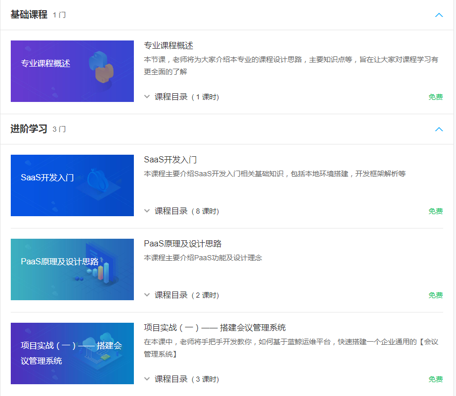

提供了长期有效的 [早起鸟儿有虫吃](https://bk.tencent.com/s-mart/community/question/440) 学习活动，参与有礼。

## 开发交流

为了提供即时有效的技术沟通，组建了“运维开发群”QQ群号码：878501914
