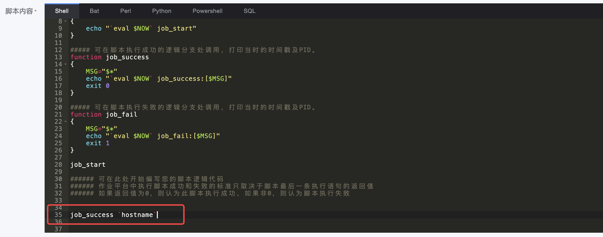
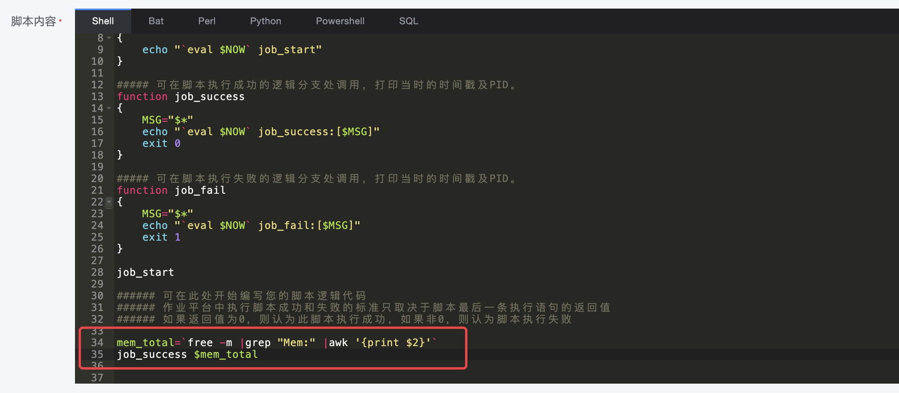

# 使用内置函数实现执行结果分组功能

在日常运维事务中，我们经常会碰到需要统计线上服务器信息的需求，常见的解决方案是在一台运维机上写 "处理登录机器并获取信息" 的脚本逻辑，然后逐台或者并发对多台机器执行，并把结果记录到文本中，最后再对文本进行排序或去重等处理来得出最终结果；而在蓝鲸作业平台中，可以通过内置函数 `job_succese` 轻松达到目的。

## 场景案例

下面我们列举几个实际需求场景案例来演示：

### 1. 检查所有机器是否存在重复主机名的问题

- 代码逻辑

  

- 结果展示

  

  在上图中我们会发现，`job_success` 方法会将 hostname 执行的结果相同的依次分组展示；红框中可见每个分组都只有1台主机，那么结论就是不存在 **主机名重复** 的问题。

### 2. 检查线上机器的内存分布情况

- 代码逻辑

  

- 结果展示

  

  如上图所见，最终4台机器的内存分布分别有 `16G` `32G` 和 `64G` 三种；其中，`32G`内存的机器有两台。

## 结论

诸如此类的 "对多台服务器的信息进行分组显示/统计" 场景还有很多，这里就不一一列举了；希望通过上述示例可以帮助你了解蓝鲸作业平台的内置函数使用方法，感谢你的支持。