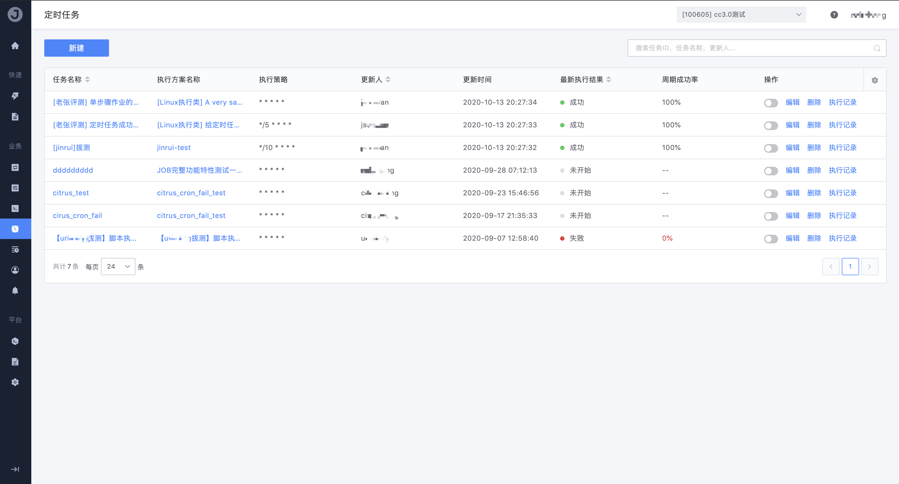
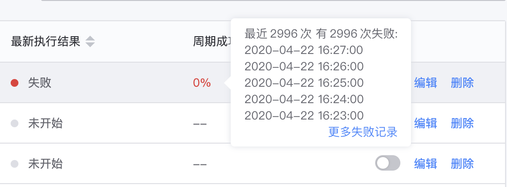
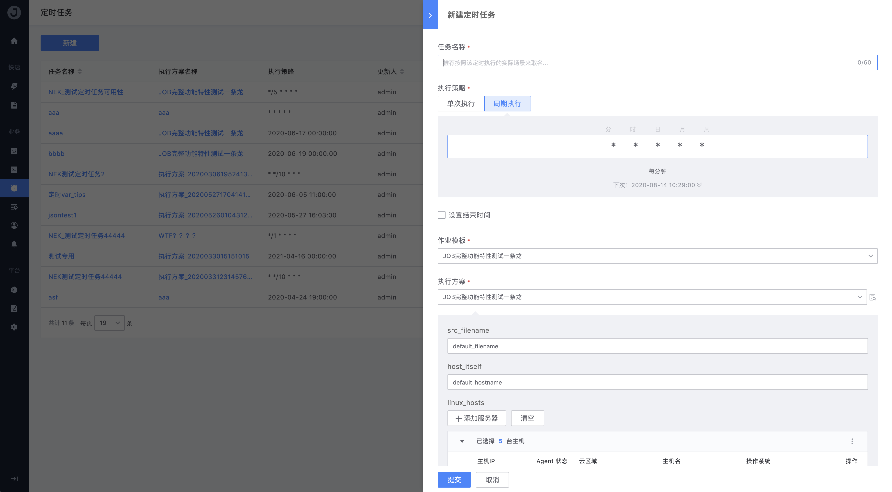

# 定时任务

作业除了可以直接执行以外还支持定时执行，定时任务功能就是用来管理定时执行的作业任务；除此之外，由于定时场景的特殊性无法即时获取到执行结果反馈，所以引入了 `周期成功率` 的统计方法，帮助用户确认循环执行过程中有哪些任务出现了执行失败的问题。

## 定时任务列表

- 任务名称

  - 定时任务的名称

- 执行方案名称

  - 定时任务关联的作业执行方案名称

- 执行策略

  - 定时的策略，`周期执行` 显示表达式，`单次执行` 显示执行时间

- 更新人

  - 最近一次编辑该任务的人

- 更新时间

  - 最近一次编辑该任务的时间

- 最新执行结果

  - 最近一次该任务执行的结果

- 周期成功率

  

  - 定时任务的周期执行成功比率，使用户能更直观的看出定时任务的最近执行情况，若成功率非100%，鼠标hover后会显示出失败的任务信息；由于执行的周期有长短差异、单/多次之分，所以成功率的计算公式会随着用户定义的不同类型表达式进行匹配对应，规则如下：

    - `周期性 且 时间间隔 ≤ 1小时`的，计算公式为：

      `最近24小时成功次数 / 最近24小时执行总次数 * 100`相当于`60*24=最近1440次成功次数 / 1440 * 100` 

    - 除此之外，`一次性`或者`周期性 且 时间间隔 ≥ 2小时`的，计算公式为：`最近10次的成功次数 / 10 * 100`

- 操作

  - 开关

    开启 / 关闭定时任务

  - 编辑

    编辑定时任务的配置

  - 删除

    删除对应的定时任务

  - 执行记录

    查看对应定时任务的执行记录

## 新建定时任务

点击列表页左上角的**「新建」**按钮可以创建新的定时任务

- 任务名称

  定时任务的名称（根据定时执行的场景设置一个有辨识度的名称）

- 执行策略

  - 单次执行

    就像闹钟一样，设置一个未来时间点，任务只会在那个时间点触发执行一次

  - 周期执行

    采用了和 Linux Crontab 同样的表达式，让使用门槛更低，上手更容易

- 作业模板

  选择定时执行的任务所属作业模板

- 执行方案

  从已选作业模板中设置一个执行方案