# 作业管理

「作业」是蓝鲸作业平台的核心能力之一！它的理念是：通过流程编排能力，将运维操作场景中涉及到的多个脚本执行或文件分发步骤组合成一个作业模板，这个作业模板尽可能把场景相关的共性逻辑都包含进去，然后再根据实际使用场景衍生出相应的执行方案，那么作业模板和执行方案的关系即为 "一对多"。

## 作业列表

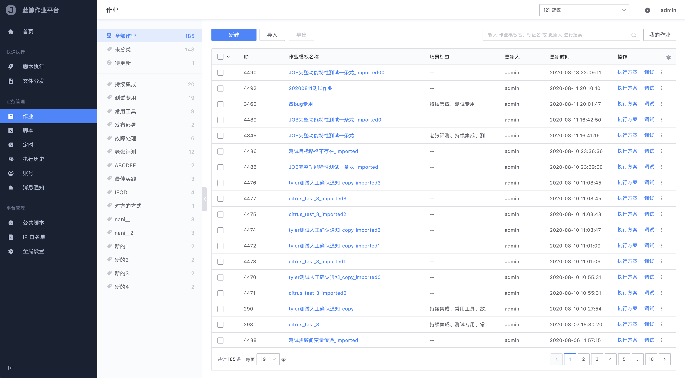

作业列表页支持按 `标签` 进行分类管理，使不同场景的作业模板得以很好的收纳起来，便于查找；标签的管理支持在表格中直接添加/编辑，非常方便！除此之外，对于自己关注的作业模板还可以添加个人收藏，后续从首页就能很方便的快速进入。

## 导入/导出

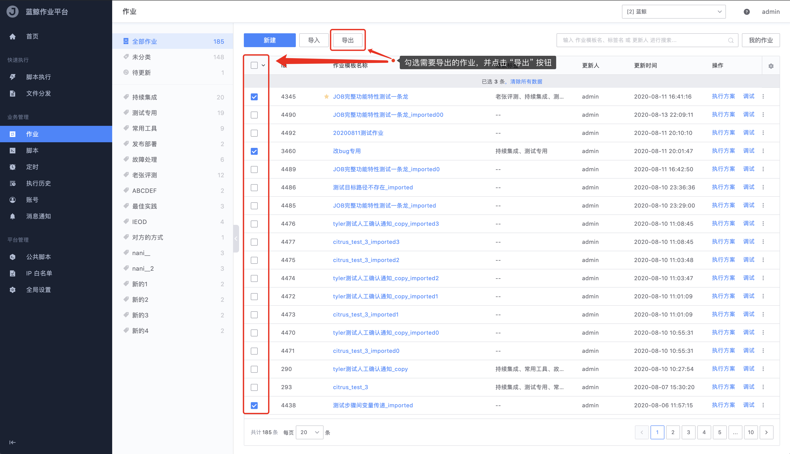

从列表中勾选需要导出的作业模板，并点击 `导出` 按钮将其导出。

### 导出流程

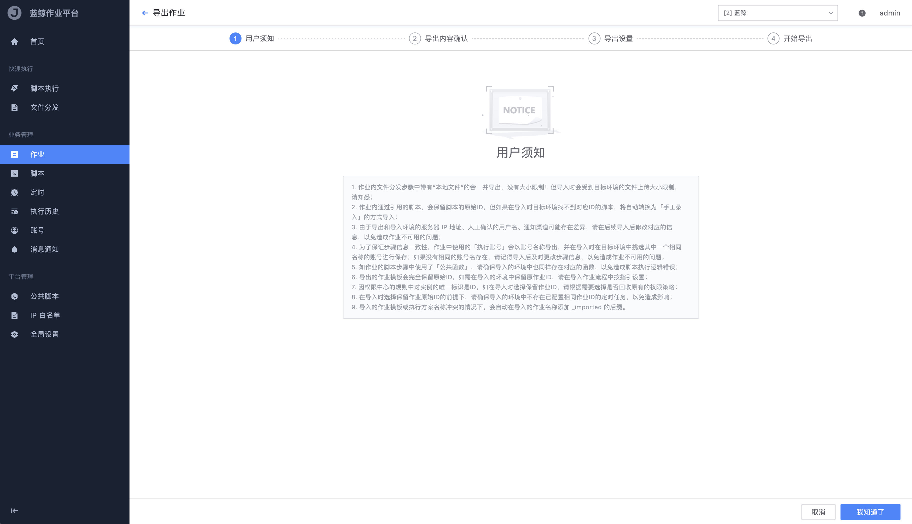

流程如下：`用户须知` -> `导出内容确认` -> `导出设置` -> `开始导出`

1. 用户须知

   作业的导出/导入会有一些既定的规则，在导入/导出的第一步 `用户须知` 中有详细描述，第一次使用请详细阅读。

2. 导出内容确认

   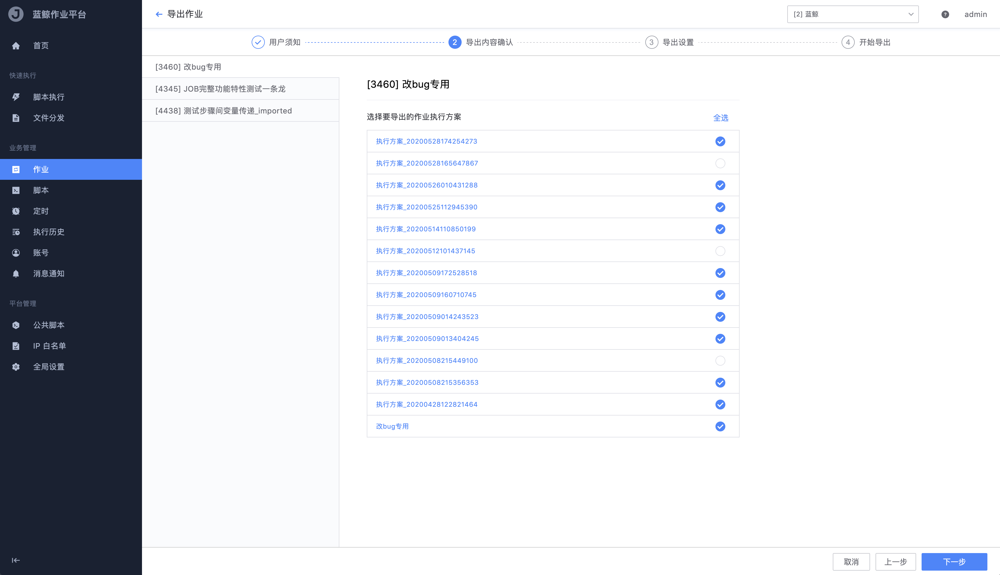

   在这个步骤中，用户可以自定义选择需要导出的作业执行方案，而无需全部导出。

3. 导出设置

   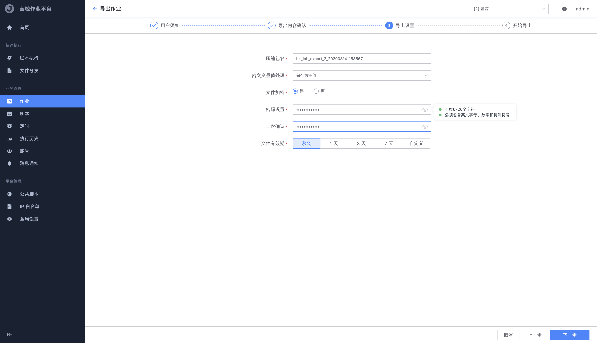

   主要是对导出的压缩包一些常规基础和安全设置；

   - 压缩包名

     支持自定义设置导出的文件压缩包名称

   - 密文变量值处理

     当导出的作业中包含 `密文` 类型的变量时，这里可以设置是否将密文原值导出，也可选择不导出

   - 文件加密

     设置密码后，在导入时需要输入正确的密码

   - 文件有效期

     选择文件压缩包的导入有效期，超过有效期将不可再被导入

4. 开始导出

   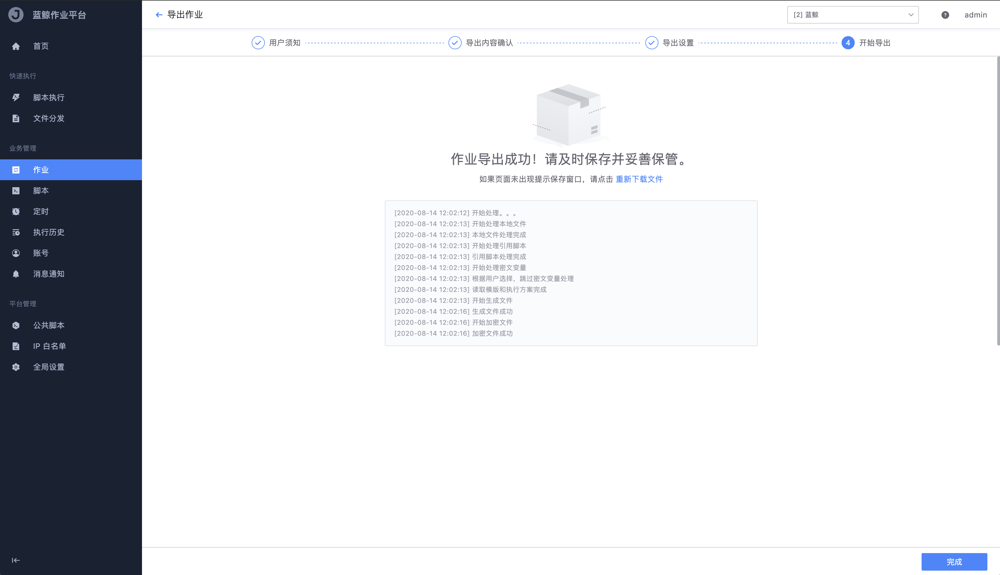

   该步骤将正式开始执行作业导出动作，导出任务完成后会自动弹出文件保存本地的弹窗，如果丢失可点击 `重新下载文件` 再次下载。

### 导入流程

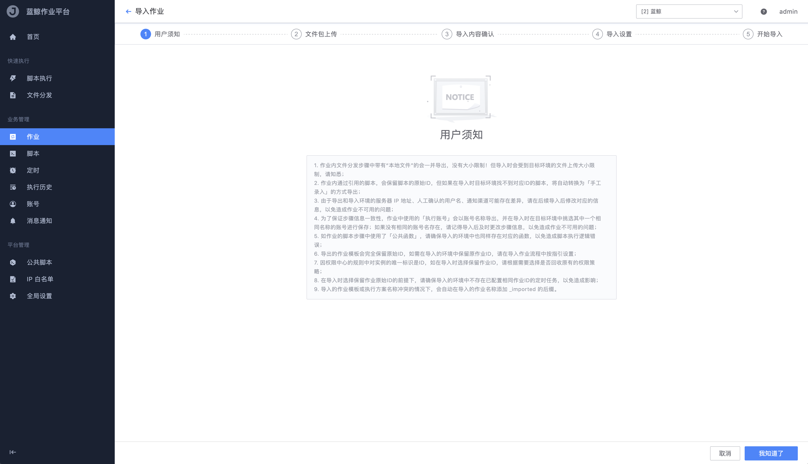

流程如下：`用户须知` -> `文件包上传` -> `导入内容确认` -> `导入设置` -> `开始导入`

1. 用户须知

   作业的导出/导入会有一些既定的规则，在导入/导出的第一步 `用户须知` 中有详细描述，第一次使用请详细阅读。

2. 文件包上传

   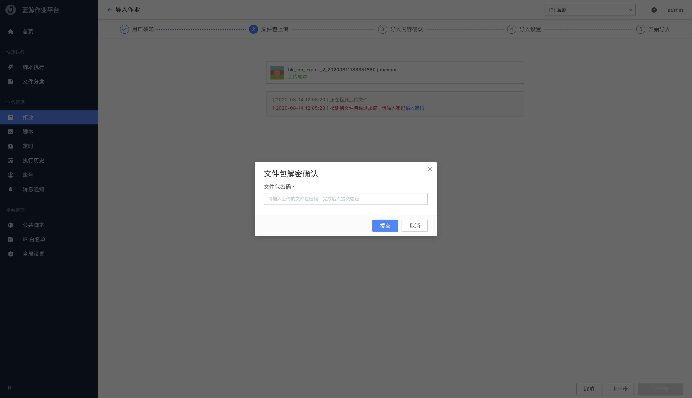

   点击上传文件压缩包后，如果后台检测到文件经过加密，将会自动弹出密码输入框，需填写正确密码才可继续导入

3. 导入内容确认

   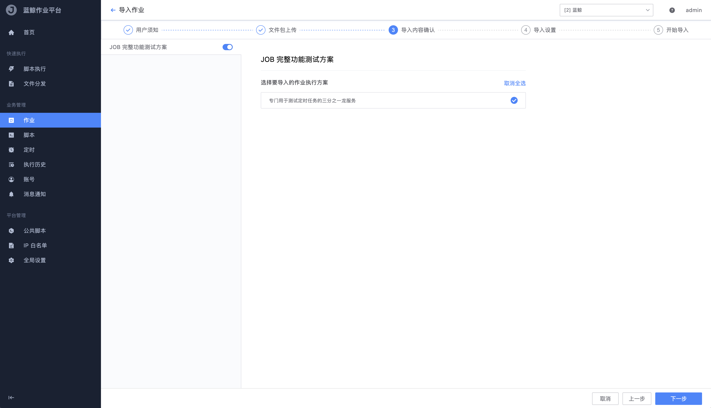

   在这个步骤中，用户可以按需选择需要导入的作业模板或执行方案，而无需全部导入。

4. 导入设置

   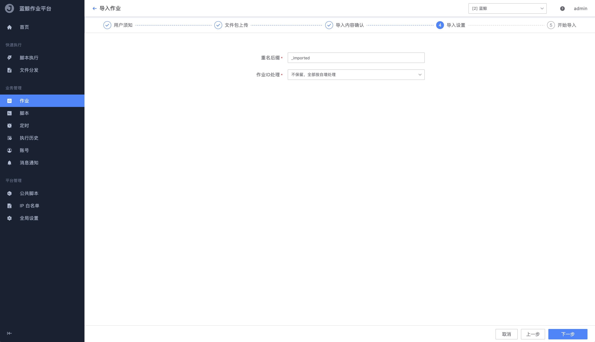

   - 重名后缀

     当导入的作业模板名称已经存在时，会按照这个设置自动追加后缀名称

   - 作业ID处理

     选择导入后对作业模板ID的处理

5. 开始导入

   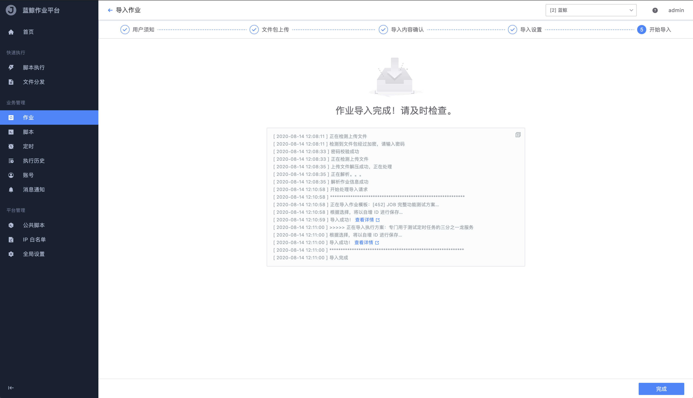

   该步骤将正式开始作业导入任务，导入过程中可以点击日志中的链接及时查看已导入成功的作业信息。

## 创建作业模板

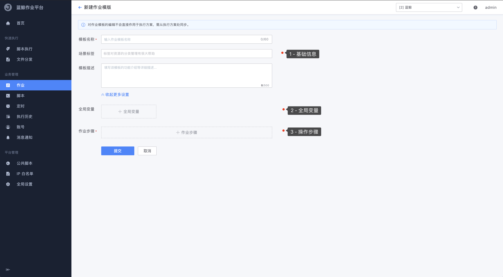

作业模板由 “基础信息 / 全局变量 / 作业步骤” 3部分组成：

1. 基础信息

   - 模板名称

     设置作业模板的名称

   - 场景标签

     设置作业模板使用场景的分类标签

   - 模板描述

     备注跟作业模板使用相关的详细描述

2. 全局变量

   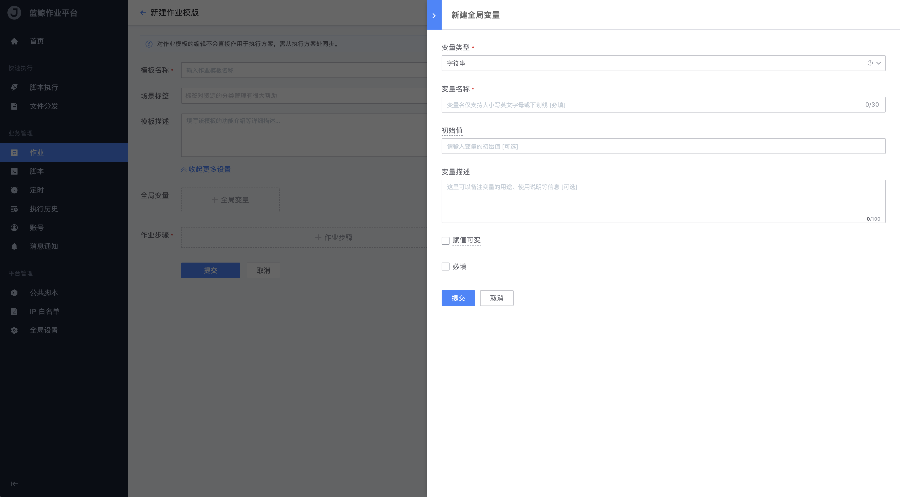

   - 变量类型

     - 字符串

       普通的字符串类型变量，没有使用限制，可跨主机或跨步骤共享使用

     - 命名空间

       它的作用如其名，变量在不同主机有自己的命名空间，主机之间不会相互影响

     - 主机列表

       主机列表主要用于多个步骤都是对同一批执行对象时而设置的，方便批量同步和管理

     - 密文

       作业平台产品层对密文类型变量做了加密处理，保护其隐私性，不会以明文形式外显

   - 变量名称

     即变量的使用名称，遵循 Linux 操作系统对变量的命名规范

   - 默认值

     设置了变量的默认值后，该模板衍生的执行方案会默认带上，但执行方案也可以单独进行修改

   - 变量描述

     用于标注该变量的用途、作用等详细描述信息

   - 其他

     - 赋值可变

       表示该变量的值可以在任一步骤中被改变

     - 必填

       表示该变量在作业执行前必须填写，不能为空

3. 作业步骤

   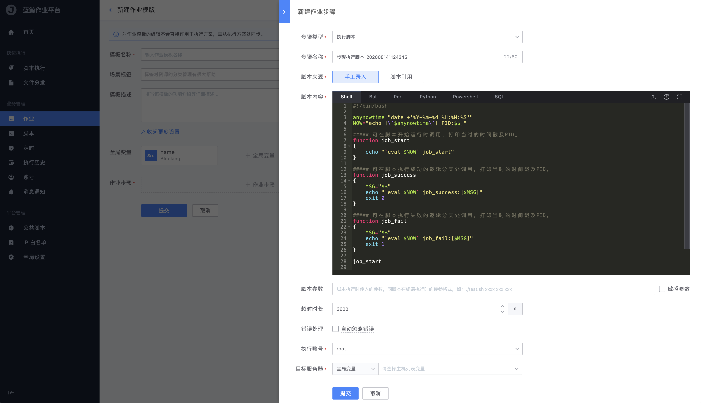

   - 步骤类型

     当前一共有3种步骤类型，分别为：`执行脚本` `分发文件` 和 `人工确认`

   - 步骤名称

     用于表示该步骤的具体作用

   - 步骤内容

     `执行脚本` 和 `分发文件` 的步骤内容与快速执行方式相同，这里不再重复介绍；

     `人工确认` 的步骤类型是作业中独有的，特别详解一下：

     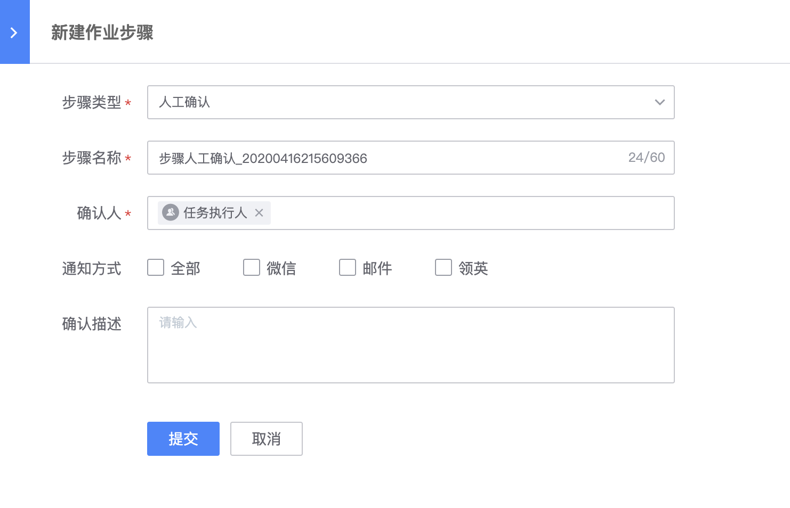

     - 确认人

       填写该确认步骤的实际干系人，不在确认人名单中的其他人员是无法执行确认操作的！

     - 通知方式

       选择当运行到该步骤时，以什么方式发送消息通知 "确认人"

     - 确认描述

       备注一些在当前执行场景中，需要确认人 Check 的事项，描述清楚需要确认的点。

   - 错误处理
   
     当步骤执行失败时，如果勾选了 `自动忽略错误` 流程将会忽略失败并继续向下执行

## 模板调试

作业模板的「**调试**」功能是专门为模板所属人在变更模板逻辑后需要调试而设计的，调试模式中的作业内容会与作业模板完全保持一致，而无需像作业执行方案那样需要同步才能到最新状态。

## 生成执行方案

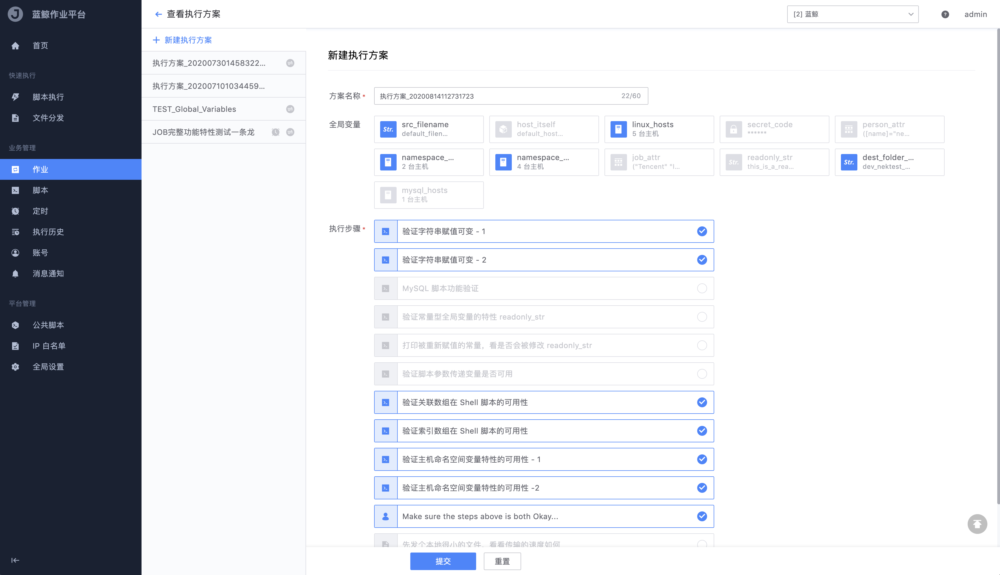

作业模板创建完后，即可以从模板中创建出一或多个根据场景需求定制的「**执行方案**」；每个执行方案可以从模板中勾选自己所需的步骤，修改全局变量的变量值。

重要！执行方案除了可以勾选步骤和修改全局变量值以外，不可修改步骤顺序、不可修改步骤内容、不可删除全局变量。

## 运行执行方案

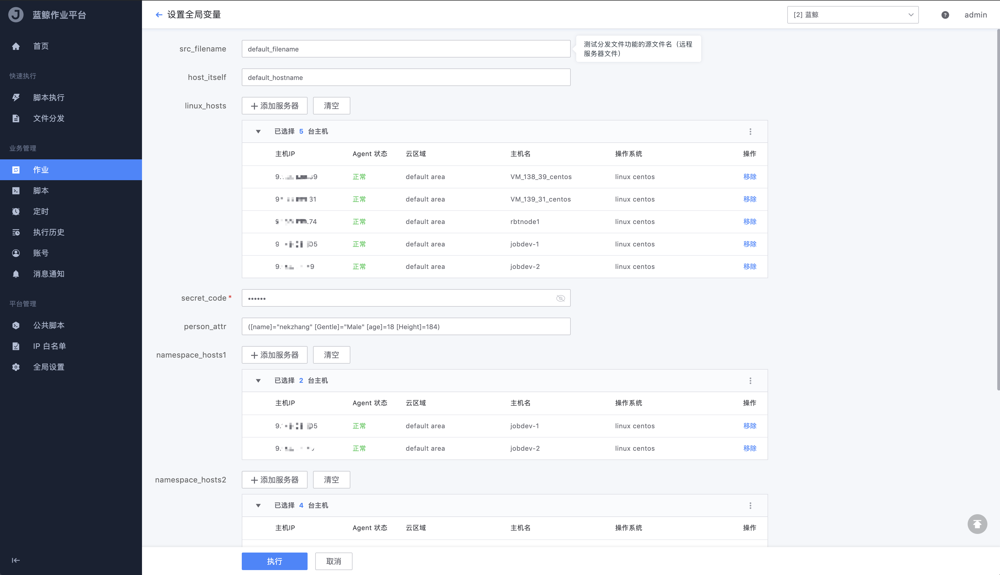

选择自己所需的执行方案，点「**去执行**」前往执行页面；对于设置了全局变量的执行方案，会先进入全局变量的确认页面，在该页面下，用户可以按照自己的需求场景修改填入对应的变量值，确认后再点执行即可。

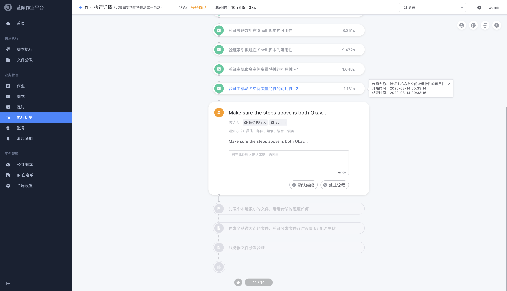

开始执行后，就可以看到任务的整体执行情况，包括任务当前的进度、耗时、状态等信息；点击某个步骤可以进入查看步骤的执行明细：

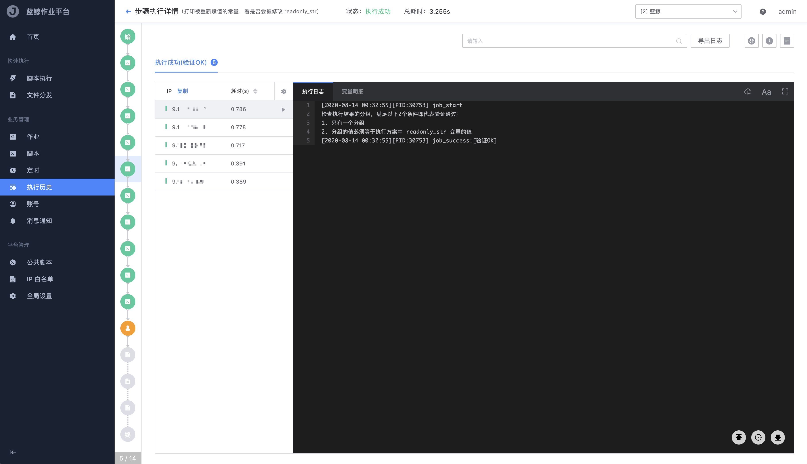

在步骤执行详情页中，可以查看每一台目标服务器的执行耗时、返回码、结果日志等信息；除此之外，还提供了一些辅助功能，可以帮助用户查看跟该步骤相关的配置、步骤信息，包括操作记录。
