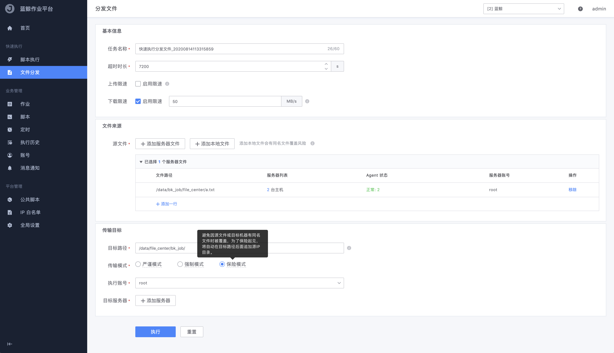
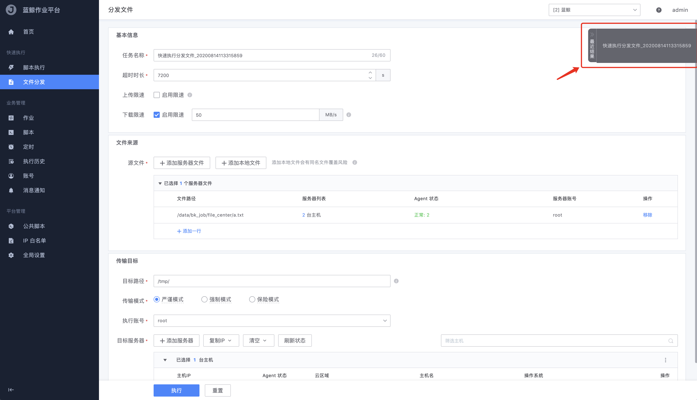

# 快速分发文件

与「快速执行脚本」功能提供的使用场景相同，快速分发文件的目的也是为了让需要进行一次性传输文件的用户，可以在这里快速的执行并得到结果。

- 任务名称

  本次分发文件的任务名，方便后续在执行历史中有迹可循

- 超时时长

  本次分发文件的超时设置，当文件传输时间超过时将会自动关闭，结果被视为 "执行超时"

- 上传 / 下载限速

  由于蓝鲸管控平台 Agent 默认的配置是会根据服务器带宽和资源使用情况进行限制的，防止出现因为执行的任务导致拖垮业务的机器；所以当用户自己确认机器允许更大限度传输时，通过开启限速设置可以提高传输的速率。

- 源文件

  本次分发的源文件选择，支持选择 `服务器文件/目录` 或 `本地文件`

- 目标路径

  本次文件分发到目标服务器的绝对路径地址

- 传输模式

  > `严谨模式`：严谨判断目标路径是否存在！若不存在，任务将自动终止。
  >
  > `强制模式`：不论目标路径是否存在，都将强制按照用户指定的目标路径进行传输（不存在会自动创建）。
  >
  > `保险模式`：避免因源文件或目标机器有同名时被覆盖，为了安全起见，将自动在目标路径后面追加源IP目录。

- 执行账号

  本次文件分发的目标服务器相关的账号，如 Linux 系统的 `root` 或者 Windows 系统的 `Administrator`

- 目标服务器

  从蓝鲸配置平台中获取执行的目标服务器，支持通过 `静态-IP选择` `动态-拓扑选择` `动态-分组选择` 和 `手动输入` 的方式选择

同样的，为了满足需要反复传输文件的使用场景，页面上提供了快捷查看近5次文件分发记录的功能：

