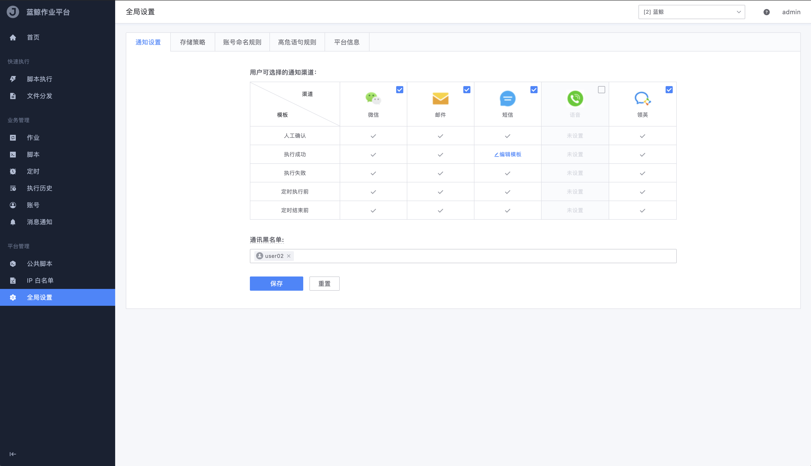

# 全局设置

全局设置提供了面向平台管理员的管理/维护功能，该页面下的功能核心是作用于整个平台的，如平台内所有业务的可选消息发送渠道、作业平台的历史数据存储策略、等等...



- 通知设置

  设置作业平台内所有业务/用户可选的消息通知渠道、模板和对象

  ```
  「通讯黑名单」的使用场景：每个企业都会有一些高层、特殊敏感人员是跟业务不相关的，为了避免业务运维在设置任务的消息通知对象时误操作配置了这些敏感用户，所以提供了黑名单功能来避免出现这种问题。
  ```

- 账号命名规则

  不同企业可能会对 OS 有定制化或规范上的特殊需求，比如 A企业修改了 Linux内核，调整了 useradd 时的账号命名规则；或者，B企业要求公司所有账号命名规范必须是 `xxxxxx` ；为了满足这种同一功能但不同定制化需求的场景，我们将账号的命名规则通过页面可配置化的方式，提供给企业作业平台管理员自定义设置。

  

- 高危语句规则

  为了规避运维操作人员在脚本里误写入一些高危的命令，如 `rm -rf /` 这种删除服务器根目录的严重错误！我们提供了高危语句的自定义配置功能，企业可以按照自己的场景需要，通过正则的方式按不同脚本类型进行配置。

  
  
- 平台信息

  提供企业可定制化的平台信息显示功能，其中包含作业平台的网页标签 Title 文案、Footer 信息等等...

  