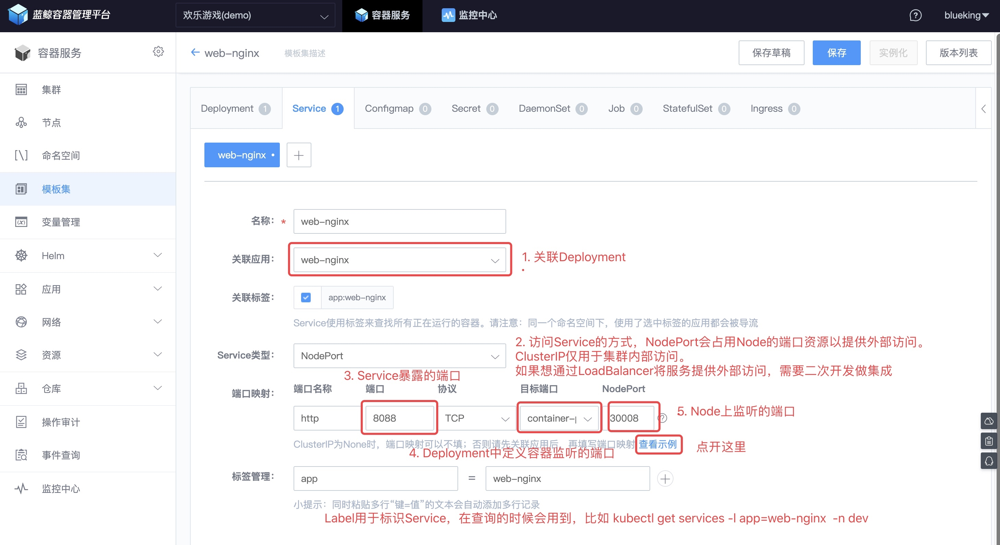

# Kubernetes Service 说明

Service 是 kubernetes(简称 k8s)的一种抽象：一个 Pod 的逻辑分组，一种可以访问它们的策略 —— 通常称为微服务。这一组 Pod 能够被 Service 访问到，通常是通过 Label Selector 实现。

## 1. 模板示例
```yml
kind: Service
apiVersion: v1
metadata:
  name: servergame
spec:
  type: NodePort
  selector:
    app: servergame
  ports:
  - name: http
    protocol: TCP
    port: 8080
    targetPort: http
    nodePort: 30000
```

## 2. 配置项说明
### 2.1 ServiceTypes
ServiceTypes 允许指定一个需要的类型的 Service，默认是`ClusterIP`类型
- ClusterIP：通过集群的内部 IP 暴露服务，选择该值，服务只能够在集群内部可以访问，这也是默认的 ServiceType。
- NodePort：通过每个 Node 上的 IP 和静态端口（NodePort）暴露服务。NodePort 服务会路由到 ClusterIP 服务，这个 ClusterIP 服务会自动创建。通过请求 <NodeIP>:<NodePort>，可以从集群的外部访问一个 NodePort 服务。
- LoadBalancer：使用云提供商的负载局衡器，可以向外部暴露服务。外部的负载均衡器可以路由到 NodePort 服务和 ClusterIP 服务。
- ExternalName：通过返回 CNAME 和它的值，可以将服务映射到 externalName 字段的内容（例如， foo.bar.example.com）。 没有任何类型代理被创建，这只有 Kubernetes 1.7 或更高版本的 kube-dns 才支持。
上面的示例中，Service 采用的是 NodePort 类型`.spec.type: NodePort`，同时也指定了服务端口号`nodePort: 30000`(如果不指定，会由系统在 service node range 中随机分配一个)
### 2.2 Selector
通过`.spec.selector`， 将 Service 对象与指定的 Pods 进行关联。如示例中，`servergame`这一 Service 对象，会将请求代理到使用了 TCP 端口 8080，并且具有 label `app=servergame`的 Pods 上。
### 2.3 Ports
`.spec.ports[]`用来描述 Service 的接收端口与后端 Pod 端口之间的映射关系。Service 能够将一个接收端口映射到任意的 targetPort。 默认情况下，targetPort 将被设置为与 port 字段相同的值。 targetPort 可以是 Pod 的端口号，也可以是一个字符串(引用了 backend Pod 的一个端口的名称)。
`.spec.ports[i].protocol`能够支持 TCP 和 UDP 协议，默认 TCP 协议

## 3. Service 之“吃豆小游戏”实践
下面是 bcs 小游戏中，Service 用法的示例: rumpetroll2 用于暴露后端小游戏房间的服务，redis 用于暴露 redis 的服务。其中，rumpetroll2 会将请求代理到具有 label`app=web`的 Pods 上，`clusterIP: None`表示 rumpetroll2 是 Headless Service，适用于 statefulset 管理的 Pods。
```yml
apiVersion: v1
kind: Service
metadata:
  name: rumpetroll2
  namespace: rumpetroll-v2
  labels:
    app: rumpetroll-v2
spec:
  ports:
  - port: 80
    name: web
  clusterIP: None
  selector:
    app: web
```
```yml
apiVersion: v1
kind: Service
metadata:
  name: redis
  namespace: rumpetroll-v2
spec:
  selector:
    app: redis-v2
  ports:
  - name: default
    protocol: TCP
    port: 6379
    targetPort: 6379
```

## 4. BCS 模板集操作
关于 Service 的实战演练，请参照 [快速构建 Nginx 集群](../../../Scenes/Bcs_deploy_nginx_cluster.md)。


