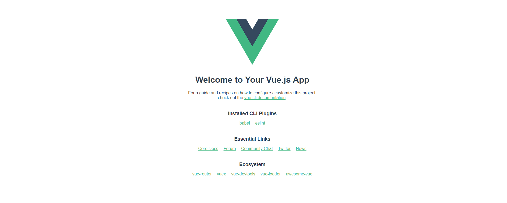

# 蓝鲸 Django 开发框结合 Vue.js 框架项目

## 前言

在看本篇教程之前，我们认为你已经有了一些 Django 和 Vue 基础，并且在自己电脑上已经安装好了 npm 和 Vue，因为接下来我们会用到它们去初始化一个 Vue 项目，

当然，如果你对 Vue 所知甚少的话，那么我们非常建议你看过 Vue 官方文档之后再来看本篇教程：

[Vue 官方文档](https://cn.vuejs.org/v2/guide/)

在接下来的内容中，我们将从开发框架开始，一点一点的去完成我们 Django 开发框架和 Vue 进行前后端分离的目标，

同时，我们也会尽可能地标明大家在进行实践的过程中，可能会遇到的问题以及解决方案。

如果你已经准备好这些的话，那么接下来让我们开始吧。

注 本篇教程编写时的环境说明：

> 操作系统：Windwos 10 
>
> Python 版本：3.6.5
>
> 开发框架版本： 3.2.7.88
>
> vue 版本：@vue/cli 4.4.1

## 注意事项

本篇文章所出现的地址 http://dev.paas-class.bktencent.com:8080 皆是本地测试地址， 大家可以根据你的 PaaS 地址灵活修改。

## 开发框架准备

在进行前后端分离之前，我们首先要先准备好我们的后端环境，并编写一个非常简单的后端接口，这个后端接口将会接受一个 Get 或者 Post 请求，并返回如下 json 字符串：

```json
{"hello": "world"}
```

首先我们需要先初始化一下我们的蓝鲸开发框架，使之可以正常运行，之后我们需要在`home_application/views.py `文件中添加一个我们的路由，`/hello`

当然，home_application 并不是强制的，如果你想的话，你可以将`/hello` 对应的函数定义在任何地方，只要我们通过一个特定的 url 访问`/hello`这个路由的时候，它可以返回我们所需要的字符串即可。

以下是代码：

```python
# views.py

def hello(request):
    return JsonResponse({"hello": "world"})


# urls.py
urlpatterns = (
    url(r'^$', views.home),
    url(r'^dev-guide/$', views.dev_guide),
    url(r'^contact/$', views.contact),
    url(r'^hello/$', views.hello),
)
```

当然，我们努力使一切变得足够简单，**当我们解决了比如跨域，crsf 这些关键问题的时候**，意味着你可以在现在的基础上添加任何复杂的处理逻辑。

现在让我们从浏览器访问我们刚刚创建的`hello` 路由, 输入网址：http://dev.paas-class.bktencent.com:8000/hello/ 按下回车，

很好，浏览器正确的显示出了`{"hello": "world"}` ，如果出现其他问题的话，你可能需要去检查你的本地配置是否正确。

到这里，我们开发框架的一个简单的准备就完成啦，当然这只是第一步，当我们遇到诸如跨域，csrf 这些问题的时候，这意味着我们还需要在开发框架中添加额外的配置。

## 前端Vue项目准备

新建一个 Vue 项目非常简单，我们只需要在命令行输入：

```bash
vue create projectname
```

> 注：projectname 是你要起的项目名称。

经过一些简单的配置之后，我们即可在本地创建一个标准的 Vue 项目，让我们打开该项目目录，在命令行输入:

```bash
npm run serve
```

当控制台输出：

```bash
  App running at:
  - Local:   http://localhost:8080/
  - Network: http://192.168.256.00:8080/

  Note that the development build is not optimized.
  To create a production build, run npm run build.
```

这意味着我们的 Vue 项目已经初始化成功了，现在让我们在浏览器中输入：http://localhost:8080/  看看我们的 Vue 项目是否真的启动成功了:




Nice，这一切真的是出奇的顺利。

当然，到现在，我们的前后端分离之路才真正的算刚刚开始，因为现在我们的 Vue 项目 和我们的开发框架 就如同两个陌生人一样，没有任何交集，
为了将我们的 Vue 项目和 Django 开发框架联系起来，我们需要在 Vue 中写一个请求函数，这个函数会请求我们的`/hello` 接口, 
如果成功的话，那么我们的 Vue 项目应该收到后端返回过来的 `{"hello": "world"}` 数据。

### 安装 axios 库

为了让我们的 Vue 项目具备向后端发起请求的能力，我们需要安装 axios 库，我们将会使用它，并用它编写一个简单的 Post 请求。

安装：

```shell
npm install --save axios vue-axios
```

在 vue 项目 src/main.js 文件中添加如下配置：

```js
import Vue from 'vue'
import App from './App.vue'
import axios from 'axios'
import VueAxios from 'vue-axios'
Vue.use(VueAxios,axios); 
Vue.config.productionTip = false
axios.defaults.baseURL = 'http://dev.paas-class.bktencent.com:8000/' //axios 发起请求的前缀

new Vue({
  render: h => h(App),
}).$mount('#app')

```

之后让我们点开 src/components/HelloWorld.vue 文件, 并加入以下内容：

```js
<script>
	export default {
		name: 'HelloWorld',
		props: {
			msg: String
		},
		mounted() {
			this.test()
		},
		methods: {
			test: function() {
				this.axios({
					url: "/hello/",
					method: 'post',
					responseType: 'json', // 默认的
				}).then(res => {
					var jsondata = JSON.parse(JSON.stringify(res.data));
					console.log(jsondata)
				})
			}
		}
	}
</script>
```

这段代码的含义是当我们的 HelloWorld.vue 界面初始化的时候，会调用我们的 test 方法，test 向后端`/hello/`的路由发送一个 Post 请求。并将后端返回的内容打印到控制台中。

现在让我们重新启动我们的Vue项目，并在浏览器访问 http://localhost:8080/  ， 并记得打开 `f12`，这样我们才能看到请求的详细信息。

显而易见的，这一切开始变得不那么顺利了起来，我们的请求失败了，控制台无情的输出了以下信息：

```js
localhost/:1 Access to XMLHttpRequest at 'http://dev.paas-class.bktencent.com:8000/test/' from origin 'http://localhost:8080' has been blocked by CORS policy: No 'Access-Control-Allow-Origin' header is present on the requested resource.
```

这是一个典型的跨域问题，那么接下来就让我们解决它。

## 解决跨域问题

首先我们需要在我们的后台框架中安装针对于解决跨域问题的 Python 依赖：

``````bash
 pip install django-cors-middleware
``````

看名字我们就知道了，现在我们需要去配置中添加我们相应的中间件配置, 在`/config/default.py` 文件中添加如下配置：

```python
# 将corsheaders添加为我们的django app
INSTALLED_APPS += (  # noqa
    'home_application',
    'mako_application',
    'corsheaders',
)

# 添加自定义中间件
MIDDLEWARE += (  # noqa
    'corsheaders.middleware.CorsMiddleware',
)
```

之后我们需要在`config/stag.py` 文件中追加如下配置;

```python
# 白名单, 域名请按照前段实际配置修改
CORS_ORIGIN_WHITELIST = [
    'http://localhost:8080',
]
# 允许跨域使用 cookie
CORS_ALLOW_CREDENTIALS = True
```

之后就是非常非常非常重要的一步了，在项目根目录下 setting.py 文件中添加我们的跨域配置：

```python
#在本地开发环境下开启跨域允许
if ENVIRONMENT == 'dev':
    # 跨域增加忽略
    CORS_ALLOW_CREDENTIALS = True
    CORS_ORIGIN_ALLOW_ALL = True
    CORS_ORIGIN_WHITELIST = [
        'http://localhost:8080',
    ]

    CORS_ALLOW_METHODS = (
        'DELETE',
        'GET',
        'OPTIONS',
        'PATCH',
        'POST',
        'PUT',
        'VIEW',
    )

    CORS_ALLOW_HEADERS = (
        'accept',
        'accept-encoding',
        'authorization',
        'content-type',
        'dnt',
        'origin',
        'user-agent',
        'x-csrftoken',
        'x-requested-with',
    )
```

让我们刷新我们的前端项目，Nice！ 跨域的问题解决了，刚才的报错没有了，但是新的问题出现了，我们的 hello 请求依然没有请求成功，并出现了新的错误：

```txt
POST http://dev.paas-class.bktencent.com:8000/hello/ 403 (Forbidden)
```

## 解决403 csrf token认证问题

大家都知道，Django 为了防止`CRSF`攻击，要求我们每一个 Post 请求都要求携带一个 crsftoken 来验明真身，
当然，如果你并不惧怕 CSRF 攻击，你可以简单粗暴的注释掉 CSRF 的中间件，解决不了问题，那就先解决发现问题的人，这当然没有什么问题，
但是我们非常不建议你这样做，因为大多数时候，CSRF 对于一个 web 应用是非常有必要的。

在 Django 应用中，csrftoken 就隐藏在我们应用的 cookie 中，只要拿到 cookie 解析出来 csrftoken 的值，然后每次请求的时候带上它，简直完美，
可是，我们知道，只有同域名下我们才是共享 cookie 的，而现在我们 Vue 项目的访问地址是 http://localhost:8080/ ，
而后端的访问地址却是 http://dev.paas-class.bktencent.com:8000 ，所以为了拿到我们的 cookie，
我们需要改变一下策略，那就是将我们的前端访问地址修改为： http://dev.paas-class.bktencent.com:8080 。

之后我们需要在我们 Vue 项目中`/src/main.js`中添加我们相关的配置就可以了：

```js
import Vue from 'vue'
import App from './App.vue'
import axios from 'axios'
import VueAxios from 'vue-axios'
Vue.config.productionTip = false
Vue.use(VueAxios,axios); 
// 这里是添加的部分
function getCsrftokenByCookie () {
    const cookie = document.cookie.split(';')
    // 获取csrftoken
    let csrftoken = ''
    for (const i in cookie) {
        if (cookie[i].indexOf('csrftoken') !== -1) {
            csrftoken = cookie[i].split('=')[1]
        }
    }
    return csrftoken
}
// 每次请求头都带上我们的X-CSRFToken 信息
axios.defaults.headers.common['X-CSRFToken'] = getCsrftokenByCookie();
axios.defaults.withCredentials = true;
Vue.config.productionTip = false
axios.defaults.baseURL = 'http://dev.paas-class.bktencent.com:8000/'

new Vue({
  render: h => h(App),
}).$mount('#app')

```

现在让我们浏览器访问  http://dev.paas-class.bktencent.com:8080 ，发现，amazing！ 我们的 hello 请求竟然成功了。

当然，你也有可能面临失败，看到这样的字样`Invalid Host header`

好在它解决起来足够简单，我们只需要在我们的 Vue 项目根目录新建一个 vue.config.js项目文件，并添加如下配置：

```js
module.exports = {
    devServer: {
        disableHostCheck: true,
    }
}
```

重启我们的 Vue 项目，发现一切已经恢复正常了，控制台如期打印出了 hello world 字样。

现在我们已经解决了前后端分离中最核心的两个问题，跨域和403认证，这意味着你现在可以做任何你想做的事情了，
比如编写一个接口，返回当前用户信息等等，这些都不会再有问题，因为现在前端可以任意请求后端的接口，并拿到后端接口返回的信息。

到这里一切理应结束了，但是并没有，我们还需要最后一步功能要做，不过好消息是，相较于前面的跨域 和 csrf 问题，后面我们遇到的问题都是相当简单。

因为我们最终要将应用部署到蓝鲸pass平台，这意味着我们需要将我们 Vue 项目合并到我们的开发框架中去。

## vue 项目 和 开发框架 打包部署

首先我们需要将我们的 Vue 项目编译成静态文件，执行:

```bash
npm run build
```

之后我们会看到我们项目根目录生成了 dist 文件夹，这里面就是我们 vue 项目打包好的静态文件了, 将 dist 文件夹直接拷到我们蓝鲸开发框架的根目录下的`static`文件夹中.

之后我们需要重写设置我们的 django 静态路径，将我们的静态文件指向我们 static 文件夹下面的 dist 文件夹。

在 `config/default.py`文件中追加以下配置:

```python
TEMPLATES[0]['DIRS'] += (
    os.path.join(BASE_DIR, 'static', 'dist'),
)
```

注意，如果你前端 Vue 项目中使用了 vue-router 并使用了`history `路由模式，那么你需要修改`config/default.py` 中的 `IS_BKUI_HISTORY_MODE` 字段为`True`.

之后在： `config/stag.py` \ `config/prod.py`两个文件都加上

```python
BK_STATIC_URL = STATIC_URL + 'dist/'
```

最后一步： 修改我们的首页路径为 index.html

```python
def home(request):
    """
    首页
    """
    return render(request, 'index.html')
```

## 解决静态资源404问题

之后，访问我们的后端项目， http://dev.paas-class.bktencent.com:8000 ，发现一片空白，打开控制台我们发现，我们的静态文件全部都是404了。


我们点进去看看这些静态文件请求的地址是什么：

```python
http://dev.paas-class.bktencent.com:8000/css/app.775a4d94.css
```

嗯，我们的静态文件明明在 static/dist 文件夹中啊，这样请求肯定是请求不到的，所以我们正确的静态资源引用路径应该为：

```python
http://dev.paas-class.bktencent.com:8000/static/dist/css/app.775a4d94.css
```

明白了问题的原因，我们就要去找如何配置我们的静态资源引用路径呢？

还记得我们的`vue.config.js `, 没错，就是它，我们只需要每次在`打包部署前`添加如下配置：

```python
module.exports = {
    devServer: {
        disableHostCheck: true,
    },
	publicPath: '/static/dist/'
}
```

即可，为什么一定要是打包部署之前呢？因为你本地开发 Vue 项目的时候，如果也加上 publicPath 配置的话，那么你访问http://dev.paas-class.bktencent.com:8080  
Vue 项目的资源路径就会出问题了，所以一定要是部署之前，加上这个配置，然后 run build 。

重新编译我们的 Vue 项目，点开 dist 文件中的 index.html文件，我们发现所有静态资源路径的引用已经正确修改为：/static/dist/ 了

```html
<!DOCTYPE html>
<html lang=en>
	<head>
		<meta charset=utf-8>
		<meta http-equiv=X-UA-Compatible content="IE=edge">
		<meta name=viewport content="width=device-width,initial-scale=1">
		<link rel=icon href=/static/dist/favicon.ico> <title>vuetest</title>
		<link href=/static/dist/css/app.775a4d94.css rel=preload as=style>
		<link href=/static/dist/js/app.6101c35b.js rel=preload as=script>
		<link href=/static/dist/js/chunk-vendors.9c9ac966.js rel=preload as=script>
		<link href=/static/dist/css/app.775a4d94.css rel=stylesheet>
	</head>
	<body><noscript><strong>We're sorry but vuetest doesn't work properly without JavaScript enabled. Please enable it to
				continue.</strong></noscript>
		<div id=app></div>
		<script src=/static/dist/js/chunk-vendors.9c9ac966.js> </script> <script src=/static/dist/js/app.6101c35b.js> </script>
		 </body> </html>
```

将我们的 dist 文件再次复制到我们到我们蓝鲸开发框架的 static 目录下，注意别忘记先把之前的删了哦。

之后打开浏览访问 http://dev.paas-class.bktencent.com:8080， 发现一切ok了。

## 总结

本篇我们从一个最最最简单的接口示例开始，复现并解决了我们在实际前后端分离的过程中遇到的常见问题，例子虽然简单，
但是道理是一样的，解决了这些问题之后，我们剩下的就是专心致志的去写我们的业务逻辑了，
如果你在使用过程中发现了其他我们没有注意到的问题，欢迎大家积极反馈，我们会努力维持我们本篇文章的一个最新状态。

那么，开始你的前后端分离之旅吧！


