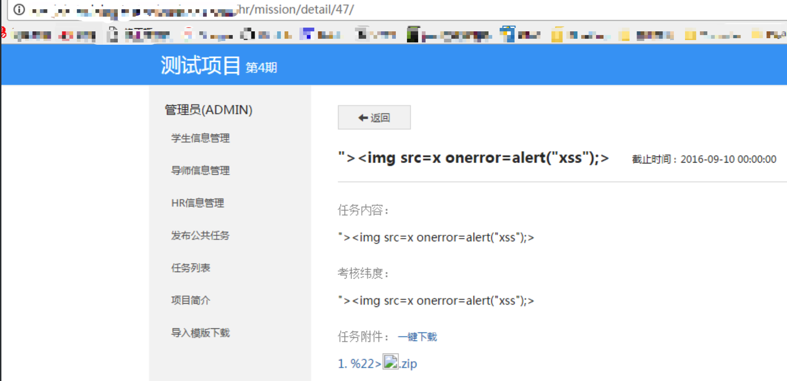

## 1 常见越权分类

1. 平行越权

    场景1：普通用户A可以访问到普通用户B的数据

    场景2：用户可以通过修改请求链接或参数，访问到其它本应无权访问的数据

2. 上下越权

    普通用户可以执行管理员的操作

## 2 场景1 ：对get请求中显式的URL更改进行越权

对如图的URL格式，在没有严格判断的情况下，特别是后台采用API模式时，用户通过随意更改/detail/后面的数字，可以绕过权限判断访问任意的页面。

### 2.1 解决

对所有增、删、改、查的功能中，对用户暴露出的API，都要进行严格的权限判断

对用户身份，需要操作的id需要做严格的校验，建议在RUL中加入业务字段，根据业务字段判断用户是否有操作权限

### 2.2 测试

将URL中的id更改为权限外的页面id，检查是否能越权访问以及返回页面是否符合预期

## 3 场景2： 对post请求中的预置参数更改进行越权

一些固定的post参数，如hidden属性的input，或ajax的data中在页面返回时就确定的信息，都是可能被修改的

如图，页面在后端渲染时确定了一个report_id，用户点击按钮时就会拿这个id去下载相应的文件。如果在下载逻辑中没有进行权限控制，则可能被修改id来下载任意文件，造成越权。

### 3.1 解决

同场景1，完善各个视图函数的权限控制。

### 3.2 测试

使用Postman或其他chrome插件来模拟、修改POST请求

使用fiddler抓取请求包，修改post请求中的参数

## 4 场景3： 非管理员用户访问管理界面

通常app中会设定一个管理员界面，方便进行一些配置工作。一般的做法是前端进行控制，管理界面的url不会暴露给非管理员用户，但是不排除非管理员通过各种手段获取到所有url并进行访问。

### 4.1 解决

后台管理相关的操作，需要在后台对操作用户进行权限校验，避免非法用户的访问

### 4.2 测试

用普通用户的帐号尝试访问管理员界面或者管理操作的cgi
