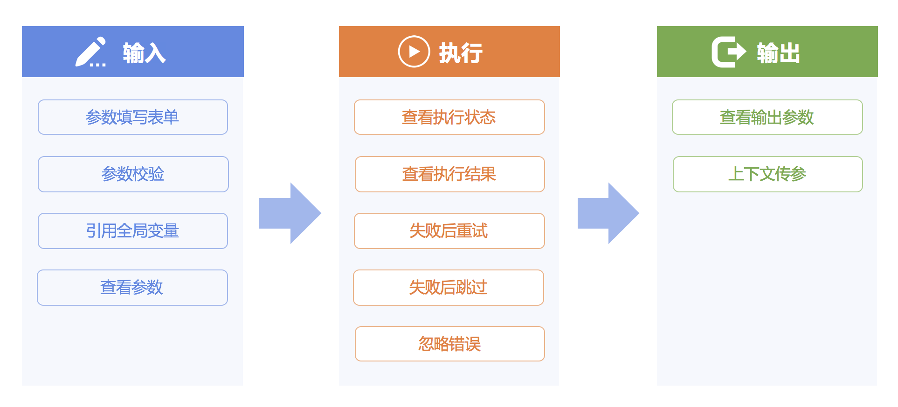
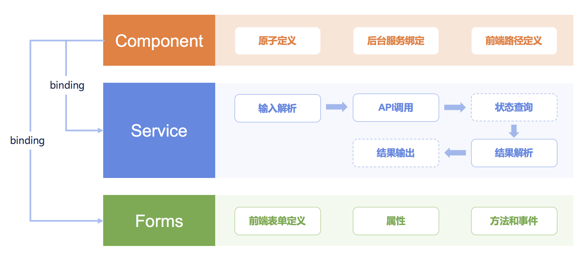

# 标准运维插件开发

标准运维插件是标准运维任务执行的最小单元，对应于内部某项服务（如定时）或者第三方系统 API 的调用（如 JOB-快速执行脚本），

通过将 API 参数前端表单化，加上参数校验、逻辑封装等功能，以图形化的方式提供给用户使用。

标准插件功能主要包括输入、执行、输出三部分。


标准插件架构包含插件定义 Component、后台执行逻辑 Service、以及前端表单配置 Forms。


## 标准插件开发步骤

### 初始化插件模块

在项目根目录下执行 `python manage.py create_atoms_app {CUSTOM PLUGINS NAME}`，

其中 `{CUSTOM PLUGINS NAME}` 为你定制开发的标准插件集合包名，

注意不要和项目中已有的模块和插件集合名字重复，名字最好能体现插件包的作用。

执行命令后会生成如下目录结构：

```bash
{CUSTOM PLUGINS NAME}
├── __init__.py
├── apps.py
├── components
│   ├── __init__.py
│   └── collections
│       ├── __init__.py
│       └── plugins.py
├── migrations
│   └── __init__.py
├── static
│   └── {CUSTOM PLUGINS NAME}
│       └── plugins.js
└── tests
    ├── __init__.py
    └── components
        ├── __init__.py
        └── collections
            ├── __init__.py
            └── plugins_test
                └── __init__.py
```

其中，components 放置标准插件集合后台代码文件，static 放置标准插件集合前端静态代码文件，

`plugin.py` 和 `plugin.js` 可以改为你开发的标准插件对应的系统名简称，如 job、cmdb 等。

### 修改项目 settings 配置

打开 `config/default.py` 文件，找到 INSTALLED_APPS 变量，加入步骤1中创建的 `{CUSTOM PLUGINS NAME}`。

### 加入新的 API 网关

如果你开发的标准插件依赖自定义接入的 API 网关，那么在你将接口接入蓝鲸 API 网关后，需要手动将 API 添加到 Client SDK 中。

在 `{CUSTOM PLUGINS NAME}/__init__.py` 文件下编写相应的代码即可向 Client 中添加对应的接口：

```python
from packages.blueking.component import collections
from packages.blueking.component.base import ComponentAPI
from packages.blueking.component.client import ComponentClient

class CollectionsMySystem(object):

    def __init__(self, client):
        self.client = client

        self.get_status = ComponentAPI(
            client=self.client, method='GET',
            path='/api/c/compapi{bk_api_ver}/my_system/status/',
            description=u"查询状态"
        )

        self.set_status = ComponentAPI(
            client=self.client, method='POST',
            path='/api/c/compapi{bk_api_ver}/my_system/status/',
            description=u"设置状态"
        )


collections.AVAILABLE_COLLECTIONS.update({
    'my_system': CollectionsMySystem
})

ComponentClient.setup_components(collections.AVAILABLE_COLLECTIONS)
```

上面的例子中为 Client 添加了一个名为 `my_system` 的系统，并且为该系统中添加了 `get_status` 和 `set_status` 两个接口。

### 标准插件后台开发

在 `plugin.py` 文件中编写插件后台逻辑，主要包括标准插件定义和后台执行逻辑，

下面是示例代码

```python
# -*- coding: utf-8 -*-

import logging

from django.utils.translation import ugettext_lazy as _

from pipeline.core.flow.activity import Service
from pipeline.component_framework.component import Component
from gcloud.conf import settings

logger = logging.getLogger('celery')
get_client_by_user = settings.ESB_GET_CLIENT_BY_USER

__group_name__ = _(u"自定义插件(CUSTOM)")

class TestCustomService(Service):
    __need_schedule__ = False

    def execute(self, data, parent_data):
        executor = parent_data.inputs.executor
        biz_cc_id = parent_data.inputs.biz_cc_id
        client = get_client_by_user(executor)

        test_input = data.inputs.test_input
        test_textarea = data.inputs.test_textarea
        test_radio = data.inputs.test_radio

        api_kwargs = {
            'biz_biz_id': biz_cc_id,
            'executor': executor,
            'test_input': test_input,
            'test_textarea': test_textarea,
            'test_radio': test_radio,
        }

        api_result = client.test_api.test1(api_kwargs)
        logger.info('test_api result: {result}, api_kwargs: {kwargs}'.format(result=api_result, kwargs=api_kwargs))
        if api_result['result']:
            data.set_outputs('data1', api_result['data']['data1'])
            return True
        else:
            data.set_outputs('ex_data', api_result['message'])
            return False

    def outputs_format(self):
        return [
            self.OutputItem(name=_(u'结果数据1'), key='data1', type='string')
        ]

class TestCustomComponent(Component):
    name = _(u"自定义插件测试")
    code = 'test_custom'
    bound_service = TestCustomService
    form = '%scustom_plugins/plugin.js' % settings.STATIC_URL

```

其中各属性和类含义为：

- `__group_name__`： 标准插件所属分类（一般是对应 API 的系统简称，如配置平台(CMDB)。
- `class TestCustomService(Service)`：标准插件后台执行逻辑。
- `class TestCustomComponent(Component)`：标准插件定义，前后端服务绑定。

TestCustomService 类详解：

- `__need_schedule__`：是否是异步标准插件（包括异步轮询和异步回调），默认为 False。
- `interval`：异步标准插件的轮询策略。
- `def execute`：标准插件执行逻辑，包含前端参数获取、API 参数组装、结果解析、结果输出。
- `def schedule`：异步标准插件的轮询或者回调逻辑，同步标准插件不需要定义该方法。
- `def outputs_format`：输出参数定义。

execute 函数详解：

- 可以是任何 python 代码，如果需要调用蓝鲸 API 网关接口，一般分为参数组装、API 调用、结果解析。
- data 是标准插件输入输出参数数据对象，输入参数对应于前端的表单，可以用 `data.inputs.xxx` 或者 `data.get_one_of_inputs('xxx')` 获取
某一个参数；执行完成可以使用 `data.set_outputs` 写入输出参数，异常信息请赋值给 `ex_data`。
- `parent_data` 是任务的公共参数，包括 executor（执行者），operator（操作员），biz_cc_id（所属业务 ID）等。详细信息请查看
`gcloud/taskflow3/utils.py`。
- 返回 `False` 表示执行失败，同步标准插件返回 `True` 表示标准插件执行成功，异步标准插件返回 `True` 会进入休眠，等待第一次异步轮询或者外部回调，执行 `schedule` 函数。

outputs_format 函数详解：

- 返回输出参数的列表。
- 列表格式的每一项定义一个返回字段，是 `execute` 函数中的 `set_outputs` 输出的字段的子集；`key` 表示输出字段标识，`name` 表示输出
字段含义，`type` 表示输出字段类型（`str`、`int` 等 `python` 数据结构）。

schedule 函数详解：

- 由 `TestCustomService` 类的 `interval` 属性控制调度策略，如 `pipeline.core.flow.activity.StaticIntervalGenerator`（每隔
多少秒轮询一次）、`SquareIntervalGenerator`（每次轮询间隔时间是当前已调度次数的平方）。
- 使用 `self.finish_schedule` 结束轮询，返回 `True` 表示标准插件执行成功，`False` 表示执行失败。


TestCustomComponent 类详解：
- `name`：标准插件名称。
- `code`：标准插件唯一编码，请保持全局唯一。
- `bound_service`：绑定后台服务 `TestCustomService`。
- `form`：前端表单文件路径，请加上 `settings.STATIC_URL` 前缀。

### 标准插件前端开发

在 `plugin.js` 文件中编写前端逻辑，利用标准运维的前端插件框架，只需要配置就能生成前端表单，

下面是示例代码

```js
(function(){
    $.atoms.test_custom = [
        {
            tag_code: "test_input",
            type: "input",
            attrs: {
                name: gettext("参数1"),
                placeholder: gettext("请输入字符串"),
                hookable: true,
                validation: [
                    {
                        type: "required"
                    }
                ]
            }
        },
        {
            tag_code: "test_textarea",
            type: "textarea",
            attrs: {
                name: gettext("参数2"),
                placeholder: gettext("多个使用换行分隔"),
                hookable: true,
                validation: [
                    {
                        type: "required"
                    }
                ]
            }
        },
        {
            tag_code: "test_radio",
            type: "radio",
            attrs: {
                name: gettext("参数3"),
                items: [
                    {value: "1", name: gettext("选项1")},
                    {value: "2", name: gettext("选项2")},
                    {value: "3", name: gettext("选项3")}
                ],
                default: "1",
                hookable: true,
                validation: [
                    {
                        type: "required"
                    }
                ]
            }
        }
    ]
})();
```

通过 $.atoms 注册标准插件前端配置，其中各项含义是：

- `test_custom`：标准插件后台定义的 code。
- `tag_code`：参数 code，请保持全局唯一，命名规范为"系统名_参数名"。
- `type`：前端表单类型，可选 input、textarea、radio、checkbox、select、datetime、datatable、upload、combine 等。
- `attrs`：对应type的属性设置，如 name、validation等。

### 标准插件远程加载

标准运维支持从系统外部加载标准插件，但是，对于编写的插件有以下要求（如果你编写的插件不需要进行远程加载，可以跳过此章节）：

- 需要声明插件所需的系统中不存在的 python 第三方组件库
- 插件表单需要使用嵌入的方式

#### 组件库依赖声明

若你编写的插件需要依赖标准运维运行时不存在的 python 第三方插件，则需要在 `{CUSTOM PLUGINS NAME}/__init__.py` 中添加 `__requirements__` 变量并声明所需要的组件及版本号：

```python

# {CUSTOM PLUGINS NAME}/__init__.py

__requirements__ = [
    "flask==x.x.x", # 特定版本号
    "mako", # 不限制版本号
]
```

#### 嵌入式表单

远程加载的插件目前不支持从静态文件中读取插件的前端表单，所以需要用嵌入的方式将表单添加到插件的后台定义中：

- 在 Component 类中添加 `embedded_form` 属性并设置为 `True`
- 在 Component 类中添加 `form` 属性并将其值设置为表单的定义

下面代码 展示了插件的内嵌式表单声明的方式：

```python
class TestCustomComponent(Component):
    name = _(u"自定义插件测试")
    code = 'test_custom'
    bound_service = TestCustomService
    embedded_form = True  # 内嵌式表单声明
    # 表单定义
    form = """
    (function(){
        $.atoms.test_custom = [
            {
                tag_code: "test_input",
                type: "input",
                attrs: {
                    name: gettext("参数1"),
                    placeholder: gettext("请输入字符串"),
                    hookable: true,
                    validation: [
                        {
                            type: "required"
                        }
                    ]
                }
            },
            {
                tag_code: "test_textarea",
                type: "textarea",
                attrs: {
                    name: gettext("参数2"),
                    placeholder: gettext("多个使用换行分隔"),
                    hookable: true,
                    validation: [
                        {
                            type: "required"
                        }
                    ]
                }
            },
            {
                tag_code: "test_radio",
                type: "radio",
                attrs: {
                    name: gettext("参数3"),
                    items: [
                        {value: "1", name: gettext("选项1")},
                        {value: "2", name: gettext("选项2")},
                        {value: "3", name: gettext("选项3")}
                    ],
                    default: "1",
                    hookable: true,
                    validation: [
                        {
                            type: "required"
                        }
                    ]
                }
            }
        ]
    })();
    """
```

### 标准插件单元测试

在我们完成自定义组件的开发后，我们需要测试组件是否能够按照我们预期的那样运行。

最简单的方式就是构造一个包含该节点的流程然后把流程跑起来观察其行为和输出是否符合预期。

但是这种测试方式十分耗时而且是一次性的，下次若是修改了节点后需要再进行一遍相同的操作。

为了解决这个问题，框架内部提供了组件测试单元测试框架，框架会模拟组件在流程中执行的场景，
并根据开发者编写的测试用例来执行组件并检测组件的行为是否符合预期。

借助组件单元测试框架能够节省我们测试组件的时间，并且保证组件实现在发生变化后能够快速确认改动是否影响了组件的功能。

标准插件的单元测试需要在 `{CUSTOM PLUGINS NAME}/tests` 下根据插件后台定义文件创建子目录路径一致的测试文件并编写测试代码。
例如针对 `{CUSTOM PLUGINS NAME}/components/collections/plugins.py` 中编写的插件，

应该在 `{CUSTOM PLUGINS NAME}/tests/components/collections/plugins_test` 目录下为每个插件创建对应的文件并编写单元测试。

另外，测试文件名应该为 `test_{code}.py`，`{code}` 为插件的唯一编码。

单元测试编写指引请参考：[标准插件单元测试编写](https://github.com/Tencent/bk-sops/blob/master/pipeline/docs/user_guide_component_unit_test.md)。

### 标准插件功能测试

开发完成后，先在根目录下执行 `python manage.py collectstatic –noinput` 收集静态资源。

然后新建流程模板，并添加标准插件节点，标准插件类型选择新开发的标准插件，确保展示的输入参数和前端配置项一致，输出参数和后台
outputs_format 一致，其中执行结果是系统默认，值是 `True` 或 `False`，表示节点执行结果是成功还是失败。

然后使用新建的流程创建任务，填写参数并执行，执行后查看结果是否符合预期，可以结合日志更准确的评估执行结果。

## 标准插件开发规范

- 分组命名规则是“系统名(系统英文缩写)”，如“作业平台(JOB)”。
- 标准插件编码(code)使用下划线方式，规则是“系统名_接口名”，如 job_execute_task。
- 后台类名使用驼峰式，规则是“标准插件编码+继承类名”，如 JobExecuteTaskService。
- 前端 JS 文件目录保持和系统名缩写一致，JS 文件名保持和标准插件编码一致。
- 参数 tag_code 命名规则是“系统名_参数名”，这样可以保证全局唯一；长度不要超过 20 个字符。
- 后台和前端中的中文都要使用翻译函数，以便可以国际化。

## 官方标准插件库
### 蓝鲸服务系列

- 蓝鲸服务(BK)-定时
- 蓝鲸服务(BK)-暂停
- 蓝鲸服务(BK)-HTTP 请求
- 蓝鲸服务(BK)-发送通知

### 配置平台系列

- 配置平台(CMDB)-创建集群
- 配置平台(CMDB)-更新集群属性
- 配置平台(CMDB)-修改集群服务状态
- 配置平台(CMDB)-清空集群中主机
- 配置平台(CMDB)-删除集群
- 配置平台(CMDB)-更新模块属性
- 配置平台(CMDB)-转移主机模块
- 配置平台(CMDB)-更新主机属性
- 配置平台(CMDB)-转移主机至空闲机
- 配置平台(CMDB)-转移主机到业务的故障机模块
- 配置平台(CMDB)-转移主机至资源池
- 配置平台(CMDB)-故障机替换

### 作业平台系列

- 作业平台(JOB)-执行作业
- 作业平台(JOB)-快速分发文件
- 作业平台(JOB)-快速执行脚本
- 作业平台(JOB)-新建定时作业
