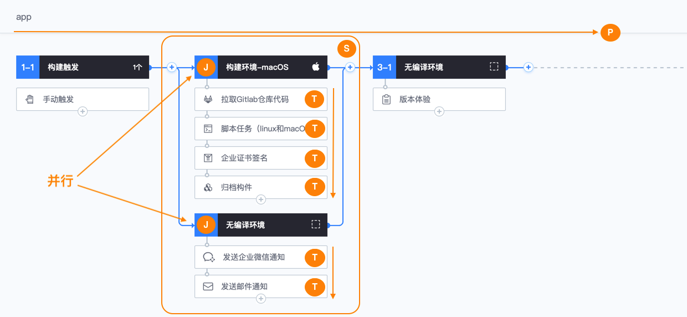

# 术语解释

- **Task**：又称“插件”，即一个单独的任务，如拉取 GitHub 仓库代码。

- **Job**：又称“作业”，运行在一个特定构建环境里。由多个 Task 组成，且当一个 Task 失败，则该 Job 失败，其余 Task 不再执行。

- **Stage**：又称“阶段”，由多个 Job 组成。同个 Stage 下的 Job 并行执行，且 Job 与 Job 之间相互独立。当一个 Job 失败，则该 Stage 失败。

- **Pipeline**：又称“流水线”，由多个 Stage 组成。同个 Pipeline 下的 Stage 串行执行，一个 Stage 失败，将不会执行后续 Stage。当一个 Stage 失败，则该 Pipeline 失败。

- **Materials**：又称“源材料”，即用于构建的代码。流水线中添加拉取代码库的插件后，流水线便有了材料。

- **Triggers**：又称“触发”，即流水线构建的触发方式，目前包括：手动触发、定时触发、代码库事件触发以及远程触发。

- **Artifact**：又称“构件”，编译或打包等操作后产生的文件，如镜像、版本压缩包、ipa 包、apk 包等等，可被归档至制品库。

- **Node**：又称“节点”，分为构建节点和服务器节点。构建节点用于任务构建，包括源代码拉取、编译和打包等功能；服务器节点用于构件部署，进行功能验证或性能测试等。

- **Workspace**：又称“工作空间”，构建机上的工作目录，也是所有与构建机相关的插件执行时的相对目录。
