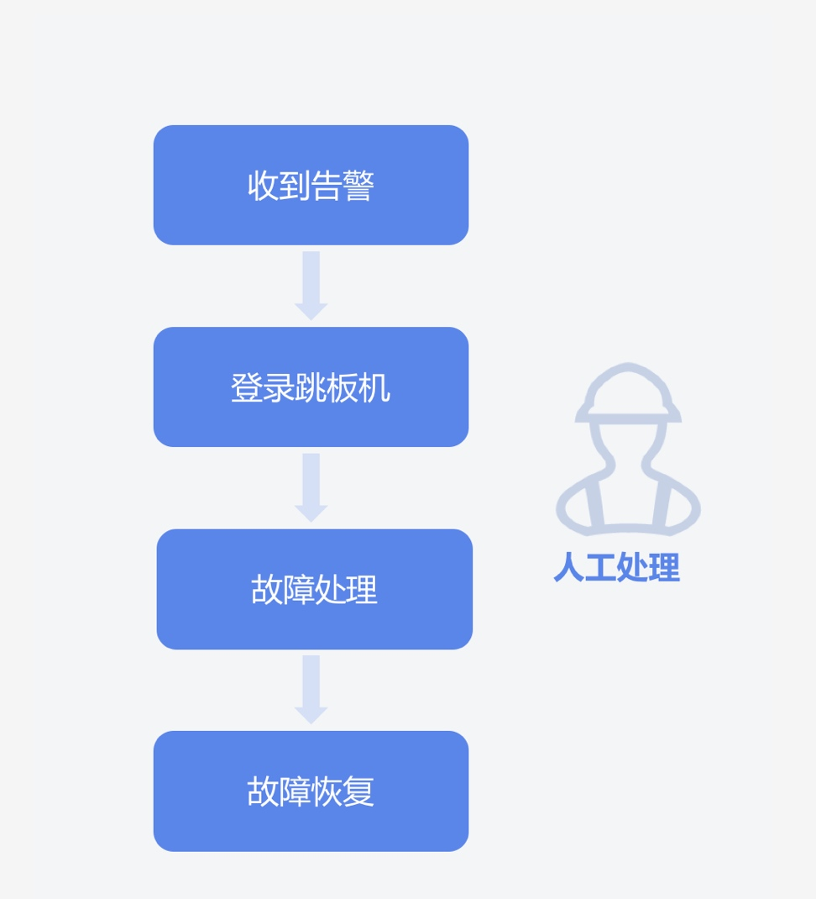
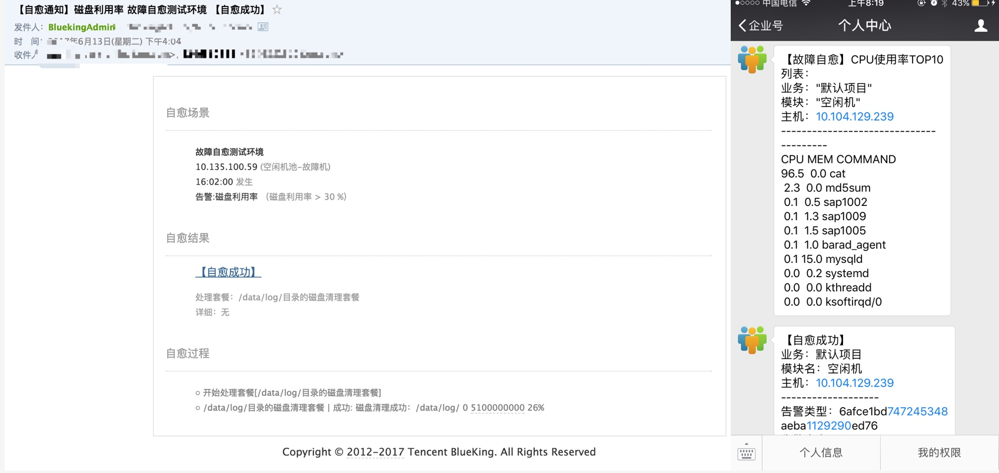
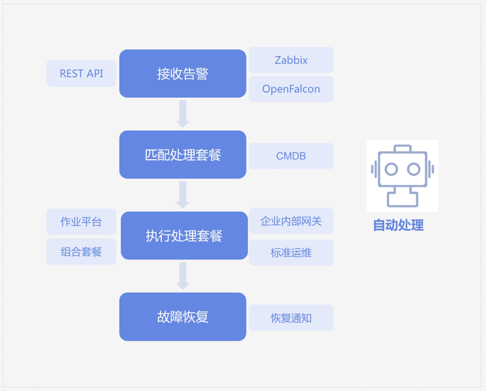
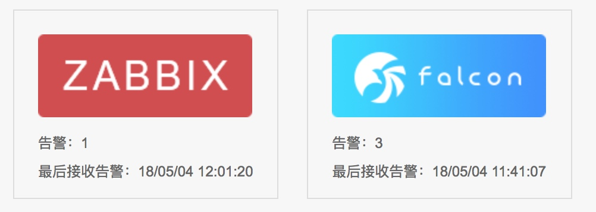
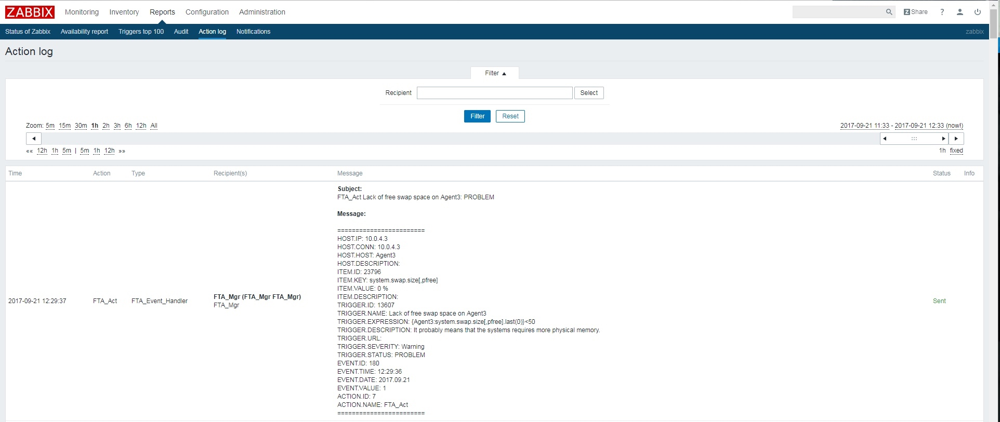
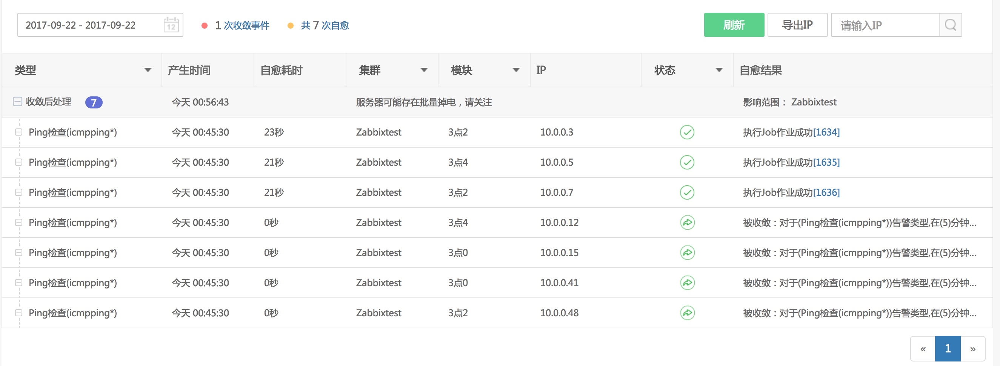
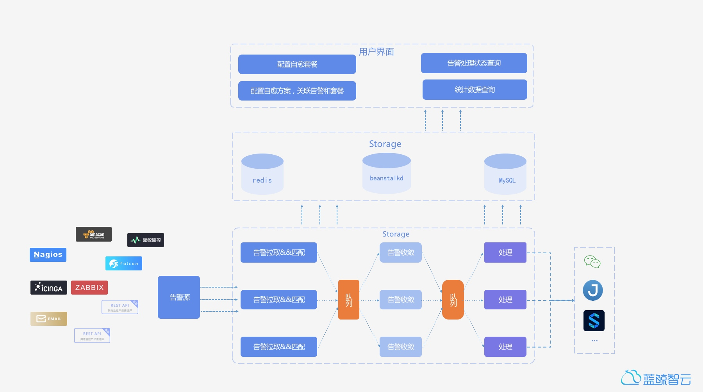

# 设计理念

> 以产品设计理念剖析企业建设故障自动化处理方案的思路。

人工处理告警，一直是运维心中的痛。大年初一拜年、结婚、和老婆孩子外出过周末等美好时光，作为运维的你，好像一直心系 IT 系统，保持与笔记本的安全距离。

为什么这么多年过去了，还是这么苦逼，不是说运维行业转 AIOps 了，我竟然还在手工处理告警，我该怎么办？

本文介绍故障自愈攻克的 3 个技术点，以及 **献上开箱即用的方案**。

## 基本流程

自动化的要点是什么？**把人的经验抽象、固化为程序处理**，工业(第 3 次工业革命)或互联网都是如此。

举个例子，磁盘出现告警，运维首先想到的是登陆服务器清理磁盘。

接下来，我们拆解背后的逻辑。

### 抽象告警处理流程

- 拉取磁盘告警
- 编写磁盘清理的脚本或作业任务
- 设计关联模块：**把拉取到的磁盘告警，与调用脚本的模块串起来**

流程图如下：

### 通过 CMDB 做资源清洗

不同模块的磁盘清理方案不一样，如何解决呢？

这时需要 **引入 CMDB(设备、人、业务的映射关系)**，通过 CMDB 把 `IP` 清洗为 `模块`，这样就解决了接入层 和 逻辑层、存储层的 **告警使用对应的磁盘清理方案**。

流程图如下：

### 对接企业内部网关

故障自愈可能会处理失败，这时需要通知用户。故障自愈的处理方式除了调用作业外，还可能需要**调用企业内部的网关**，比如服务器重启、申请服务器等。

使用 PaaS 层的 ESB 是一种解决思路，通过 ESB 封装企业内部网关，解决权限校验、频率控制、访问统计、路由分发以及自助接入等功能，不要直接调用裸接口了。

下图为故障自愈调用邮件和微信通知网关：

经过这一轮的探索，故障自动处理的流程如下：

### 对接企业内部监控产品

以 Zabbix、Open-Falcon 为例，介绍如何对接企业内部的监控产品。

#### 对接 Zabbix

[《当 Zabbix 遇见故障自愈》](https://mp.weixin.qq.com/s/kZzLv2QOQvtX7Bim5n-NJQ) 介绍了拉取 Zabbix 告警的方案，**通过 ActionScript 调用脚本，把 Zabbix 告警推送至自愈的告警拉取模块**。

推送(或叫回调)可以保证告警拉取的实时性。

下图为 Zabbix 推送告警示例：

实际上是 Zabbix 调用推送告警的脚本：

对接 Zabbix 的落地案例可以参考陈亮撰写的 [那些年我们想做的无人值守](https://mp.weixin.qq.com/s/MX74-vDEOkFA0Om6WDrwYQ)。

除 Zabbix 外，Open-Falcon 在国内的社区热度也不错，所以也介绍拉取其告警的方案。

#### 对接 Open-falcon

方案类似 Zabbix，不过 Open-falcon 直接提供了 callback 功能，简化了流程。

下图为在 Open-Falcon 告警模板中，将故障自愈接收告警的地址，**录入至 Callback 地址**中。

收到了 Open-Falcon 推送的告警后，解析对应的字段即可。

如果企业内部的 CMDB 以 IP 来标识主机，需要再做一层转换，因为 Open-Falcon 的资源标识 `endpoint` 默认是主机名，那么就需要使用 CMDB 的自动发现功能自动上报主机名，同时提供把主机名清洗为 IP 的功能。

下面是 Nginx 模块磁盘告警的自愈示例，匹配 Nginx 模块的磁盘清理套餐，清理 Nginx 模块的日志文件，整个过程不到 30 秒。

告警自动处理看似如此简单，然而并非如此。

## 两面性

**故障自动处理就像一把刀，有其两面性**。

因为要确保告警的真实性，一旦把假告警也自动处理了，就很悲催了。

举个例子。网络波动，批量出现 PING 告警。实际上服务器运行正常，这时你把服务器都重启了，那就 GG 了。

如何解决呢？分析事物的规律。

批量出现告警，那可以在告警拉取模块后面，**增加一个收敛模块**：

- 比如，在 X 时间内出现 Y 个告警，打电话给运维审批。

- X 时间内同一主机出现使用相同套餐的告警，则收敛时间窗口中后面的告警则跳过，比如同时收到进程告警 和  端口告警，就不用拉 2 次进程了。

还有就是，原有监控系统没有收敛能力，那么可以借用这个功能来做告警汇总，因为收敛逻辑一样，只是收敛的处理方式有差异。

解决了安全和基本的告警自动处理诉求后，你可能还想处理复杂的故障处理场景。

## 复杂告警的处理方案 - 组合套餐

举个例子，A 模块是重要模块，出现 PING 不可达告警，首先要校验 A 模块是否真的故障，如果真的故障，接下来是从资源池中获取备机 ...  故障替换等等，期间每个环节都有可能出错，那就要考虑异常分支的场景。

**树结构**可以解决该问题，**二叉树**足以满足大部分场景(成功、失败两种分支)。

上面这张图，是一个自愈处理方案，可以称之为组合套餐。

这里同时引入了原子的概念，通过组装原子来满足各种需求场景， 和`资源编排`说的是同一个理儿。

注：如果你想使用三叉树，其实可以把组合套餐也作为一个原子套餐(节点)。

## 技术架构

经过前面对 **故障自愈的处理流程**、**故障自愈的两面性**、**复杂的故障处理方案** 的层层梳理，我们有了一张故障自愈的技术架构图。

故障自愈的告警拉取模块，周期性或通过 **回调** 方式从各大监控系统中获取告警，通过调用蓝鲸 CMDB 的 API **解析** 告警所属的业务、模块，查询该业务、模块在故障自愈配置的处理动作，经过 **告警收敛** 模块的过滤以确认没有大批量相同属性(如同业务、机房等)，最后执行对应的 **处理动作**，告警恢复，业务恢复正常。

相信这次以经行业验证的故障自愈做技术剖析，能对大家建设企业内部的故障自动处理方案提供参考思路。
