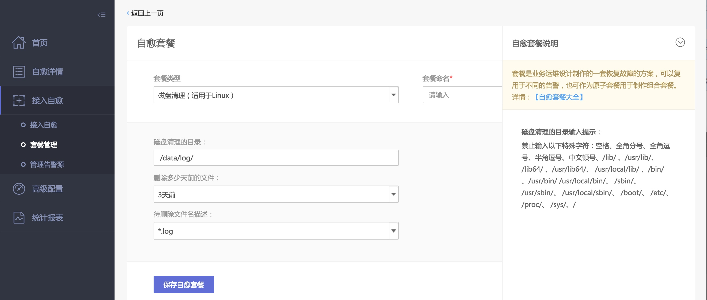
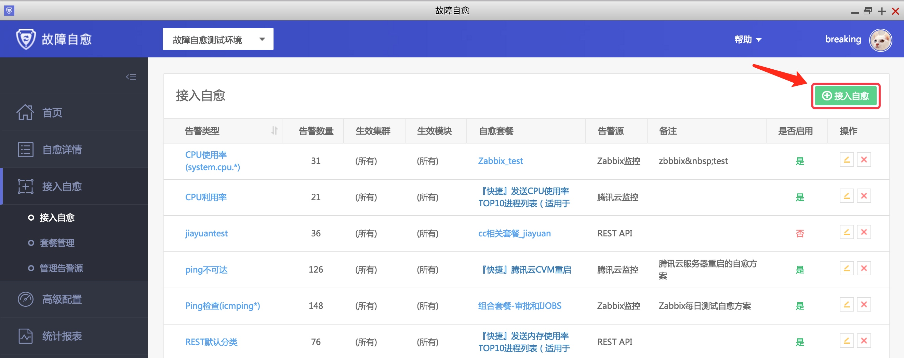
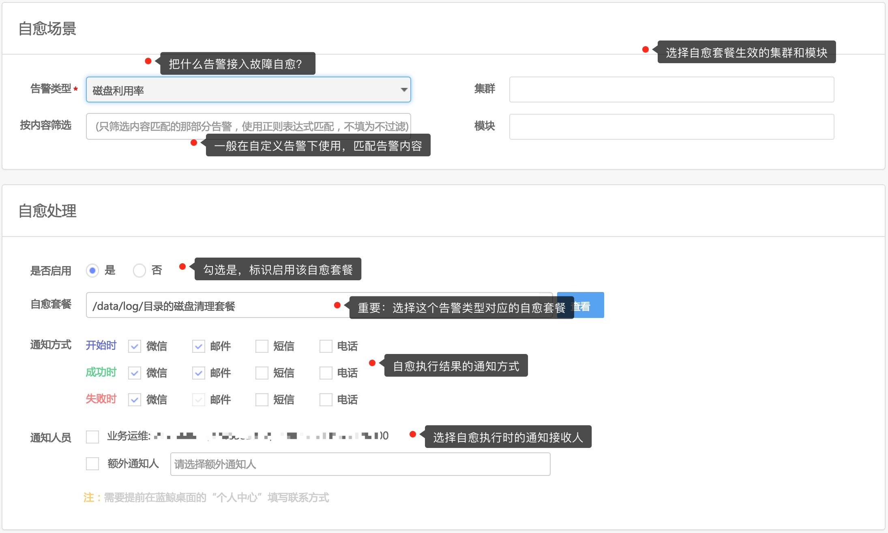

# 创建磁盘清理自愈套餐和方案

磁盘使用率告警的自动化是一个经典的场景，本文通过这个案例介绍故障自愈中 **自愈套餐**、**自愈方案** 的概念，以及故障自愈是如何实现告警的自动化处理。

首先，创建自愈套餐。

## 创建磁盘清理自愈套餐

磁盘告警来了，执行什么动作来清理磁盘。

1.1_fta_create_fta_solutions_disk.mp4

**接入流程**：

依次选择 【接入自愈】 → 【套餐管理】  → 【创建自愈套餐】

按照 【磁盘清理(适用于 Linux)】套餐页面的提示，输入【套餐命名】、【磁盘清理的目录】，选【删除多少天的文件】和【待删除文件名描述】，然后保存自愈套餐即可。

> 提示：该套餐实现出现磁盘使用率告警时，找出 `/data/log/` 目录下 `3天前` 以 `.log` 结尾的文件并删除。

接下来我们需要把 `磁盘使用率` 告警接入刚刚创建的磁盘清理套餐。

## 接入磁盘清理自愈方案

1.2_fta_bind_fta_solutions_disk.mp4

在【接入自愈】菜单中点击【接入自愈】。

进入【接入自愈】页面，做如下配置：

如此，完成磁盘清理告警接入故障自愈。

