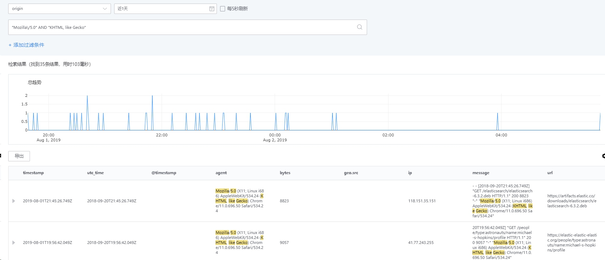
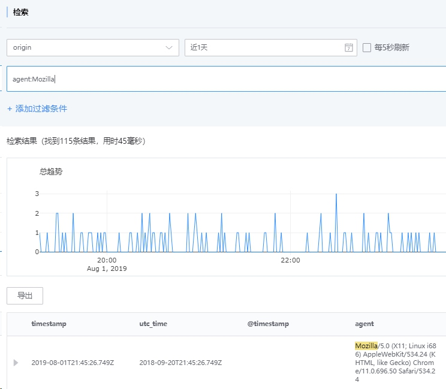
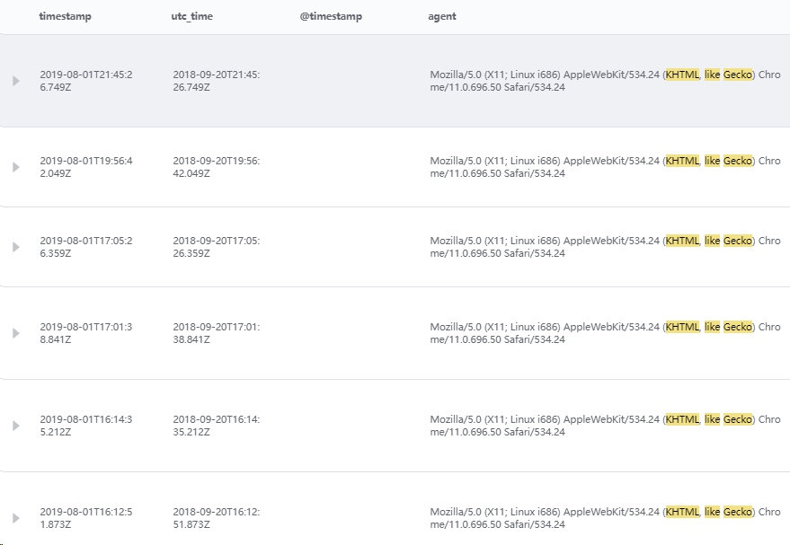
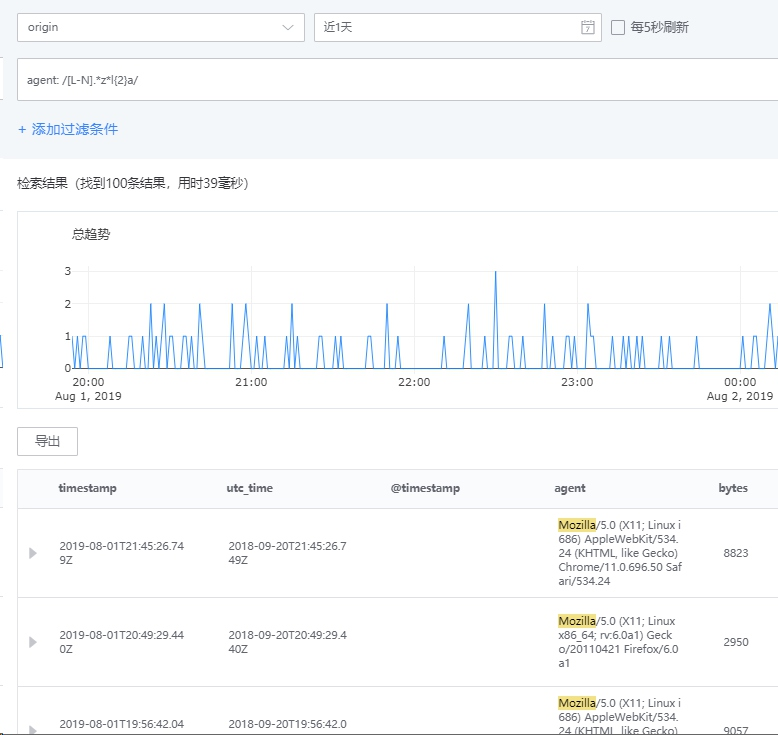
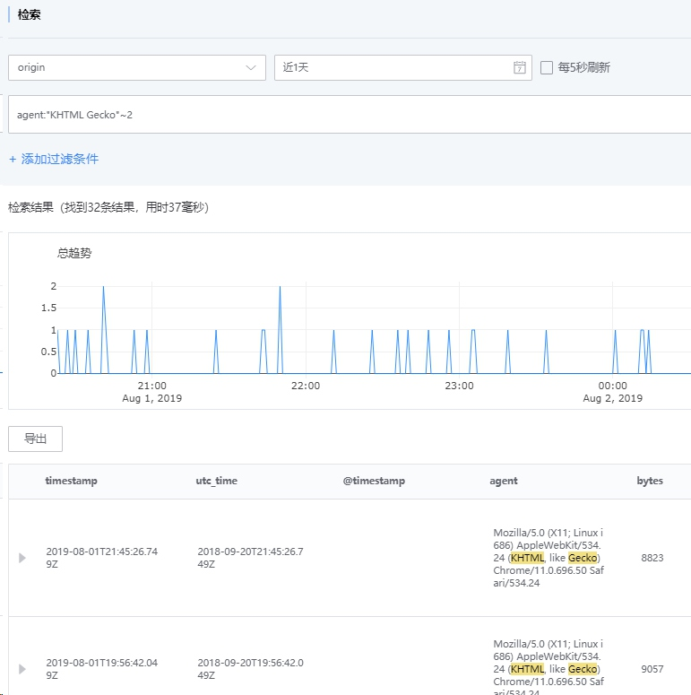
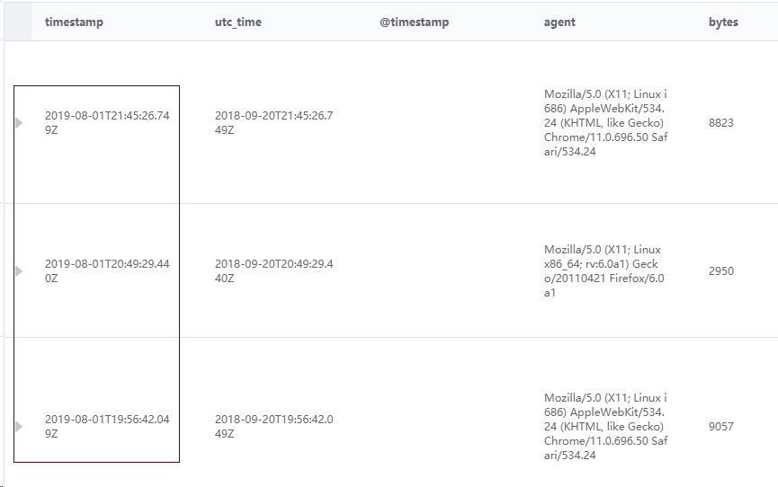
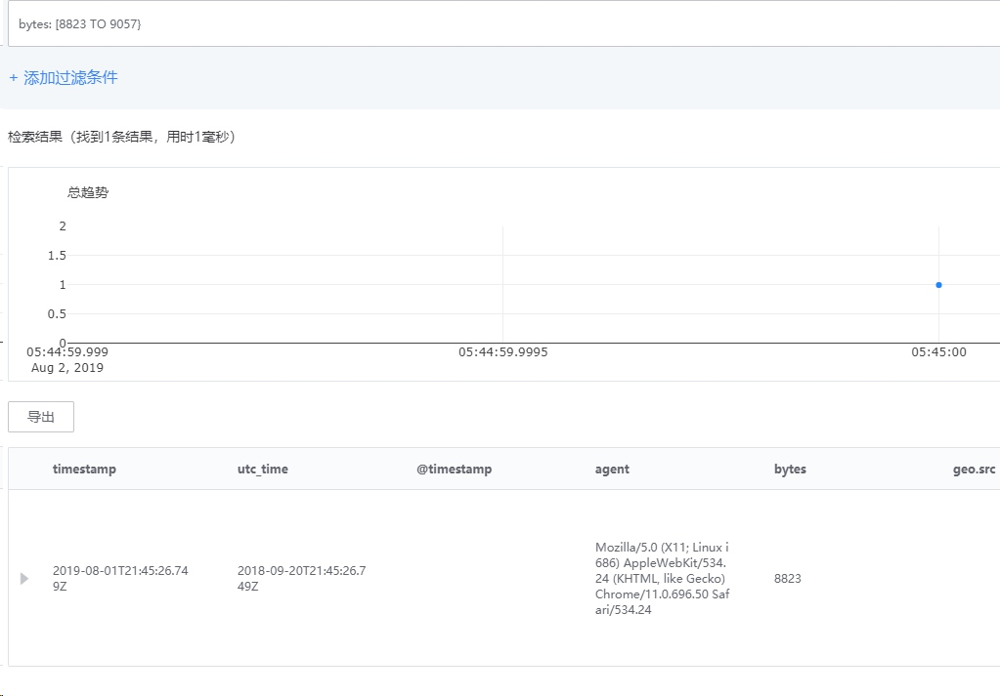
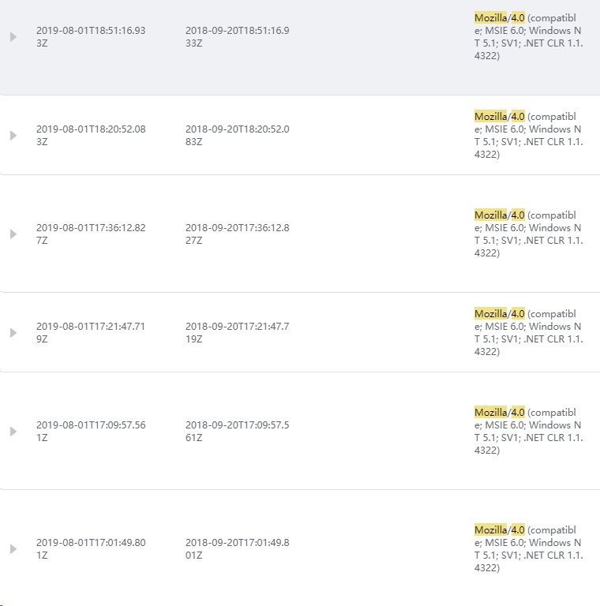

# 检索语法指南

在日志检索当中，使用了标准的 Elasticsearch QueryString，基本支持所有语法。下面是基础的语法介绍。

## QueryString简介

查询后台会根据 QueryString 传入的文本信息进行解析，解析的语法原则是根据具体的操作符进行分割判断，并对分割后的每一段进行独立分析，然后进行查询分析。
如图：

查询语句 (Mozilla) OR (Chrome)

查询语句会根据操作分成 Mozilla 和 Chrome 两个部分，每个部分都会被查询后台独立进行分析。

> **注意：**“空格”不会被作为是操作符，如查询(KHTML,like Gecko) OR (200 8823)，KHTML，like Gecko 会被完整的传入到后台去进行查找分析。能够搜索出只有 Gecko 或者只有200的字段，因为具体的字段在 ES 后天进行了分词配置。如果想独立搜索200和8823可通过语句200 AND 8823查询。

## QueryString语法

### 基础语法

上面提到 QueryString 的内容会被解析成词语或者操作符，词语可以是单词-如 MozillaORChrome，也可以是个短语语句，被双引号包围`"Mozilla\/5.0" AND "KHTML,like Gecko"`。

### 查询指定字段

默认情况下 QueryString 会将查询内容解析到所有的字段（_all），可以通过字段设定固定查询具体的字段。

例：查询 agent 里面包含 Mozilla。

`agent:Mozilla`

例：查询 agent 里面包含 Mozilla 或者 X11 或者 4.0。

`agent: Mozilla OR X11 OR 4.0`

例：查询 agent 里面具体的短语（使用双引号包裹）。

`agent: "KHTML,like Gecko"`

例：查询 geo. 通配符含有 CN 的内容。

`geo.\*:CN`

例：查询 geo.src 非空

`_exists_: geo.src`

### 通配符

通配符支持 ? 和 * 。

? 替换一个单独的字符。

\* 替换一个0个或者多个字符。

这个与正则表达式类似。

如查询 `agent: M?zi*a`。

> 注意：通配符查询是会消耗大量内存的，在一个短语或者词语中存在多个通配符，会导致大量的词语列入搜索范围。

如：`agent: *zi*a`。

能够查询出 agent 中包含的结果，但是对于 agent 字段的所有短语都会进行检索，消耗大量的时间和后台内存。

考虑必要的查询场景，日志检索没有对该功能进行禁用。使用通配符的时候需要详细考虑一下具体的查询语句。

### 正则表达式

正则表达式模式嵌套可以再 Query String 中使用，使用时需要将查询内容包裹在两个正斜杠中（“/”）。

如：`agent: /[L-N].*z*l{2}a/`

### 模糊查询

可以带波浪号对末尾模糊查询。

`agent: Mozill~`

可以针对短语进行模糊查询。

`agent:"KHTML Gecko"~2`

### 范围查询

范围查询是针对时间、数字和字符串类型的字段使用的。

范围查询的操作符主要是 []和{}，其中[]是闭合查询，{}非闭合查询。

例：查询 Bytes 字段从8023到9057区间内的数据，包含8023和9057。

`bytes: [8823 TO 9057]`

例：查询时间字段是时间类型的区间。

`timestamp:[2019-08-01T19:56:00 TO 2019-08-01T22:00:00]`

例：查询Bytes字段从8023到9057区间内的数据，不包含9057。

`bytes: [8823 TO 9057}`

## Bool操作符

回顾一个最基础的查询

`agent: Mozilla X11 4.0 5.0`

在这个查询当中，所有的短语都是可选的，也就是会得到如下的结果：

如果希望对查询操作有更多的控制，可以通过 Bool 操作符如：

`agent: Mozilla X11 +4.0 -5.0`

对于这个查询的理解，

Mozilla X11是可选的，主要满足其中之一，记录就会找出，

4.0是必须的，

5.0是不能存在的，

得到如下的结果：

以上的查询可以被理解成：

`agent: ((Mozilla AND 4.0) OR (X11 AND 4.0) OR 4.0) AND NOT 5.0`

相比而言使用 Bool 操作符就能够简单获得需要的结果。

## 条件分组

`agent: ((Mozilla AND 4.0) OR (X11 AND 4.0) OR 4.0) AND NOT 5.0`

上面的这种查询就是分组的示例，还可以针对不同的字段进行条件分组。

`bytes: "2189" AND agent: ((Mozilla AND 4.0) OR (X11 AND 4.0) OR 4.0) AND NOT 5.0`

## 特殊字符的转义

如果希望查询的内容当中是包含日志检索的操作符，那么需要在 Query String 当中进行转义，通过反斜杠进行转义，需要转义的字符如下：

`+ - = && || >< ! ( ) { } [ ] ^ " ~ * ? : \ /`

如果忘记了转义会导致查询报错。

如希望查询 agent 是 Mozilla/5.0 (X11; Linux x86_64; rv:6.0a1) Gecko/20110421 Firefox/6.0a1。

通过转义，

`agent:Mozilla\/5.0 \(X11; Linux x86_64; rv\:6.0a1\) Gecko\/20110421 Firefox\/6.0a1`

转义后会转成分词的模式进行查询。

