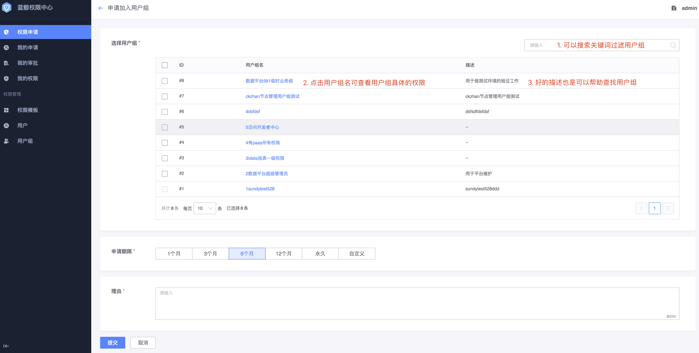
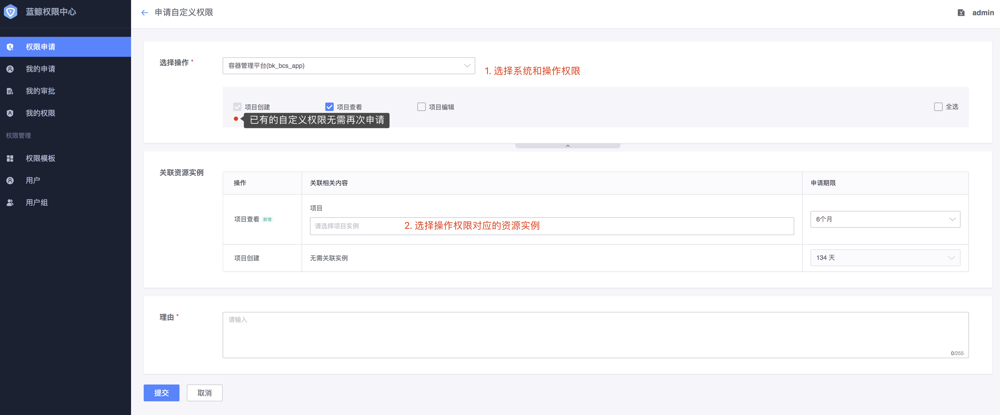
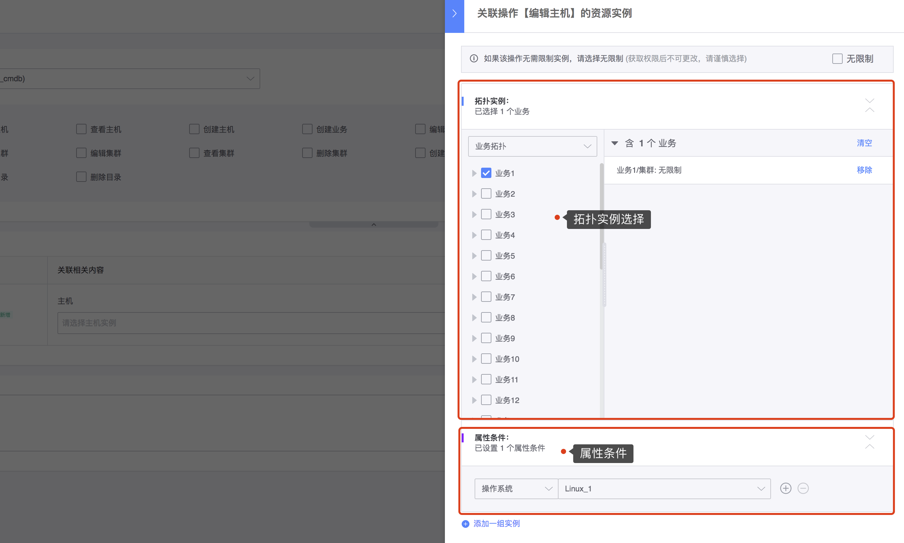
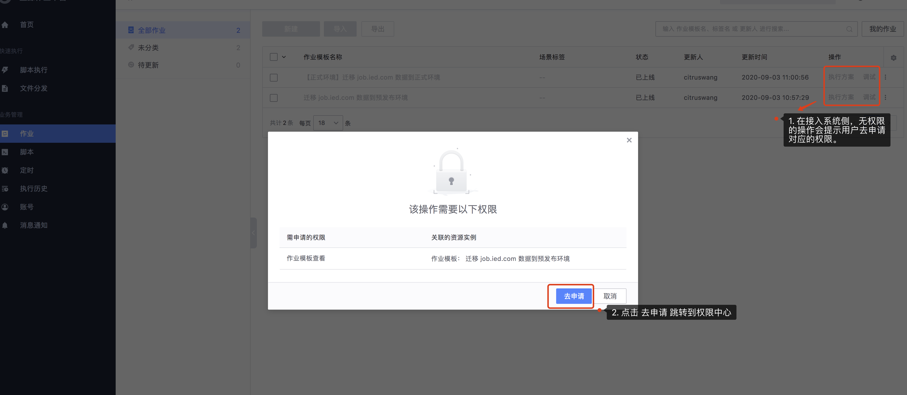
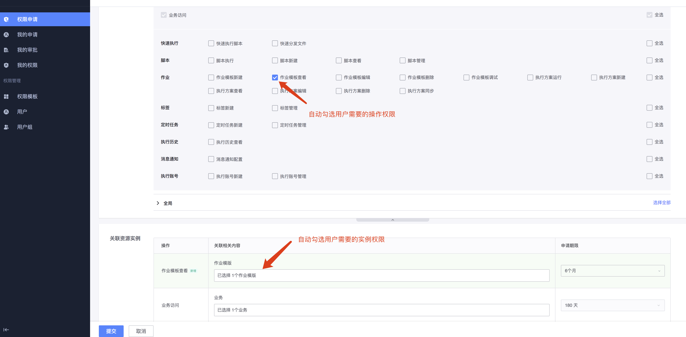

# 权限申请

用户可以通过三种方式主动申请需要的权限：`申请加入用户组`、`申请自定义权限`、`从接入系统侧无权限跳转`。

## 申请加入用户组

蓝鲸权限中心`推荐`的权限管理方式，用户进入权限申请页面 ，点击`申请加入用户组`按钮进行申请，在申请用户组列表页面，用户只需要通过关键词搜索到需要的用户组，申请加入即可。

## 申请自定义权限

自定义权限建议是在用户组权限无法满足的情况下才申请，自定义权限虽然灵活，但零散的权限带来的后果就是不方便后续权限的统一管理。

用户在权限申请界面，点击`申请自定义权限`按钮进行申请。

权限中心支持`拓扑实例选择`、`属性条件`两种实例选择方式，大部分接入系统只接入拓扑实例选择方式。

- 拓扑实例选择：如果接入系统提供了多种视图选择，用户在拓扑实例选择这里可以通过多种方式来选择想要的实例，拓扑实例除了叶子节点外，其他节点均为动态节点，即选择了当前节点，默认就包含了所有子级的节点，包括未来新加的子节点。拓扑实例选择能满足大部分用户的选择需求。

- 属性条件：属性条件是一种高级的实例筛选方式，属性条件是动态选择方式，对于那些经常有实例变动或者需要范围权限的用户来说，属性条件是更好的方式。

一组实例选择，可以通过`拓扑实例选择`或`属性条件`，也可以组合使用，组合使用时，拓扑实例和属性条件是`且`的关系。多组实例之间是`或`的关系。

## 从接入系统侧无权限跳转

用户直接访问接入系统页面，接入系统会提示用户无权限并申请需要的操作权限。

点击`去申请`自动跳转到权限中心，跳转时会自动带上用户需要的操作和实例权限，用户直接点击提交即可完成权限申请。

