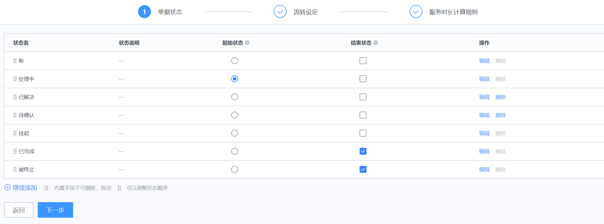
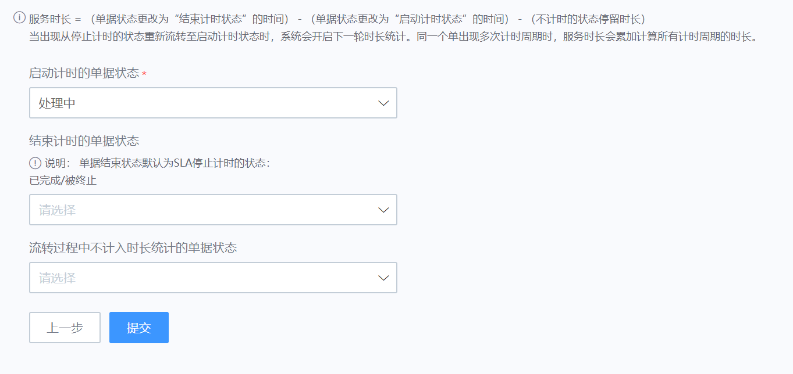

## 单据状态管理

单据状态管理：可根据需要，针对不同服务类型，自定义管理相应的单据状态、以及状态间的流转规则。单据状态的更新及变化，会体现在每一个具体的服务单据流转过程中。

单据状态列表

单据状态列表

工单状态的应用场景：

1.  当服务类型的工单状态差异性很大时，可以通过此项设定来满足。

2.  工单状态和服务协议的计时标准有关。可以设定不同服务类型下的服务计时规则，包括开始计时的状态，结束计时的状态，以及过程中某些不计入耗时的中间状态。可以更加灵活支持不同场景下的服务计时需求。

-   单据状态设定

    根据实际需求，设置合适的工单状态，并设置开始状态和结束状态。**开始状态只能选择1个，结束状态支持多个。**“开始状态”设定完成后，即每个单据一旦提交成功，其初始状态即为设定的“开始状态”。“结束状态”设定完成后，即当单据进入到该状态时，将无法再被操作。

-   流转设定

    流转设定，是设置工作状态间的先后流转关系。如果需要设置该流转，请在两个状态间的复选框内打勾。结束状态（如已完成，被终止，被撤销）无法逆向流转。

流转设定

-   服务时长计算规则

    当服务需要启用SLA，需要提前设定服务时长的统计规则。设定在单据流转过程中的计时起止状态，以及过程中不计入计时的特别状态。

    设置完成后，服务下的单据实例会根据协议中设定的规则，启动对应优先级下的服务时长统计。

> 注：
>
>   1.  服务时长的统计规则修改将会直接生效到已有的单据实例中，请谨慎操作。
>
>   2.  只有单据的“优先级”不为空时，才会触发SLA的计时规则。

服务时长计算规则设定

