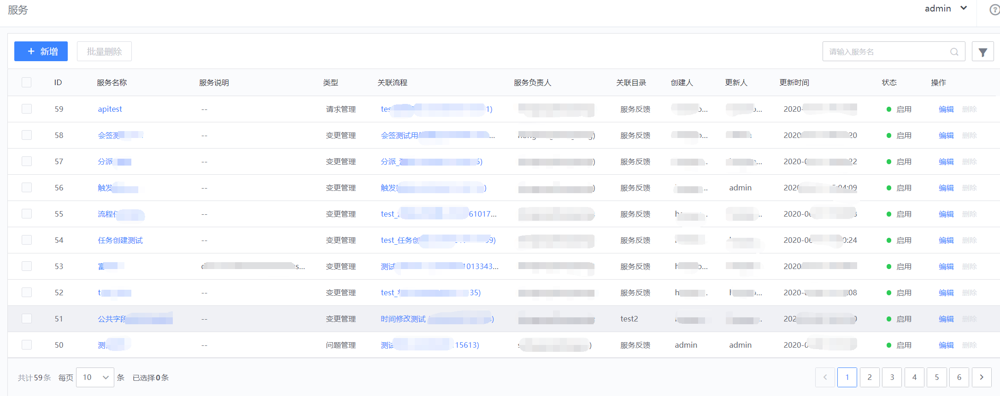
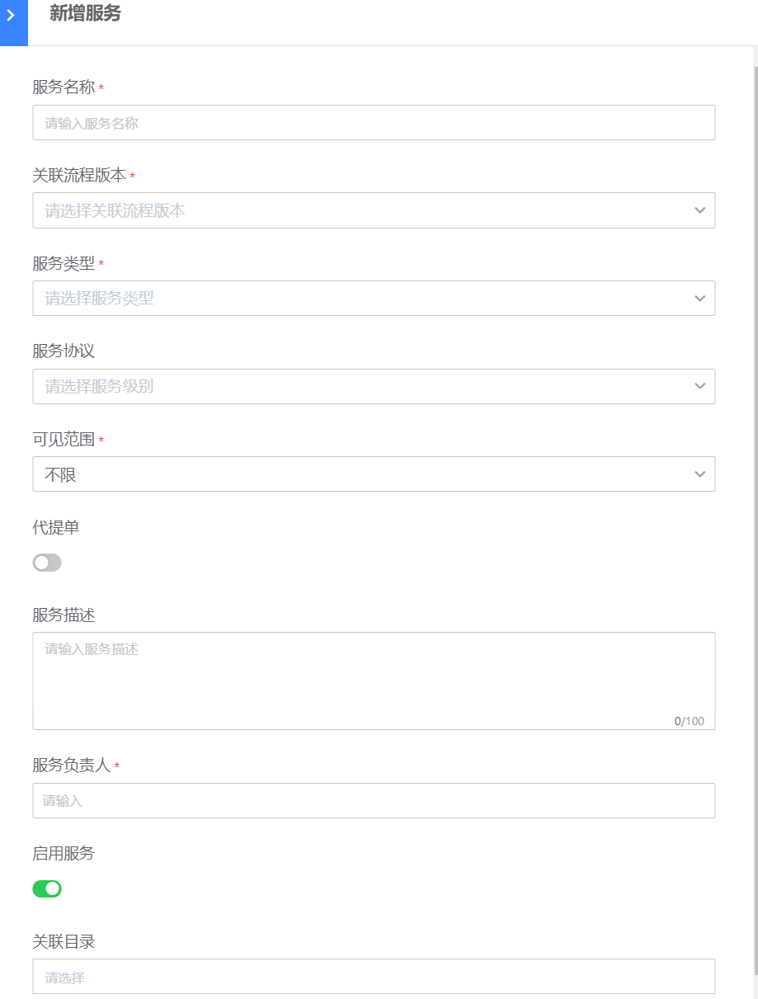

## 服务管理（后台）

将整体服务场景通过服务目录以及服务的方式进行统一管理及更新，便于为客户/用户提供的服务管理。同时，服务管理会和流程版本关联，以将流程应用至具体的服务中。

### 服务

服务是服务场景的最小单元。管理员进行服务梳理时，可以从上至下，即从梳理大的服务目录，再细化服务目录下的服务。也可以先将具体服务梳理完成后再进行目录类别划分。可视自己企业自身情况而定。

服务列表

服务列表除显示服务的基本属性，还会显示其归属的服务目录，以及服务的更新时间等信息。可对服务进行新增，编辑，删除操作。

> 注：当服务有关联目录时，该服务不能删除。在服务目录移除该服务之后，方可删除。

新增服务

-   服务名称：服务名称，便于了解服务基本内容。

-   关联流程版本：该服务启用后会根据指定的流程模板进行服务流转和处理。关联的流程是指已经正式发布的流程版本，可根据版本号辨认版本更新时间，方便管理员选择更新。

-   服务类型：指该服务属于哪种服务类型模块。系统内置了请求，事件，变更，问题四种服务类型。如管理员需要对服务类型进行修改，可以在系统配置的“数据字典”进行修改。

-   服务协议：指该服务需要应用哪种服务协议作为其服务标准的考量。关联服务协议后，该服务下的工单将会通过服务协议中的计时规则进行服务时效的计算与展示。【\*关联流程版本中必须应用服务协议相关的“紧急程度”“影响范围”“优先级”3个公共字段才可以】

-   可见范围：该服务入口对哪些用户开放访问。【如要通过组织架构来进行范围管理，需要先接入蓝鲸“用户管理”，且在“系统配置”中打开“组织架构功能”应用开关】

-   代提单：是否可代他人提单的启停开关。开启后，在提单页面，当前用户需要手动录入提单人。提交后，手动填入的提单人将作为单据的提单人保存并应用。

-   服务描述：对服务内容的具体描述。非必填，但合理的描述更有助用户对服务的理解。

-   服务负责人：该服务的管理人。当服务出现异常时，系统会通知到对应服务负责人。

-   启用服务：服务启用生效的开关。

-   关联目录：可快速选择服务目录，将该服务关联至对应服务目录下。
