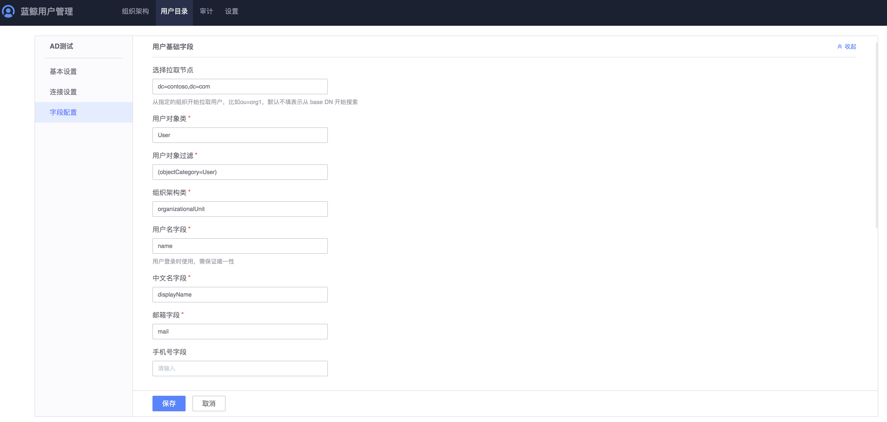
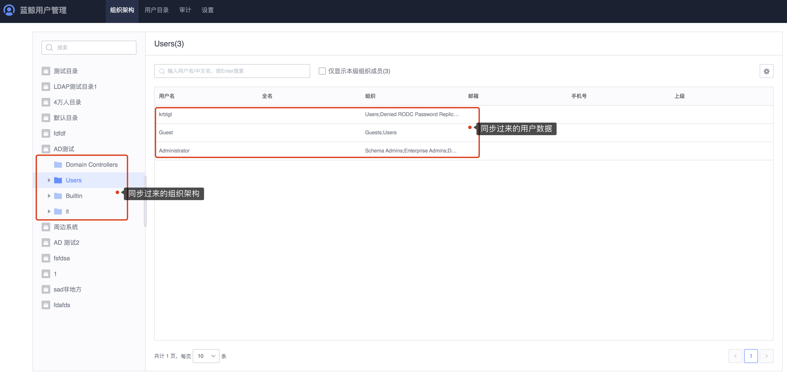
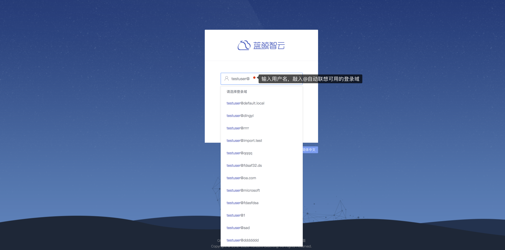

# 创建 MAD 目录

本文介绍如何创建 Microsoft Active Directory(MAD) 目录，并且同步 MAD 用户到用户管理。

##前置条件

> 1. 需要有已经搭建好的 MAD 服务
>
> 2. 需要申请 MAD 目录的新建权限

## 操作步骤

1. 点击`用户目录 -> 新建目录`，选择`Microsoft Active Directory`目录类型进行目录创建并进入下一步。

   

2. 在`基本设置`页面，填写基本信息。

   - 目录名：目录名称，保存后可随时修改；
   - 登录域：登录域是用来登录的时候区分用户来源，为了方便区分，一般为公司`代号`，保存后不可修改。

   

3. 在`连接设置`页面，填写连接 MAD 服务器的基本信息。

   - 连接地址：MAD 服务器地址，一般直接填写 MAD 服务器的 IP 地址，或者`IP:PORT`形式，端口如果是默认的可以不填写；
   - SSL 加密方式：默认即可；
   - 超时设置：尝试连接 MAD 服务器的连接超时设置；
   - 拉取周期：同步 MAD 用户数据的周期，填写`0`表示不自动拉取；
   - 根目录：MAD 根目录，默认`cn`即可；
   - 用户名：登录 MAD 服务的用户名；
   - 密码：登录服务的用户名密码；

   填写完后，点击`测试连接`如果正常会提示成功信息，如有错误，请查看用户管理后台日志信息。

   

4. 在`字段配置`页面，主要配置拉取字段的信息，只需要填写用户基础字段信息，其他字段信息可以保持默认，具体字段值参考如下图。

   

5. 上述所有信息填写确认后，点击`提交`即完成 MAD 用户目录的创建，创建完成，可以立即进行用户信息同步。

   

6. 同步完用户信息，在组织架构页面可以查看同步过来的组织架构数据。

   

7. 尝试用 MAD 的用户直接登录蓝鲸。

   输入用户名时，除了默认目录外，其他目录的用户需要使用`用户名@登录域`的形式登陆。

   

