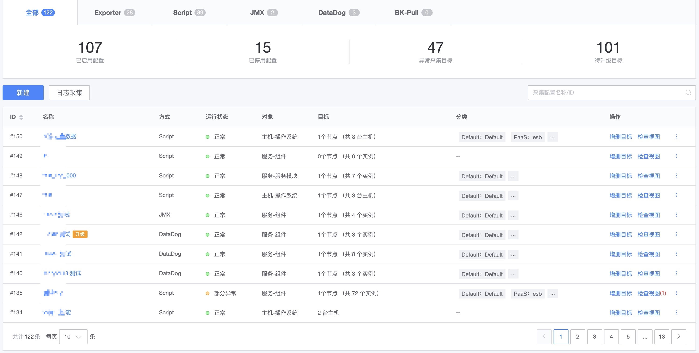
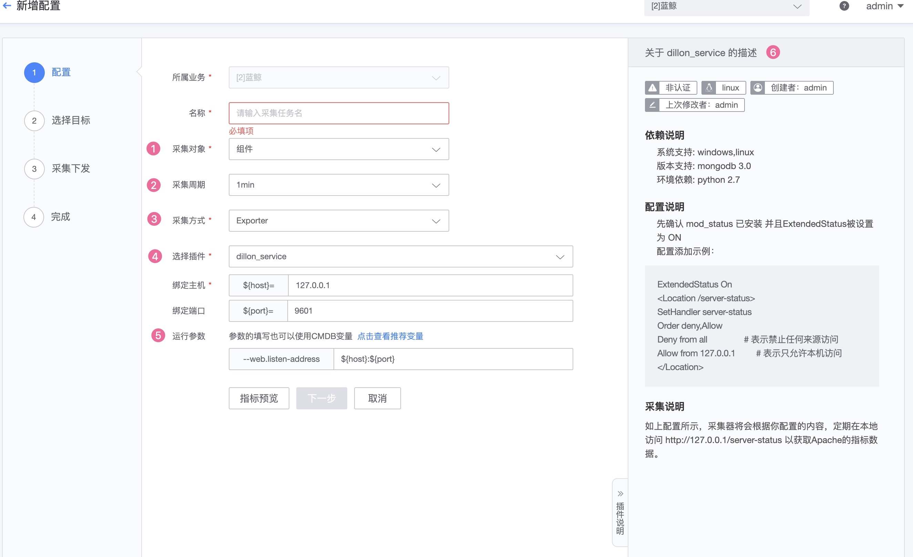
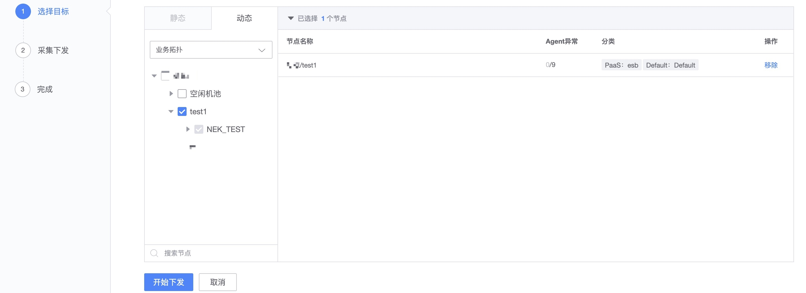
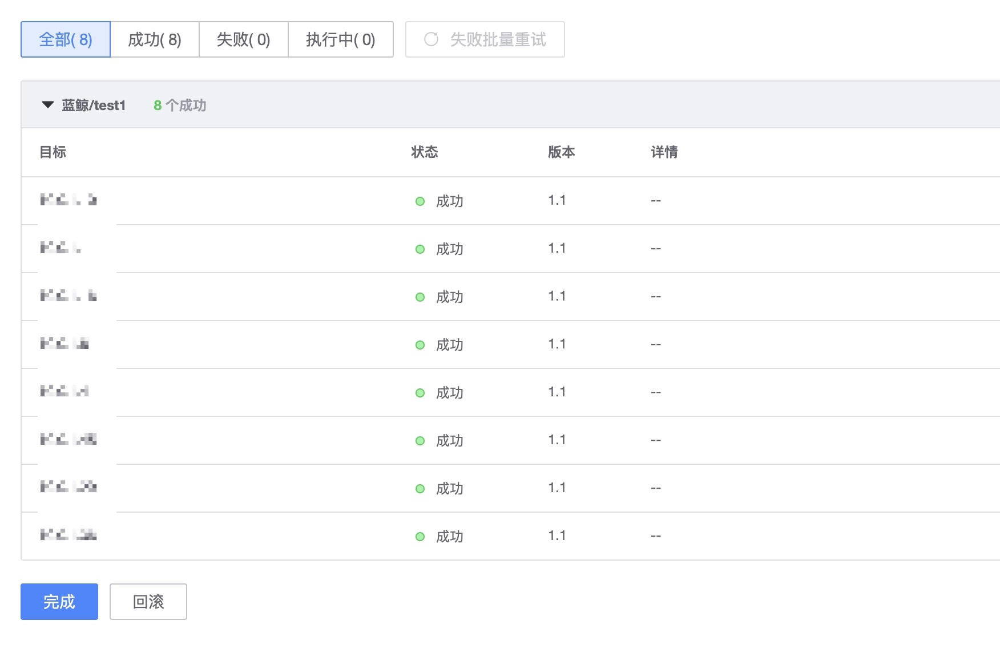

# 采集配置

采集配置及采集任务,是为了将数据从监控对象源头采集数据上来,采集使用的要么是内置的采集能力,要么是用户创建的插件.

## 前置步骤

**工作原理**：

**导航路径**： 导航 →  监控配置 →  采集 →  新建

## 主功能一览

* 采集参数支持变量
* 基于业务拓扑动态采集
* 检查视图
* 插件升级
* 采集状态

## 功能说明

### 采集配置列表

**统计数据说明**:

1. 已启用配置: 显示的是还在生效的采集任务.
2. 已停用配置: 采集配置可以停用,停用后的配置数.
3. 异常采集目标: 采集异常是采集出现问题,在检查视图处会有异常提示,这里的目标数量是 IP/实例数量
4. 待升级目标: 插件进行了变更后,大版本的变化会提示需要进行升级,否则无法编辑等操作,这里的目标数据是 IP/实例数量.

> 注意:
> 1. 统计数据可以点击进行过滤,再点击是取消过滤.
> 2. 日志采集是使用的日志平台的能力,界面交互暂时不在"新建"中

### 新建采集

**第一步: 基本配置**

* 采集周期: 默认是1分钟,可以采集2分钟 5分钟的数据,图表类会兼容采集周期显示. 注意的是策略设置的监控周期最好和采集周期一致.
* exporter 的需要设置 exporter 启动的端口.
* 参数的填写可以使用 CMDB 的变量.适用的场景就是参数内容不一样处理逻辑有所区别的. 如被监控的进程端口不一样,角色不一样(master slave)等 . 具体查看[如何实现多实例采集](../../guide/multi_instance_monitor.md)

**第二步: 选择目标**

静态和动态的采集方式,建议使用动态采集可以基于 CMDB 拓扑进行动态的扩缩容.

> 注意: 主机对应最小粒度是 IP , 服务对应的最小粒度是服务实例 instance

**第三步: 采集下发**

采集目标下发过程可视化是因为采集的目标环境有很多种不确定性因素影响采集的过程,过程可视化可以帮助相关人快速的定位问题.

失败可以查看具体的详情,还可以进行批量重试. 在编辑的时候还可以进行快速的回滚.

**第四步: 完成**

完成阶段可以快速指引到"检查视图"和"策略配置"

### 查看采集数据

为了判断采集的任务是否成功采集到数据. 有如下的方法:

* 1) 检查视图
* 2) 运行状态查看

**1) 检查视图查看**

列表页上面有"检查视图"的操作可以直接看到该采集任务的指标数据内容.

**2) 运行状态检查**

当已经遇到一些采集问题,或者列表页的统计数据已经有一些异常数据,需要关心并进行处理.

## 相关

[如何进行无数据问题定位](../../guide/nodata_problem.md) 检查视图，采集状态，数据采样。
