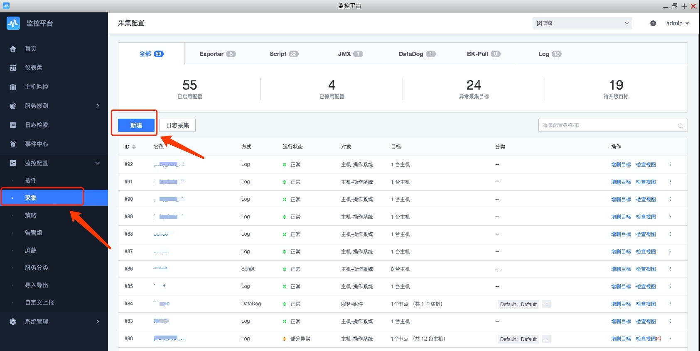
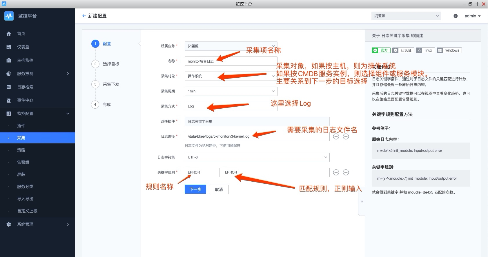
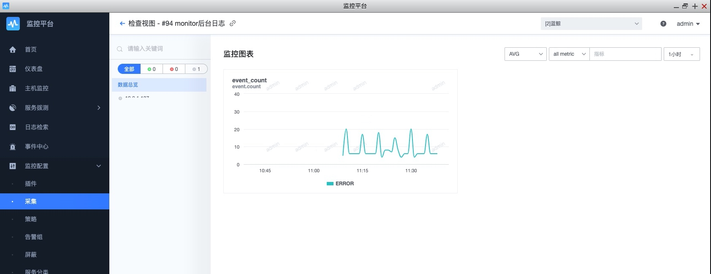
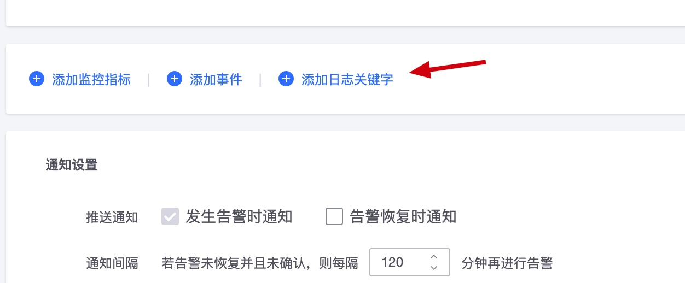
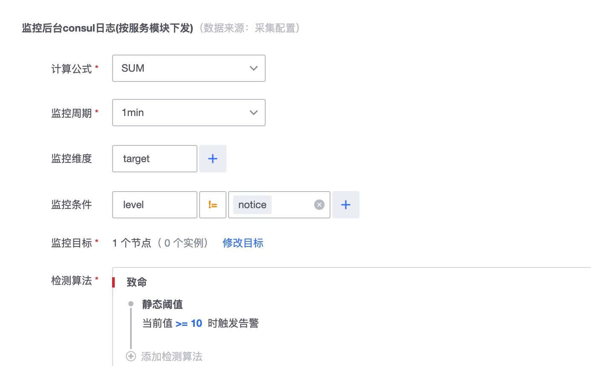

# 日志关键字监控

日志关键字监控指的是通过日志的里面关键字匹配出来的数量进行告警判断是否有问题，是一种比较常见的监控需求。在监控平台有两种日志关键字配置方法。 

## 前置步骤

先了解两种日志关键字的工作原理：

### 第一种：基于日志平台数据的日志关键字

日志平台的数据不敢是自采集的，第三方ES的还是数据平台的最终都是存储在ES的存储里面。所以这类数据的日志关键字都是基于ES查询语法日志关键。

* **优点**：日志集中存储，当接到日志关键字告警后可以直接在日志平台进行查询和定位

* **缺点**：如果日志量很大将占用大量的带宽和存储资源。另外就是查询方法是依据分词原理。像I/O 默认会拆分I和O来进行匹配

具体配置方法： [如何监控日志平台的数据](log_monitor.md)

### 第二种：在Agent端进行日志匹配生成事件

在日志所在的服务器进行日志关键字的匹配，将周期内的统计值和样本数据进行上报。再通过告警策略生成告警事件达到告警的目的。

* **优点**：在日志量很大，存储资源不够的情况下也可以满足日志关键字的需求。匹配方法为正则方式更容易配置和理解。满足及时告警需求不受日志传输的延迟影响
* **缺点**：只有一条最新的采样数据，如果需要更多信息需要通过其他方式去查看

接下来就主要介绍第二种日志关键字事件的配置方法

## 依赖 

 确保采集进程已经启动

- Linux

    ```bash
    ps -ef | grep bkmonitorbeat
    ```

- Windows

    ```bat
    tasklist | findstr bkmonitorbeat
    ```
    
- 如果没有，则需要通过**节点管理**应用安装，并托管启动。并且确保是最新的版本。

## 第一步：配置采集

导航：监控配置  →  采集  →  新建  →  采集方式(Log)





### 日志路径

填写轮转的日志绝对路径就可以。如：

```bash
/var/log/nginx/nginx.log 
```

```bash
/var/log/xxxx/error.%Y%m%d.log
```

### 维度提取

关键字不单可以匹配正则还可以从行日志中提取出维度信息，来细化关键字的内容，可以使用正则提取，例如：

```bash
    # 假如我的日志文本是这样的
    "2020-05-22 11:13:16 ERROR    28276   access.data             processor.py[172] strategy(503),item(504) query records error, System Request 'metadata_v3' error"
        
    # 那么可以填如下正则，匹配上ERROR的同时，将我的代码模块、文件名信息提取出来
    "ERROR[ 0-9]+(?P<module>[a-z\.]+) +(?P<filename>[^\[]+).*"
```

### 关键字正则规则 

正则使用的是 Golang 的正则语法，如果是有复杂的需求建议先进行调试得到正确的正则表达式， [在线正则调试地址](https://www.debuggex.com/)。

正则参考语法样例：

```bash
([^\s]*)              # 匹配 $http_host
(\d+\.\d+\.\d+\.\d+)  # 匹配 $server_addr,$remote_addr
(\"\d+\.\d+\.\d+\.\d+\,\s\d+\.\d+\.\d+\.\d+\"|\"\d+\.\d+\.\d+\.\d+\") #匹配 "$http_x_forwarded_for"
(\[[^\[\]]+\])     #匹配[$time_local]
(\"(?:[^"]|\")+|-\")  # 匹配"$request","$http_referer"，"$http_user_agent"
(\d{3})               # 匹配$status
(\d+|-)               # 匹配$body_bytes_sent
(\d*\.\d*|\-)         # 匹配$request_time,$upstream_response_time'
^                     # 匹配每行数据的开头
$                     # 匹配每行数据的结局
```

## 第二步：检查数据

通过采集下一步选择监控目标后，当前匹配的日志关键字后在“检查视图将看到相关的数据”。

检测视图查看采集数据（配置完后，需要等待2分钟左右）。



## 第三步：配置告警策略

导航：监控配置  →  策略 →  新建  →  添加日志关键字





PS：当没有发现你的采集项时，注意下是不是监控对象选择错误了。

## 使用建议

- 单行日志大小：单行太长，会导致正则匹配性能较差，建议 < 1k字节
- 日志每秒产生速率：建议 < 5w每秒
- 日志文件大小速率：建议 < 50M每秒
- 正则数量限制：即页面配置的规则数：建议 < (50M / 实际产生大小速率)每秒
    - 假如当前机器所有需要监听的日志文件，日志产生速率为1M/s。则建议规则数 < 50个
    - 假如当前机器所有需要监听的日志文件，日志产生速率为2M/s。则建议规则数 < 25个
- 正则表达式，尽可能的精确，减少".*"这种用法，提高效率。

超过上面限制，会导致处理不过来，队列积压。 每个周期上报的统计数值会不准确。
