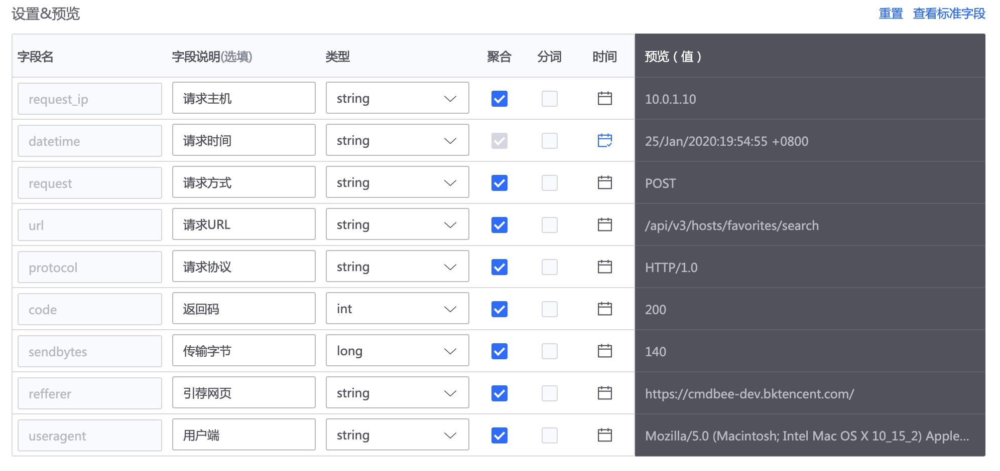
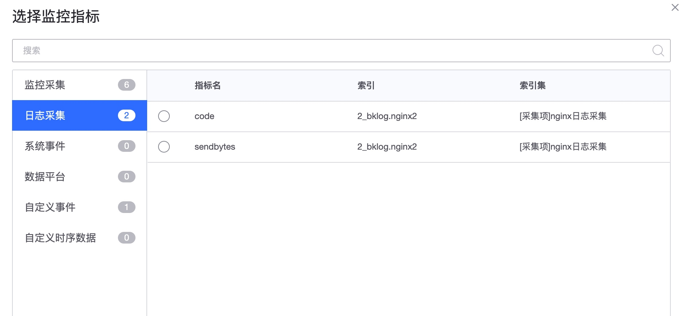

# 如何监控日志平台的数据

日志是发现问题和定位问题非常有用的一类数据，基本上任何监控对象都有日志，操作系统，进程模块，服务模块等会有相应的日志数据。

有效的使用日志数据不仅可以达到监控的目的也可以满足问题定位的有需求。

## 前置步骤

**工作原理**：

日志采集是监听日志文件内容变化进行实时的日志流采集，采集过程中可以进行"日志提取"格式化日志内容。

日志采集和处理基于日志平台服务。可以直接"日志平台"进行采集和配置，也可以直接在监控平台进行。

**采集导航路径**：导航 →  监控配置 →  采集 → 日志采集

**策略配置导航路径**：导航 →  监控配置 →  策略 → 新建  → 日志关键字/监控项(日志采集)

**问题定位导航路径**：导航 →  日志检索

**视图配置导航路径**：导航 →  仪表盘 → 新建  → 指标选择(日志采集)

## 日志采集&字段提取

具体查看日志平台[采集接入](../../../日志平台/产品白皮书/functions/manager/collect_log.md)

## 日志监控策略

日志监控有两类：

1. 日志关键字监控，最常见也是最常用的监控方法。
2. 日志时序数据监控，就是将日志转化为时序数据进行监控。

### 日志关键字监控

> 注意：当前的日志检索语句是基于 ES 的分词语法。 具体查看[query string](../../../日志平台/产品白皮书/functions/addenda/query_string.md)

### 日志时序数据监控

经过字段提取的数据会变进入到监控的指标选择器中。

* 指标： **聚合类型**并且是数值类型的，如 int/long。
* 维度： **聚合类型**并且为 string 类型的。

> 注意：当不需要进行监控，也不需要进行整体查询的时候可以使用分词。可以节省存储空间，提高效率。

在监控的指标选择器中将出现两个指标项 `code`和`sendbytes`.

其他都会变成维度

## 日志视图

在仪表盘中可以选择日志平台采集的数据进行视图的创建。

