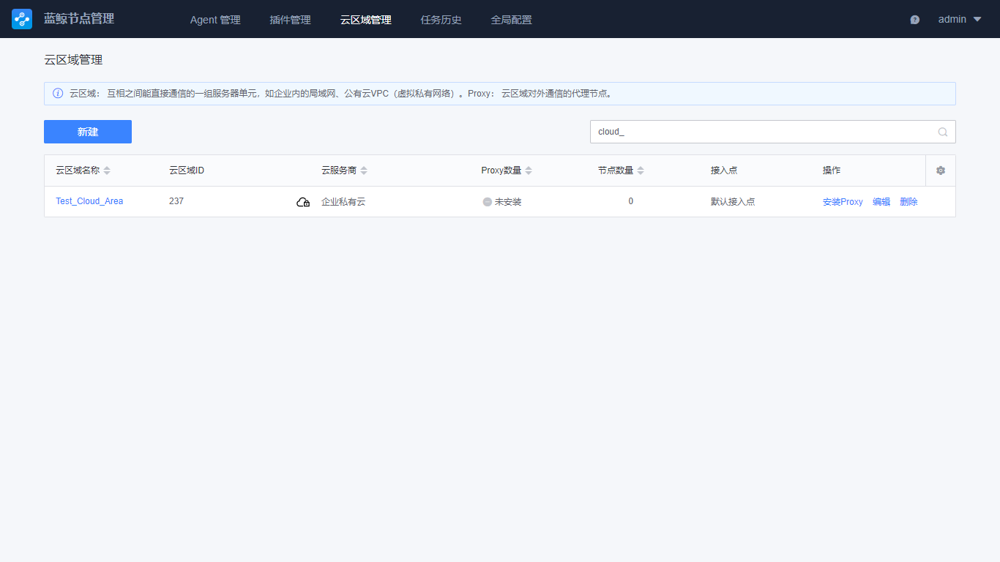
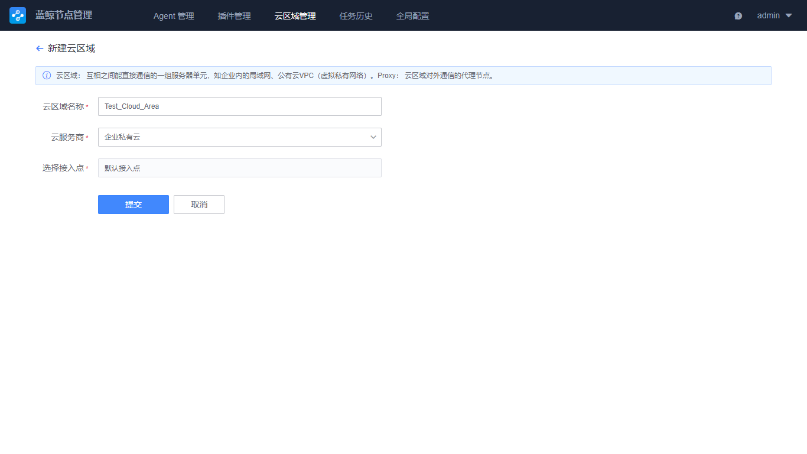
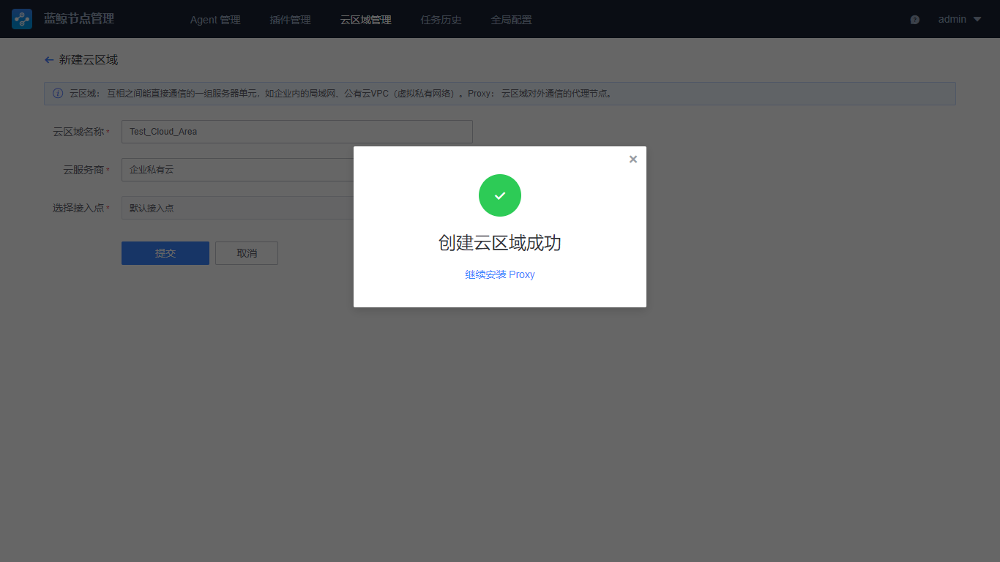
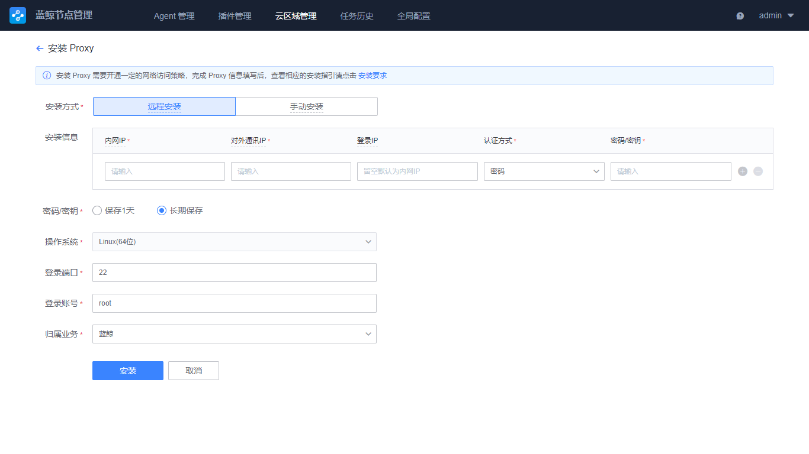
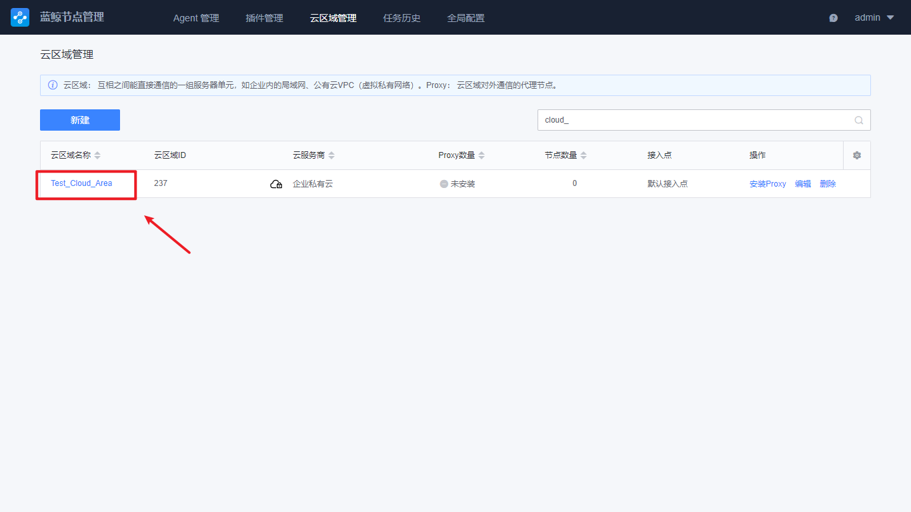
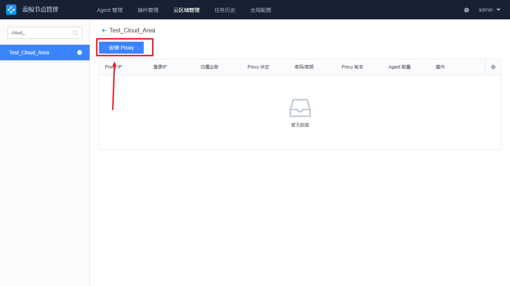

# 云区域管理

云区域是互相之间能直接通信的一组服务器单元，如企业内的局域网、公有云 VPC（虚拟私有网络）。

蓝鲸初始部署的时候，默认会创建“直连区域”，当主机可以直接与蓝鲸部署所在网络直接进行通讯连接时，Agent 安装到此区域即可。

如果企业网络有区域划分，如办公网与生产网络隔离、总公司与分公司网络隔离、国内服务网与国外服务网隔离等情况，可根据实际的网络可连通性规划创建多个云区域。

## 查看云区域

点击导航“云区域管理”可以查看当前已经存在的云区域。蓝鲸初始部署完成，此列表为空。需要注意云区域查看需要获得授权。

## 创建云区域

**第一步：创建云区域。**

在云区域管理页面，点击“新建”按钮开始创建一个新的云区域。云区域参数解释：

- 云区域名称：云区域的唯一标识，在蓝鲸中，此名称需唯一
- 云服务商：用于标识当前网络的提供商，对于企业私有网络，选择企业私有云，对于公有云提供的网络，蓝鲸默认已经提供国内外常见的厂商列表可供选择
- 接入点：当在“全局配置”中存在多个接入点，用户可以定义当前云区域通过哪个接入点与蓝鲸通讯

**第二步：成功提交以后，系统会提示“继续安装 Proxy”。**

由于自定义的云区域存在网络隔离，在未安装 Proxy 之前，不可以继续在其下安装 Agent，所以建议选择“继续安装 Proxy”配置 Proxy。

如果您还没有准备好 Proxy 的网络或主机资源，也可在后续任何时候进入到云区域管理中进行 Proxy 的安装。

**第三步：填写 Proxy 安装参数**

安装所需要的参数详情解释如下：

- 内网IP：与 Agent 可以进行网络通讯的 IP
- 对外通讯IP：与接入点可以进行网络通讯的 IP
- 登录IP：从蓝鲸可以 SSH 登录到此 Proxy 主机的 IP。此为可选配置，如果没有填写默认使用内网 IP
- 认证方式：支持密码或者秘钥的方式
- 操作系统：作为 Proxy 的主机必须为64位的 Linux系统
- 登录端口：可以进行 SSH 连接的端口
- 登录账号：建议为 root 账户，如果不能够使用 root 账户，要求所填写账户可以免密 sudo 执行 /tmp/setup_agent.sh 脚本
- 归属业务：用于定义 Proxy 安装完成后，录入到蓝鲸配置平台的哪个业务下。需要注意的是，您必须获取蓝鲸配置平台的业务权限才可以进行此操作

## Proxy查询

云区域安装完成以后，可以点击云区域标题查看云区域下 Proxy 详情。

如在此前没有安装过 Proxy，您可以点击新建继续安装 Proxy。

如果已经存在 Proxy，您也可以根据企业的实际需要，决定是否安装多个 Proxy，以达到更高的可用性、负载均衡要求。

## 卸载Proxy

卸载云区域的 Proxy，可以点击云区域名称查看已经存在的 Proxy。

在卸载之前需要确认当前 Proxy 没有 Agent 与其连接。否则会导致失败。

## 删除云区域

删除云区域之前您需要先确认当前云区域下的 Proxy 已经完全卸载。
