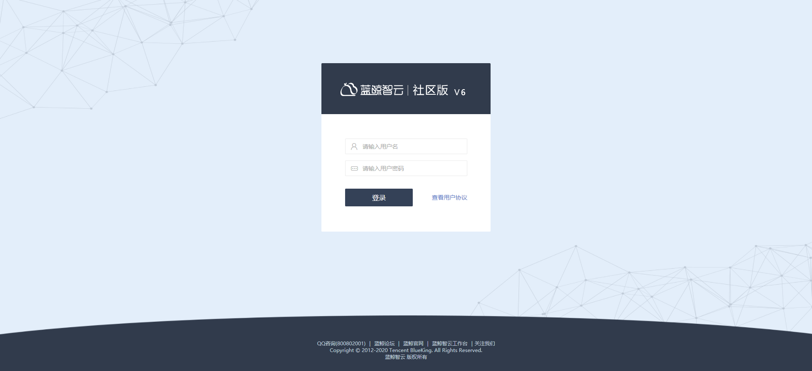

# 社区版 6.0 快速部署

## 一、安装环境准备

### 机器准备

1. 建议操作系统： CentOS 7.6
2. 建议机器配置：体验至少 4 核 16 G，硬盘至少 50G
3. 机器数量：3 台（假设ip分别为：10.0.0.1，10.0.0.2，10.0.0.3）
4. 选择一台为中控机（假设为10.0.0.1）进行安装部署操作，使用root账号登录。

### 证书获取

- 通过 `ifconfig` 或者 `ip addr` 命令分别获取三台机器第一个内网网卡 MAC 地址
- 前往蓝鲸官网证书生成页面([https://bk.tencent.com/download_ssl/](https://bk.tencent.com/download_ssl/))，根据提示在输入框中填入英文分号分隔的三个 MAC 地址，生成并下载证书
- 上传证书包至中控机

### 下载安装包

- 下载安装包到任意目录，假设下列相关包已下载至 /data 目录。（注：本文档以/data/目录为例，如果放到其他目录，请自行修改相关命令涉及到的路径）

    1. 产品软件包：bkce_product-6.0.0-rc4.tgz
    2. 公共组件包：bkce_common-3.0.0.tgz
    3. 部署脚本包：install_ce-v3.0.0-rc4.tgz

   **下载完成后，请核对邮件 MD5 码。**

### 解压相关资源包

1. 解压产品软件包（包含蓝鲸相关产品，如 PaaS、CMDB、JOB等）

   ```bash
   cd /data
   tar xvf bkce_product-6.0.0-rc4.tgz
   ```

2. 解压产品软件包下的子包

   ```bash
   cd /data/src/; for f in *gz;do tar xf $f; done
   ```
   
3. 解压公共组件包（包含蓝鲸依赖的 rpm，SaaS 镜像，定制 Python 解释器）

   ```bash
   cd /data
   tar xvf bkce_common-3.0.0.tgz
   ```

5. 解压部署脚本包

   ```bash
   tar xvf install_ce-v3.0.0-rc4.tgz
   ```
   
5. 解压证书包

    ```bash
    install -d -m 755 /data/src/cert
    tar xvf ssl_certificates.tar.gz -C /data/src/cert/
    chmod 644 /data/src/cert/*
    ```
    
6.  拷贝 rpm 包文件夹到/opt/目录

    ```bash
    cp -a /data/src/yum /opt
    ```

### 自定义安装配置

1. 生成 install.config

   ```bash
   # 请根据实际机器的IP 进行替换第一列的示例IP地址，三个内网IP保证能互相通信
   cat << EOF >/data/install/install.config
   10.0.0.1 iam,ssm,usermgr,gse,license,redis,consul,es7,monitorv3(influxdb-proxy),monitorv3(monitor),monitorv3(grafana)
   10.0.0.2 nginx,consul,mongodb,rabbitmq,appo,influxdb(bkmonitorv3),monitorv3(transfer),fta,beanstalk
   10.0.0.3 paas,cmdb,job,mysql,zk(config),kafka(config),appt,consul,log(api),nodeman(nodeman)
   EOF
   ```

2. 对  install.config  中的主机配置中控机ssh登录免密。根据提示，依次输入每台机器的root密码

   ```bash
   bash /data/install/configure_ssh_without_pass
   ```

## 二、开始部署

### 初始化操作

执行初始化操作

   ```bash
   # 快速部署暂不支持自定义安装目录
   cd /data/install/
   ./bk_install common
   ```

检查相关配置

   ```bash
   ./health_check/check_bk_controller.sh
   ```

### 部署 PaaS 

   ```bash
./bk_install paas
   ```

### 部署 app_mgr（SaaS运行环境）

   ```bash
./bk_install app_mgr
   ```

### 部署 CMDB（配置平台）

   ```bash
./bk_install cmdb
   ```

### 部署 JOB（作业平台）

   ```bash
./bk_install job
   ```

### 部署 bknodeman（节点管理）

   ```bash
./bk_install bknodeman
   ```

### 部署 bkmonitorv3 （监控平台）

   ```bash
./bk_install bkmonitorv3
   ```

### 部署 bklog （日志平台)

   ```bash
./bk_install bklog
   ```

### 部署 fta (故障自愈后台)

   ```bash
./bk_install fta
   ```

### 部署 SaaS

```bash
# 权限中心
./bk_install saas-o bk_iam
# 用户管理
./bk_install saas-o bk_user_manage
# 标准运维
./bk_install saas-o bk_sops
# 服务流程管理
./bk_install saas-o bk_itsm
# 故障自愈SaaS
./bk_install saas-o bk_fta_solutions
```

### 检测相关服务状态

```bash
cd /data/install/
./health_check/check_paas.sh
./health_check/check_cmdb.sh
./health_check/check_job.sh
./pcmd.sh -m gse '/data/install/health_check/check_gse.sh'
```

示例：


### 配置本地 hosts文件

查找 nginx 与 nodeman 模块所在的机器 IP，并在需访问的个人电脑端配置 hosts 文件


示例：

```bash
# IP 为 nginx 所在机器的外网 IP（本机浏览器可以访问的IP）
10.0.0.2 paas.bktencent.com cmdb.bktencent.com job.bktencent.com jobapi.bktencent.com
# IP 为 nodeman 所在机器的外网 IP（本机浏览器可以访问的IP）
10.0.0.3 nodeman.bktencent.com
```

### 默认自动生成的管理员账号和密码查找

在任意一台机器上，执行以下命令，获取管理员账号和密码

```bash
grep -E "BK_PAAS_ADMIN_USERNAME|BK_PAAS_ADMIN_PASSWORD" /data/install/bin/04-final/usermgr.env
```

完成以后以上步骤后，访问蓝鲸 (http://paas.bktencent.com)开始使用。

