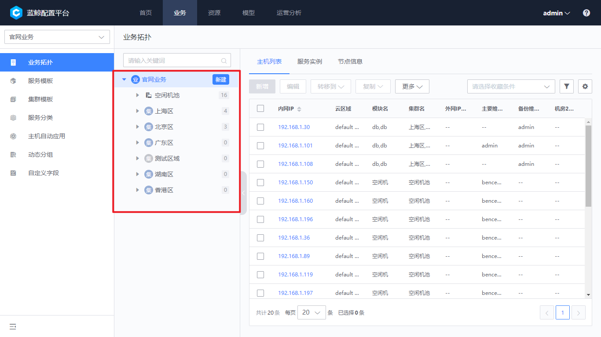

# 业务拓扑

业务拓扑是配置平台进行主机管理的基础，在业务架构以及类型越来越复杂的今天，只有建立合适的业务模型，才能结构化的管理好主机。配置平台提供用户结构自定义、拓扑属性自定义等功能。

## 创建拓扑

默认情况下，业务拓扑仅包含空闲模块，您可以通过点击业务右后方的新建功能，创建符合场景的拓扑结构。默认 “业务-集群-模块”三级的拓扑结构含义如下：

- 集群（SET）：功能较为完整的部署板块，内部强耦合，对外弱耦合。即集群之间仅有较少依赖，一个集群故障不影响其他集群的正常运行
- 模块（MODULE）：完整的一个服务模块，例如web模块、db模块等。模块下可以进一步定义服务实例、进程资源

我们提供了集群模版、服务模版分配便于用户快速创建集群、模块，详情查看服务模版，集群模版章节。对于没有特别规律的集群和模块，您可以选择不使用模版创建，后续的维护都通过手动调整每个层级节点完成。

图1.创建拓扑

## 自定义层级

除了系统默认包含的两层结构，用户可以根据企业的实际需要，在“模型-模型关系”中定义更多层级
