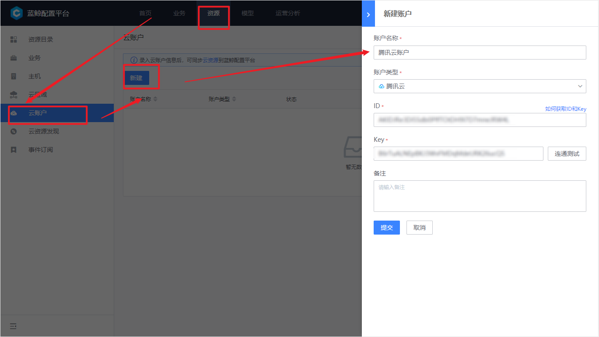
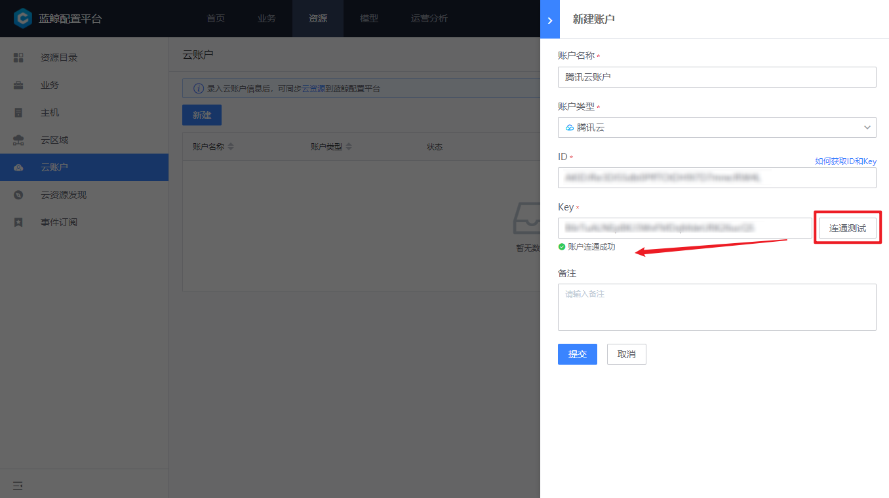
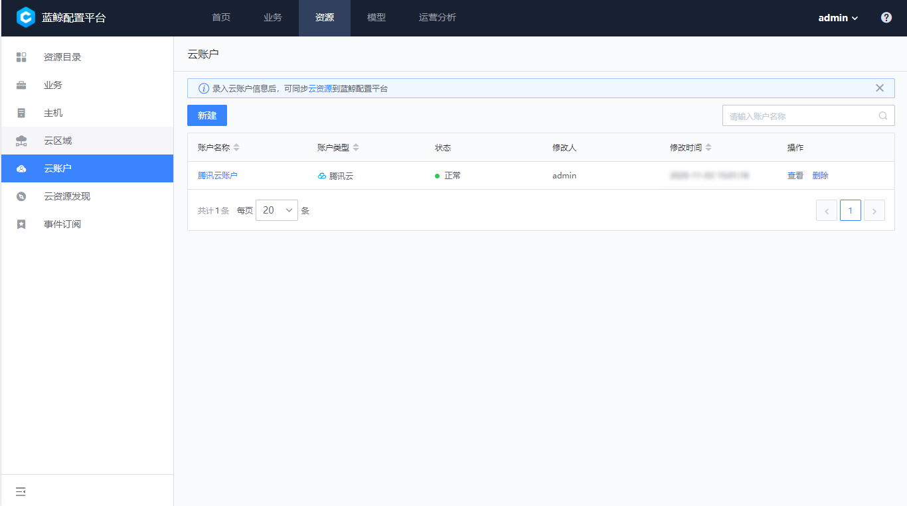
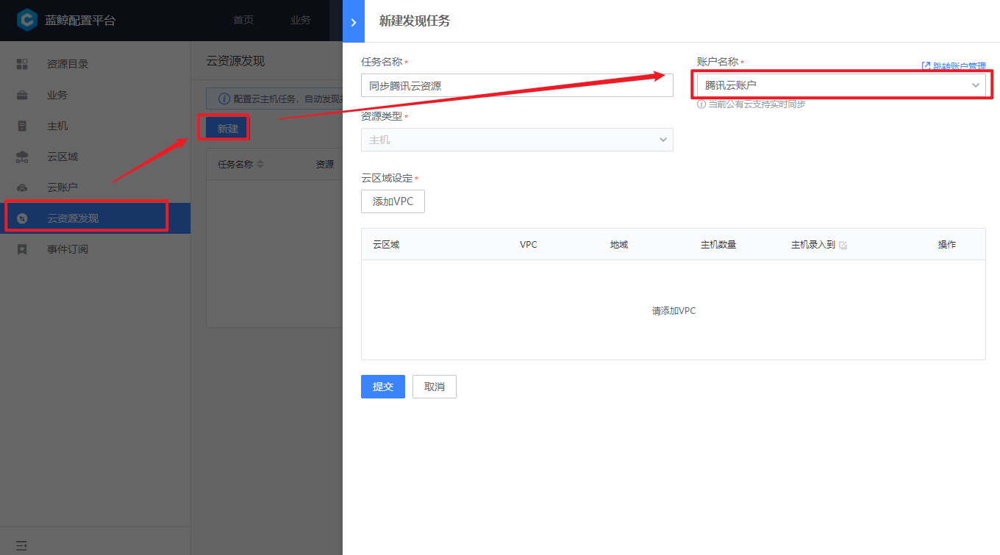
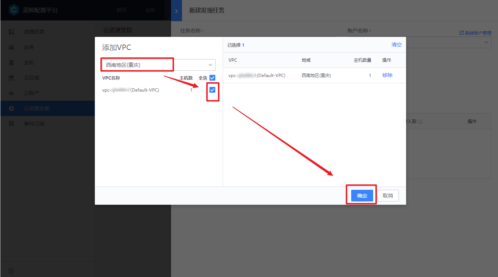
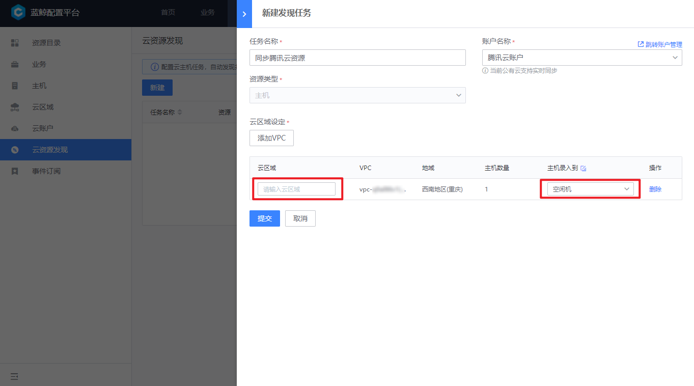
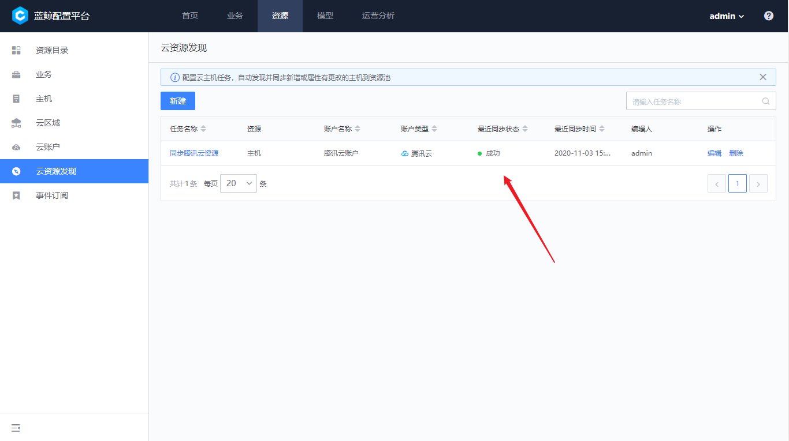

# 云资源

配置平台提供了一套基础云资源同步功能，以解决云资源的管理更新不及时，信息不准确等问题。

具体步骤为：

1. 创建云账户
2. 创建云资源发现任务
3. 分配云资源

## 1. 创建云账户

用户需先在公有云申请创建一组可访问所有资源的“子账户”。不同公有云申请方式略有差异。目前配置平台支持腾讯云和AWS的账号同步能力，相关的账户申请方式可以参考以下文档：

- 腾讯云：[https://cloud.tencent.com/document/product/598/37140](https://cloud.tencent.com/document/product/598/37140)
- AWS：[https://docs.aws.amazon.com/IAM/latest/UserGuide/id_roles_providers_enable-console-custom-url.html](https://docs.aws.amazon.com/IAM/latest/UserGuide/id_roles_providers_enable-console-custom-url.html)

申请创建了账户以后，需要记录访问的 ID 和 KEY，在配置平台中创建账户。

填写了 ID 和 KEY 以后，点击“连通测试”按钮，以确保配置平台可以正常访问公有云的接口地址，同时校验 ID 和 KEY 的可用性。

创建账户成功以后，我们接下来可以去创建云资源发现任务。

## 2. 创建云资源发现任务

进入“云资源发现”功能，点击“新建”按钮，选择刚刚创建的腾讯云账户。

目前支持按照 VPC 的粒度同步主机资源，通过选择公有云的区域，找到需要同步的 VPC。

在云区域设定中完善设置：

1. 补充VPC对应的云区域名称：公有云一个 VPC 内主机 IP 资源不重复，与配置平台中云区域是一一对应的关系。后续此 VPC 下公有云资源都会同步到此 VPC 中
2. 设定云主机录入到资源池的目录：配置平台发现一台新云主机，会优先放置到资源池的目录下，默认在“空闲机”目录。用户也可根据实际的部门或者用途划分，创建一个目录专用于存储新增的云主机资源

创建完成会立刻启动一次同步任务，可以在列表中看到同步状态。

## 3. 分配云资源

公有云上的主机资源会被同步到资源池的设定目录中，通过“分配到”功能分配到实际的业务中应用。

详细操作可以参考 [主机和资源池管理](产品功能/ResourcePool.md)

