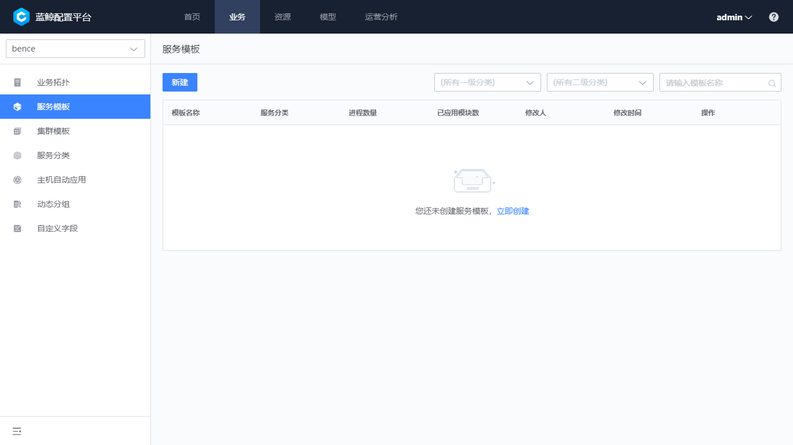
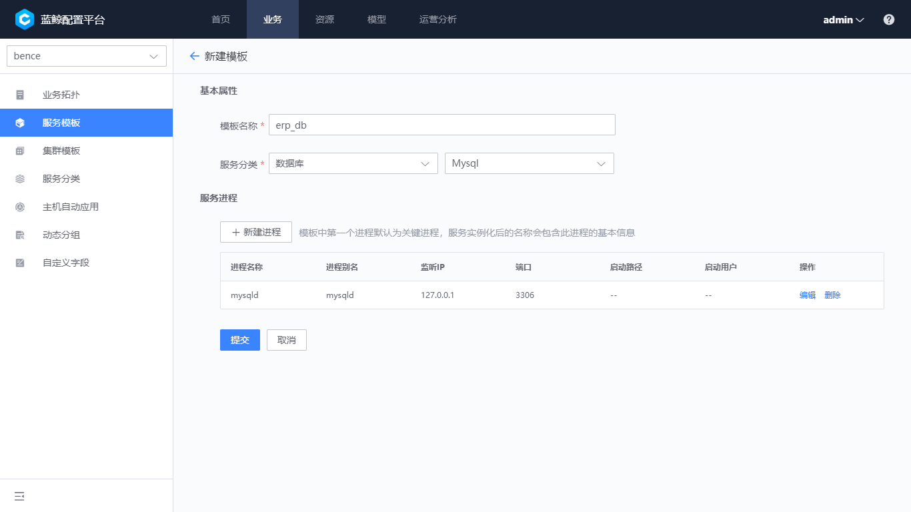
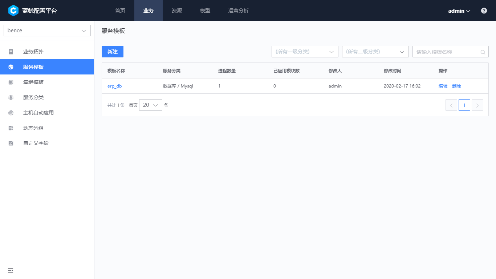
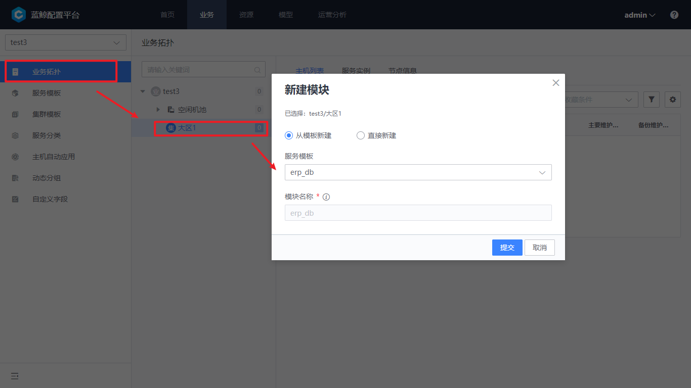
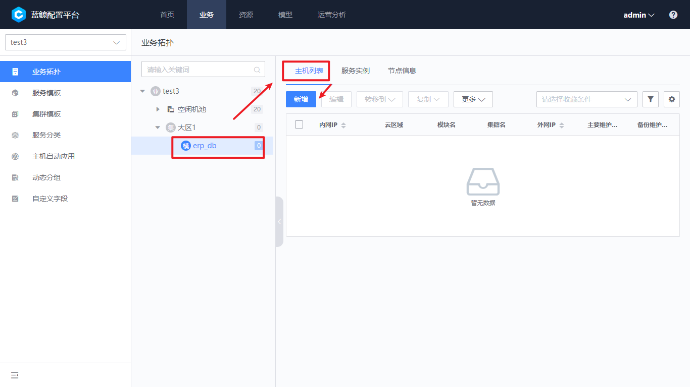
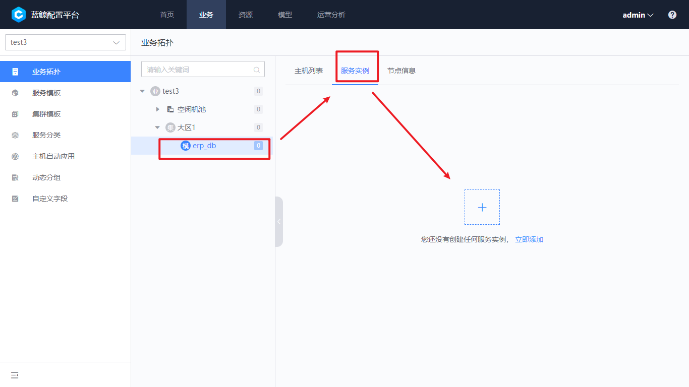
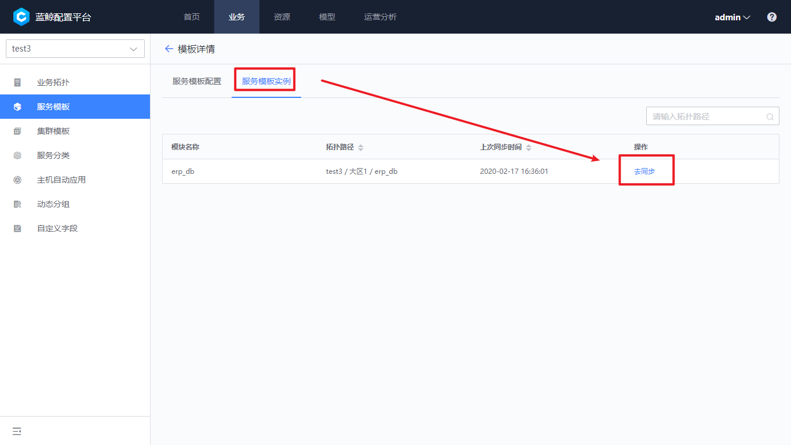
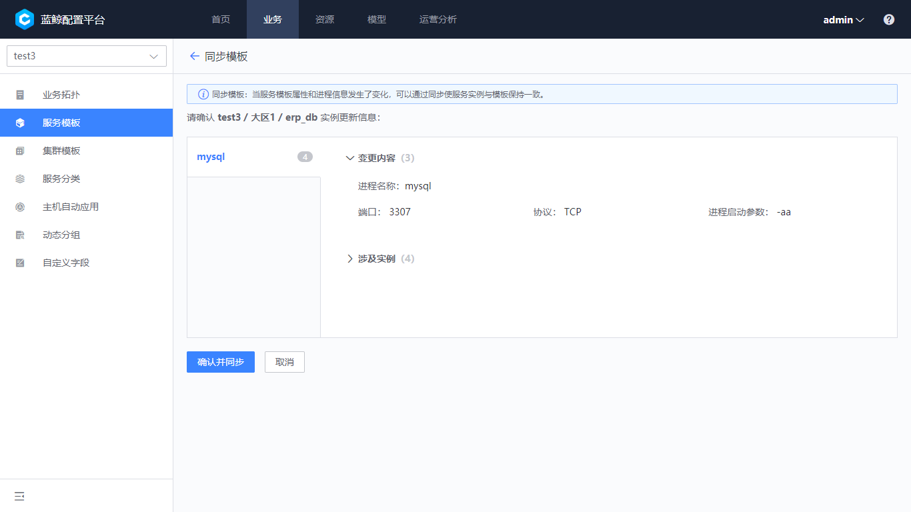

# 服务模版

服务模板可以预定义业务通用的服务，用于业务拓扑中批量部署和变更服务实例。也可以简单的理解为业务拓扑中的模块模版。

## 创建服务模版

进入到“业务-服务模版”，可以看到当前已存在的服务模版。点击“新建”按钮进入新建服务模版配置页。

图1：服务模版列表

配置服务模版包含以下信息：

- 模版名称：服务模版的唯一标识，在通过服务模版创建的模块会使用模版的同一个名称。命名方法建议以简单可理解的功能性单词，比如 test_db, erp_db 等
- 服务分类：表示此模版所属的服务类型，系统提供了常见的一些服务类型，例如 mysql、apache 等，用户也可以自定义增加业务特有服务分类
- 服务进程：进程是服务的重要组成。进程的关键属性主要有进程名称和进程别名，进程名称是进程的二进制名称，进程别名是进程的可读名称。比如 apche 的实际运行二进制名称是 java，如果填写 java 在周边系统中是无法识别这个进程的实际作用，因此这种情况下，可以填写进程名称为 java，进程别名为 tomcat。服务进程中还有其他信息，例如监听端口、监听 IP 等，可以根据实际场景的需要填写

图2：创建服务模版

服务模版创建完成以后，可以在列表中查询到此记录，应用服务模版。

图3：服务模版列表

## 使用服务模版

进入到“业务-业务拓扑”中，在左侧的拓扑树中先创建“集群”，在“集群”中创建“模块”的时候，可以看到在上个步骤中已存在的服务模版。

图4：服务模版列表

创建了模块以后，有两种方式创建服务实例，这两种方法是等效的，根据主机或服务实例的管理习惯选择即可。

**方式1：当主机转移到当前模块下，系统会自动创建服务实例。**

图5：模块中加入主机

**方式2：主动创建服务实例，主机也会归属到当前模块下。**

图5：创建服务实例

## 模版同步

当服务模版发生变化以后，可以通过“同步”功能把改动同步到服务实例中。

图6：查看服务模版已经应用的模块

图7：同步服务实例并确认

## 模版删除

为了保证配置的安全和准确，删除服务模版时会校验是否存在模块与其关联。即删除之前应该先把所有应用了模版的实例清除。
