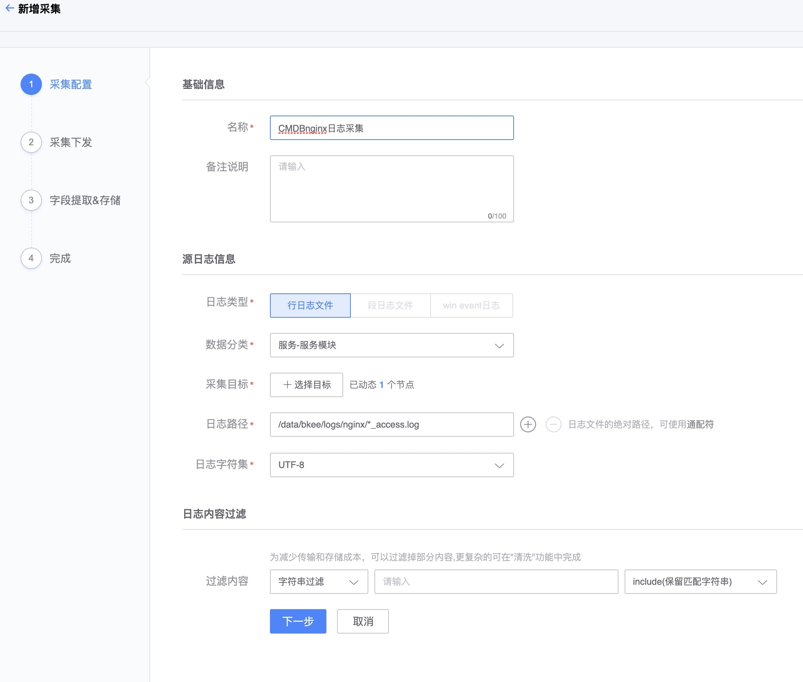
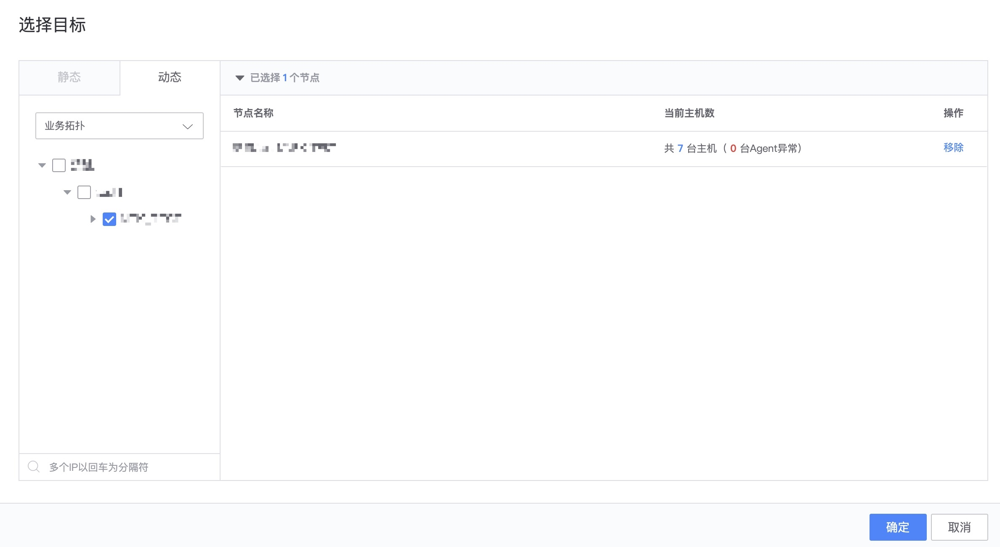
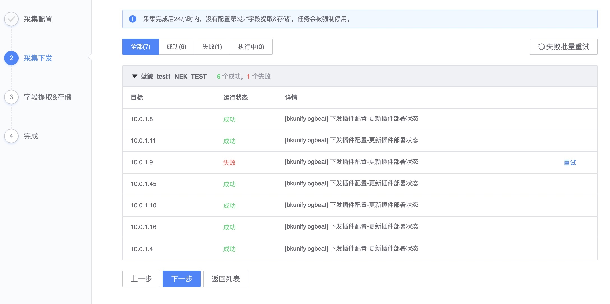
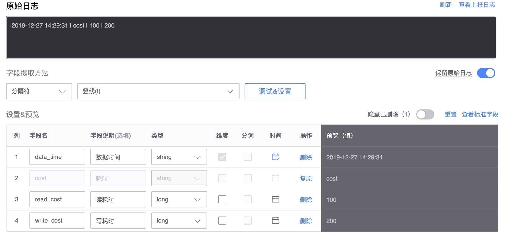

# 采集接入

日志采集是通过日志服务的自有链路,通过实时流的方式将日志采集到服务端,并且还可以在采集过程中运行agent端的过滤和服务端的字段提取功能,可以快速的实现日志的格式化需求. 


## 前置步骤


日志采集原理


## 功能列表

### 主功能一览

* 新建采集
* 采集运行状态
* 日志字段提取
* 数据采样 

### 功能介绍 

#### 新建采集

**功能位置**: 导航 →  管理 → 数据接入 →  采集接入 →  新建 

**操作步骤**: 

* (1) 采集配置
* (2) 采集下发
* (3) 字段提取&存储
* (4) 完成

##### 采集配置




* 日志类型: 先仅支持行日志文件,支持Windows和Linux系统.
* 数据分类: 具体查看术语解释 [数据分类](../concepts/glossary.md) 
* 采集目标: 可以基于静态IP采集,也可以使用动态模块方式采集. 动态采集就将随着CMDB模块的主机变化自动增删.
    
* 日志路径: 
    * 日志是绝对路径
    * 可以支持通配符方式,具体查看[常见通配符](../addenda/wildcard.md)
    * 可以支持CMDB的变量方式,具体查看[CMDB变量使用](../addenda/cmdb_var.md)
    * 可以支持多日志文件
* 日志内容过滤: 先支持include方式.

#### 采集下发

> 注意: 在当前离开采集还是在继续异步执行的,但没有完成存储设置,所以在24小后没有完成第三步的存储,采集任务会被强制停用. 



#### 字段提取

非必需项,适用场景需要对日志进行格式化的时候,适用于需要对日志进行汇聚和维度的监控需求时. 

字段提取提供三种提取方式: JSON,分隔符,正则表达式


##### 正则提取

格式说明:

正则提取使用的是Go的正则语法: 有两种形式，一种是普通提取组，另一种是命名提取组. 这里使用的是命名提取组语法. 

* 普通：(Expression)
* 命名：(?P<name>Expression) 

如: 

```
(?P<request_ip>\d+\.\d+\.\d+\.\d+) 
```

代表的意思是: 将正则匹配到的 `\d+\.\d+\.\d+\.\d+` 内容命名为 `request_ip`   

 [在线正则表达式调试页面](https://www.debuggex.com/)


#####  JSON 方式

采集上报的日志是标准的JSON格式,只提取第一级的key. 


##### 分隔符

通过分隔符来确定需要的字段内容,当前支持:竖线,逗号,反引号,空格,分号.





#### 存储

采集的数据存储的索引名,在索引集中会使用到. 


 


